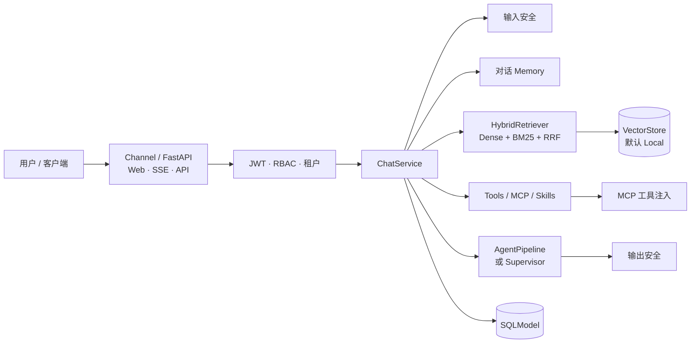
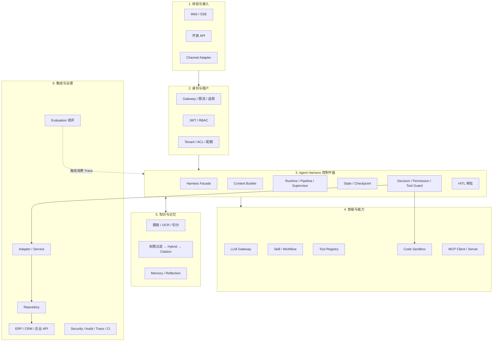
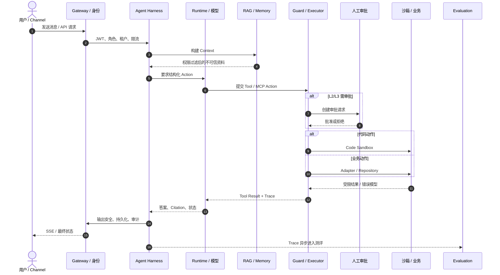

# ai-assistant

[](LICENSE)
[](CONTRIBUTING.md)
[](https://www.python.org)
[](docker-compose.yml)

> **ai-assistant** 是一个面向企业的开源 AI 助手平台，基于 RAG 与 Agent 编排，通过 MCP 连接私有知识库与受控企业能力。当前主链已可用；结构化引用、版本化测评和独立 Harness 仍是目标能力，详见下方架构概览。

## 项目定位

**ai-assistant** 围绕 **RAG 检索增强生成** 与 **Agent 编排** 两大核心能力构建，通过 **MCP 协议** 连接企业内部的文档、业务系统与第三方服务，帮助团队快速搭建可私有部署、回答可追溯、权限可管控的智能问答系统。

平台提供以下核心能力：

- **企业知识问答**：上传文档并自动分块嵌入，基于混合检索（向量 + 关键词 + RRF 融合）生成精准、附带引用来源的回答；
- **Agent 智能编排**：内置五阶段推理管线（理解 → 规划 → 行动 → 反思 → 响应），支持工具调用与 Function Calling；
- **系统互联互通**：原生支持 MCP 协议，经受控工具接入企业系统与第三方 API；Agent 不得直连业务数据库；
- **企业级管控**：RBAC 五级角色（系统管理员 / 系统访客 / 租户管理员 / 成员 / 访客）与多租户隔离，保障数据安全；
- **开箱即用**：Docker 一键部署，零额外依赖的本地向量库模式，降低落地门槛。

## 核心特性

- **混合检索 RAG**：向量稠密检索 + BM25 关键词检索 + RRF 融合。当前引用以 source 文本为主；结构化 Citation 为 TARGET。
- **五阶段 Agent 管线**：理解 → 规划 → 行动（含工具调用循环）→ 反思 → 响应，逐步逼近高质量回答。
- **流式与非流式双模式**：支持 SSE 流式增量输出（逐字推送 + 阶段进度广播），也支持一次性返回。
- **原生 MCP 协议**：作为 AI 与企业系统的「万能连接器」，将 MCP 服务器工具动态注入 Agent 工具箱。
- **多 LLM 提供商**：DeepSeek / OpenAI 兼容接口 / Ollama 本地部署 / Mock 离线占位，默认适配 DeepSeek，无 API Key 时自动降级为 Mock。
- **灵活向量库**：本地模式（SQLite + numpy，零额外依赖）或生产模式（Milvus 分布式）。
- **企业级安全**：JWT 双令牌（access + refresh）、RBAC 五级角色权限矩阵、多租户数据隔离。

## 架构概览

文档必须同时保留 **As-Is（当前实现）** 与 **TARGET（最终形态）**。目标图不能替代当前事实；当前调用链不能替代产品最终边界。权威文字稿见 [`docs/product/项目产品需求方案.md`](docs/product/项目产品需求方案.md) §3.1，可视化见 [`docs/architecture/target-agent-harness-architecture.html`](docs/architecture/target-agent-harness-architecture.html)。

### 当前实现（As-Is）

当前对话主链以 `ChatService` + 自研五阶段 `AgentPipeline`（可选 LangGraph Supervisor）为中心。独立 Agent Harness、Context Builder、Tool Executor、State Manager、结构化 Citation、版本化 Evaluation 和正式 VectorStore ADR 仍属目标治理，不得写成已完成。



默认配置事实：`AGENT_ORCHESTRATION=self`，`RAG_BACKEND=native`，`RAG_VECTOR_STORE=local`，`RAG_ENABLED=false`，`SECURITY_BLOCK_ON_INJECTION=false`。Trace 以内存环形缓冲为主。无真实 Embedding 时 Mock 只能证明链路，不能证明检索质量。

### 最终目标架构（TARGET）

目标依赖方向：`Channel/API → Harness → Runtime → Skill → Tool Executor → Service/Adapter → Repository → 数据与外部系统`。

- 第 3 层 **Agent Harness** 只负责编排：Context、Runtime、State、预算、Guard、HITL。
- **Code Sandbox** 在第 4 层，由 Tool Guard 调用；代码动作不得在宿主进程执行。
- **Evaluation 测评** 是离线横切能力，消费 Trace 与版本化数据集，不阻塞在线请求。



### 目标请求时序（TARGET）



### 目标能力与当前状态（防漂移）

| 能力 | 当前状态 | 目标边界 |
|---|---|---|
| Agent 编排 | `Partial`：`ChatService` + `AgentPipeline` 承担部分 Harness | 独立 Harness / Context / State / 预算 / 恢复 |
| RAG | `Partial`：多格式摄取、混合检索；默认未注入对话 | 权限一致、不可信标记、结构化 Citation、Evaluation 基线 |
| 代码沙箱 | `Partial`：存在沙箱工具路径 | 代码动作必须经四层隔离，不得宿主执行 |
| MCP / 工具 | `Partial`：工具与 MCP 可注入 | 完整 Tool Contract；经 Executor，不直连数据库 |
| 测评 | `Planned`：尚无版本化 Gold/基线报告 | 离线 RAG / Agent / Skill / Safety 评测 |
| 向量库 | 默认 `local`；Milvus 需闭环证据 | 正式后端由 ADR 决定，禁止口头升级为已生产 |

状态术语与 `AGENTS.md` 一致：`Implemented` / `Partial` / `Planned` / `Deferred`。禁止把 `Planned` 写成已交付。

## 技术栈

| 层 | 技术 |
|----|------|
| 后端框架 | Python 3.11+ · FastAPI 0.115 · SQLModel 0.0.22 · Pydantic v2 |
| 数据库 | SQLite（开发）/ PostgreSQL 16（生产） |
| 向量库 | Local（SQLite + numpy）或 Milvus 2.4（分布式） |
| LLM | DeepSeek / OpenAI 兼容接口 · Ollama 本地 · Mock 离线 |
| 嵌入模型 | OpenAI 兼容 `/embeddings` 协议（DeepSeek / OpenAI / 智谱 / BGE-M3 等） |
| 协议 | MCP（Model Context Protocol） |
| Web 控制台 | TypeScript · React 18 · Vite 5 · Tailwind CSS 3 · TanStack Query |
| 部署 | Docker Compose；或由 FastAPI 单进程同时提供 API 与控制台 |

## 项目结构

仓库按 **分层目录 + 能力模块** 组织：`core` / `api` / `services` / `models` 是稳定分层，一般不随功能增减；`agents` / `rag` / `mcp` 等是可复用的技术能力，只有独立能力域才在 `app/` 下新开包。业务场景（如面试官）应落在 `services/` + `api/routes/`，不要按产品功能名平铺顶层目录。

```
ai-assistant/
├── app/                         # 应用主代码
│   ├── main.py                  # FastAPI 入口、lifespan（建库、校验、调度器）
│   ├── core/                    # 基础设施：配置、数据库、JWT/RBAC（不依赖 FastAPI）
│   ├── models/                  # 数据模型（SQLModel 表，不含业务逻辑）
│   ├── schemas/                 # 请求/响应契约（Pydantic）
│   ├── api/                     # HTTP 路由（薄层：校验、调 service、返回）
│   │   ├── deps.py              # 依赖注入：get_db / get_current_user / 权限守卫
│   │   └── routes/              # health、auth、chat、rag、mcp、workflow、audit
│   ├── services/                # 业务编排：对话、认证
│   ├── agents/                  # Agent 编排：五阶段管线、Supervisor、工具、Skills、沙箱
│   ├── llm/                     # LLM 抽象 + 工厂（OpenAI 兼容 / Mock）
│   ├── rag/                     # RAG：摄取、嵌入、向量库、混合检索
│   ├── mcp/                     # MCP 客户端：连接企业系统并注入工具
│   ├── workflow/                # 工作流：cron 调度、引擎、桥接到对话
│   ├── memory/                  # 对话窗口裁剪与 LLM 压缩
│   ├── security/                # 内容安全治理（输入/输出过滤、注入检测；非 JWT 鉴权）
│   ├── audit/                   # 审计日志写入与 Admin 查询
│   ├── evolution/               # Reflect 反思与 Distill 夜间蒸馏
│   ├── debug/                   # Agent 执行 Trace
│   └── channels/                # 多入口抽象（当前登记 HTTP）
├── tests/                       # pytest 测试
├── frontend/                    # Web 控制台（Vite + React + TS，见 frontend/README.md）
├── alembic/                     # 数据库迁移
├── docs/                        # 设计文档与 OpenAPI 导出
│   ├── product/项目产品需求方案.md
│   └── architecture/target-agent-harness-architecture.html
├── AGENTS.md                    # AI / 贡献者开发规则（模块边界与扩展约定）
├── pyproject.toml               # 依赖与工具配置
└── docker-compose.yml
```

JWT 鉴权、网关、缓存属于基础设施，分别落在 `core/` 与 `api/`，不单独开顶层包。新增目录的判断标准见 [AGENTS.md](AGENTS.md) 的架构边界。

## API 端点

| 模块 | 方法 | 路径 | 说明 |
|------|------|------|------|
| 系统 | `GET` | `/` | 服务基本信息 |
| 系统 | `GET` | `/api/health` | 健康检查 |
| 认证 | `POST` | `/api/auth/login` | 用户名密码登录，返回双令牌 |
| 认证 | `POST` | `/api/auth/refresh` | 刷新令牌（refresh 轮转） |
| 认证 | `GET` | `/api/auth/me` | 当前用户信息 |
| 对话 | `POST` | `/api/chat` | 非流式对话 |
| 对话 | `POST` | `/api/chat/stream` | SSE 流式对话 |
| 对话 | `GET` | `/api/chat/conversations` | 会话列表 |
| 对话 | `GET` | `/api/chat/conversations/{id}` | 会话详情（含消息） |
| 对话 | `DELETE` | `/api/chat/conversations/{id}` | 删除会话 |
| 对话 | `GET` | `/api/chat/tools` | 可用工具列表 |
| 知识库 | `POST` | `/api/rag/documents/ingest` | 文本摄取（自动分块嵌入） |
| 知识库 | `POST` | `/api/rag/documents/upload` | 上传 txt/md/json/xml/csv/doc/xls/ppt/docx/xlsx/pptx/pdf 文件（扫描版 PDF 可配合 OCR） |
| 知识库 | `GET` | `/api/rag/documents` | 文档列表 |
| 知识库 | `GET` | `/api/rag/documents/{id}` | 文档详情 |
| 知识库 | `DELETE` | `/api/rag/documents/{id}` | 删除文档 |
| 知识库 | `POST` | `/api/rag/search` | 混合检索 |
| MCP | `GET` | `/api/mcp/servers` | 已配置的 MCP 服务器 |
| MCP | `GET` | `/api/mcp/tools` | 已连接 MCP 工具列表 |
| 工作流 | `GET` / `POST` | `/api/workflows` | 工作流列表 / 创建（需 `WORKFLOW_ENABLED`） |
| 工作流 | `GET` / `PUT` / `DELETE` | `/api/workflows/{id}` | 工作流详情、更新、删除 |
| 工作流 | `GET` | `/api/workflows/{id}/executions` | 执行历史 |
| 工作流 | `POST` | `/api/workflows/{id}/run` | 手动触发 |
| 工作流 | `POST` | `/api/workflows/{id}/toggle` | 启停开关 |
| 审计 | `GET` | `/api/admin/audit-logs` | 审计日志查询（系统管理员） |

> 启动后访问 `http://127.0.0.1:8000/docs` 查看交互式 Swagger API 文档。

## 快速开始

### 本地开发

```bash
# 1. 克隆并进入仓库
git clone https://github.com/lwmjava/ai-assistant.git
cd ai-assistant

# 2. 创建虚拟环境并安装依赖
python -m venv .venv
source .venv/bin/activate        # Windows: .venv\Scripts\activate
pip install -r requirements.txt

# 3. 配置环境变量
cp .env.example .env             # 按需修改 JWT_SECRET_KEY、LLM_API_KEY 等

# 4. 启动服务
uvicorn app.main:app --reload
# 打开 http://127.0.0.1:8000/docs 查看交互式 API 文档
```

### Web 控制台（可选）

`frontend/` 下是配套 Web 控制台，覆盖对话、知识库、工具与 MCP、工作流、审计日志六个模块。

```bash
# 方式一：开发模式（前后端分离，前端热更新，/api 自动代理到 8000）
cd frontend && npm install && npm run dev     # http://localhost:5173

# 方式二：单进程托管（构建产物由 FastAPI 直接提供，无需 Nginx 或 Node 进程）
cd frontend && npm install && npm run build
cd .. && echo "SERVE_FRONTEND=true" >> .env
uvicorn app.main:app                          # http://127.0.0.1:8000
```

两种方式的差别与托管细节见 [frontend/README.md](frontend/README.md)。

### Docker 一键部署

```bash
docker compose up -d --build
# 服务默认监听 http://localhost:8000
```

### 关键配置项

| 环境变量 | 说明 | 默认值 |
|----------|------|--------|
| `ENV` | 运行环境：`development` / `production` | `development` |
| `DATABASE_URL` | 数据库连接串 | `sqlite:///./data/ai_assistant.db` |
| `JWT_SECRET_KEY` | JWT 签名密钥（生产环境必须修改） | 默认占位值 |
| `AUTH_ENABLED` | 是否启用认证 | `true` |
| `LLM_PROVIDER` | 大模型提供商：`openai` / `ollama` / `mock` | `openai` |
| `LLM_BASE_URL` | 大模型 API 地址（兼容 OpenAI 协议均可） | `https://api.deepseek.com/v1` |
| `LLM_API_KEY` | 大模型 API Key（为空时开发环境自动降级 Mock） | — |
| `LLM_DEFAULT_MODEL` | 默认模型名 | `deepseek-chat` |
| `RAG_ENABLED` | 是否启用 RAG 检索 | `false` |
| `RAG_VECTOR_STORE` | 向量库后端：`local` / `milvus` | `local` |
| `RAG_BACKEND` | 切分/检索策略：`native` / `langchain` / `llamaindex` | `native` |
| `RAG_CHUNK_STRATEGY` | 文档切分策略（见下方「文档切分策略」） | `structured` |
| `RAG_LANGCHAIN_SPLITTER` | LangChain 切分器（当前仅 `recursive`） | `recursive` |
| `RAG_LLAMAINDEX_SPLITTER` | LlamaIndex 切分器：`sentence` / `markdown` | `sentence` |
| `RAG_OCR_ENABLED` | 是否启用扫描版 PDF OCR | `false` |
| `RAG_OCR_PROVIDER` | OCR provider：`tesseract` / `cloud` | `tesseract` |
| `RAG_OCR_LANGUAGES` | OCR 语言包 | `chi_sim+eng` |
| `RAG_OCR_TIMEOUT_SECONDS` | 单次 OCR 超时（秒） | `60.0` |
| `RAG_OCR_BASE_URL` | 云 OCR OpenAI 兼容接口地址（优先于 LLM 配置） | — |
| `RAG_OCR_API_KEY` | 云 OCR API Key（优先于 LLM 配置） | — |
| `RAG_OCR_MODEL` | 云 OCR 模型名（优先于 LLM 配置） | — |
| `EMBEDDING_PROVIDER` | 嵌入模型提供商 | `openai` |
| `MCP_ENABLED` | 是否启用 MCP 客户端 | `false` |
| `MCP_SERVERS` | MCP 服务器清单（JSON 数组） | — |
| `WORKFLOW_ENABLED` | 是否启用工作流引擎 | `false` |
| `SKILL_ENABLED` | 是否启用 YAML 技能注入 | `true` |
| `MEMORY_ENABLED` | 是否启用对话窗口与压缩 | `true` |
| `AUDIT_ENABLED` | 是否启用审计日志 | `true` |
| `SECURITY_ENABLED` | 是否启用内容安全治理 | `true` |
| `AGENT_ORCHESTRATION` | 编排实现：`self` / `langgraph` | `self` |
| `SERVE_FRONTEND` | 是否由本进程托管 `frontend/dist`（开启后 `GET /` 返回控制台） | `false` |
| `CORS_ORIGINS` | 允许的跨域来源（前后端分离部署时必填） | `*` |

完整配置项见 [`.env.example`](.env.example)。

## 文档切分策略

文档摄取时按 `RAG_CHUNK_STRATEGY` 选择切分方式，也可在调用 `ingest_text` 时用 `strategy` 参数按请求覆盖。支持六种模式：

| 策略 | 说明 |
|------|------|
| `structured` | 默认。按 Markdown 标题分节，无标题时回退到句子切分 |
| `paragraph` | 按空行/段落边界切分，超长段落内部按字符硬切 |
| `sliding_window` | 固定窗口 + 步长，适合需要重叠上下文的场景 |
| `token_aware` | 按 token 上限切分（tiktoken 优先，缺失时按字符估算） |
| `semantic` | 复用 embedding 计算相邻句子相似度，低于阈值处断开 |
| `parent_child` | 父子文档：父块为子块倍数粗块，检索命中子块时自动返回父块上下文 |

设 `RAG_CHUNK_STRATEGY=auto` 时，系统按文档特征自动路由（含标题走 `structured`、英文占比高走 `token_aware`，其余走 `paragraph`）。

## OCR（扫描版 PDF）

当 `RAG_OCR_ENABLED=true` 且 PDF 没有可提取的文本层时，系统会尝试使用 OCR 提取文本。

当前支持：

- provider：`tesseract`、`cloud`
- 本地 OCR 语言：`chi_sim+eng`

配置优先级：

1. `RAG_OCR_BASE_URL` / `RAG_OCR_API_KEY` / `RAG_OCR_MODEL`
2. 若未配置，则回退到 `LLM_BASE_URL` / `LLM_API_KEY` / `LLM_DEFAULT_MODEL`

本地 Tesseract 示例：

```env
RAG_OCR_ENABLED=true
RAG_OCR_PROVIDER=tesseract
RAG_OCR_LANGUAGES=chi_sim+eng
RAG_OCR_TIMEOUT_SECONDS=60
```

云 OCR（OpenAI 兼容视觉）示例：

```env
RAG_OCR_ENABLED=true
RAG_OCR_PROVIDER=cloud
RAG_OCR_BASE_URL=https://your-openai-compatible-endpoint/v1
RAG_OCR_API_KEY=your-api-key
RAG_OCR_MODEL=gpt-4.1-mini
RAG_OCR_TIMEOUT_SECONDS=60
```

部署要求：

- Python 依赖中已包含 PDF 渲染库 `PyMuPDF`
- 使用 `tesseract` 时，服务器需额外安装 `tesseract`
- 使用 `tesseract` 时，服务器需安装 `chi_sim` 与 `eng` 语言包
- 使用 `cloud` 时，需提供可访问的 OpenAI 兼容视觉接口与有效鉴权

说明：

- 带文本层的 PDF 不会走 OCR
- 扫描版 PDF 仅在显式开启 OCR 时尝试识别
- `pdf.py` 会先尝试文本层提取，只有无文本层时才走 OCR
- 云 OCR 当前采用“PDF 按页渲染图片，再逐页调用视觉模型”的方式提取文本
- OCR 未启用、环境缺失、配置缺失或云接口调用失败时，导入任务会失败并记录明确错误原因

## 老 Office 格式（doc / xls / ppt）

系统支持上传并摄取老 Office 二进制格式：

- `.xls`：使用纯 Python 的 `xlrd` 直接提取，无需额外系统依赖；
- `.doc` / `.ppt`：使用 headless LibreOffice（`soffice`）先转换为 `docx` / `pptx`，再复用现代解析器提取文本。

部署要求：

- `.doc` / `.ppt` 需要服务器安装 LibreOffice（Docker 镜像已内置 `libreoffice-writer` 与 `libreoffice-impress`）；
- 若未安装 LibreOffice，`.doc` / `.ppt` 导入任务会失败并记录原因：`老 Office 格式依赖缺失：未检测到 LibreOffice（soffice）`。

说明：

- 老格式转换仅用于提取可读文本，不保证复杂版式、表格结构与嵌入对象被完整还原。

## 开发

```bash
# 安装开发依赖
pip install -e ".[dev]"

# 运行测试
pytest

# 代码检查
ruff check .
mypy app/
```

## 文档入口

| 文档 | 用途 |
|---|---|
| [`AGENTS.md`](AGENTS.md) | 当前代码事实、分层边界、AI 协作规则 |
| [`docs/product/项目产品需求方案.md`](docs/product/项目产品需求方案.md) | 产品目标、TARGET 架构/时序/能力清单 |
| [`docs/architecture/target-agent-harness-architecture.html`](docs/architecture/target-agent-harness-architecture.html) | 最终架构图与时序图可视化 |
| [`docs/governance/agent-harness-engineering.md`](docs/governance/agent-harness-engineering.md) | Harness 治理与渐进提取顺序 |
| [`docs/AI辅助开发迭代指导.md`](docs/AI辅助开发迭代指导.md) | 当前推进顺序与 Evaluation 要求 |
| [`docs/checklists/anti-drift-checklist.md`](docs/checklists/anti-drift-checklist.md) | 防漂移审查 |

当 README、PRD 与代码不一致时，以代码和测试证据为当前事实，以 PRD §3.1 为目标边界，并记录漂移，不得静默选一方。

## 贡献

欢迎参与建设！提交 Issue、完善文档或贡献代码前，请先阅读 **[CONTRIBUTING.md](CONTRIBUTING.md)** 了解行为规范、分支策略与提交信息约定。

## 许可证

本项目基于 [Apache License 2.0](LICENSE) 开源。
