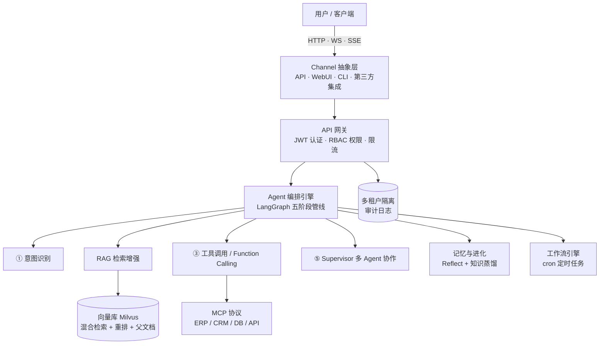

# ai-assistant

[](LICENSE)
[](https://github.com/lwmjava/ai-assistant/stargazers)
[](CONTRIBUTING.md)
[](https://www.python.org)
[](docker-compose.yml)

> **ai-assistant** 是一个面向企业的开源 AI 助手平台，基于深度文档理解（RAG）与 Agent 编排，通过 MCP 协议连接私有知识库与企业系统，提供精准、可追溯且安全的智能问答与自动化工作流。

## 项目定位

**ai-assistant** 是一个面向企业的开源 AI 助手平台，围绕 **RAG 检索增强生成** 与 **Agent 编排** 两大核心能力构建，通过 **MCP 协议** 连接企业内部的文档、业务系统与第三方服务，帮助团队快速搭建可私有部署、回答可追溯、权限可管控的智能问答与自动化工作流。

平台提供以下核心能力：

- **企业知识问答**：上传 PDF / Word / Excel / PPTX 等文档，基于混合检索与重排序生成精准、附带引用来源的回答，消除大模型幻觉；
- **Agent 智能编排**：内置五阶段推理管线（意图识别 → 检索 → 工具调用 → 多 Agent 协作 → 流式响应），应对复杂业务逻辑；
- **系统互联互通**：原生支持 MCP 协议，无缝对接 ERP / CRM / 数据库 / 第三方 API，打破数据孤岛；
- **企业级管控**：内置 RBAC 多租户隔离、敏感词护栏与全链路审计日志，保障数据安全与合规；
- **开箱即用**：提供 Docker 一键部署与现代化聊天界面，降低落地门槛。

## 核心特性

- **深度文档理解（Deep RAG）**：PDF / Word / Excel / PPTX 等多模态文档解析，混合检索（向量 + 关键词）+ 重排序，答案精准可追溯。
- **Agent 编排引擎**：LangGraph 驱动的五阶段管线（意图识别 → RAG → 工具调用 → Supervisor 多 Agent 协作 → 流式响应）。
- **原生 MCP 协议**：作为 AI 与企业系统的「万能连接器」，无缝对接 ERP / CRM / 数据库 / 第三方 API。
- **企业级安全与权限**：RBAC 多租户隔离、敏感词护栏（Guardrails）、全链路审计日志。
- **开箱即用**：Docker 一键部署 + 现代化聊天 UI。

## 架构概览



## 技术栈

| 层 | 技术 |
|----|------|
| 后端 | Python 3.11+ · FastAPI · LangGraph · LangChain · SQLModel · Pydantic v2 |
| 向量库 | Milvus（生产级分布式向量检索） |
| 前端 | React 18 · TypeScript · Vite |
| 协议 | MCP（Model Context Protocol） |
| 部署 | Docker Compose（见 docker-compose.yml） |

## 快速开始

### 本地开发

```bash
# 1. 克隆并进入仓库
git clone https://github.com/lwmjava/ai-assistant.git
cd ai-assistant

# 2. 创建虚拟环境并安装依赖
python -m venv .venv
source .venv/bin/activate        # Windows: .venv\Scripts\activate
pip install -r requirements.txt

# 3. 配置环境变量
cp .env.example .env             # 按需修改 JWT_SECRET_KEY 等

# 4. 启动服务
uvicorn app.main:app --reload
# 打开 http://127.0.0.1:8000/docs 查看交互式 API 文档
```

### Docker 一键部署

```bash
docker compose up -d --build
# 服务默认监听 http://localhost:8000
```

更完整的开发环境搭建与贡献规范请参见 **[CONTRIBUTING.md](CONTRIBUTING.md)**。

## 贡献

欢迎参与建设！提交 Issue、完善文档或贡献代码前，请先阅读 **[CONTRIBUTING.md](CONTRIBUTING.md)** 了解行为规范、分支策略与提交信息约定。

## 许可证

本项目基于 [Apache License 2.0](LICENSE) 开源。
