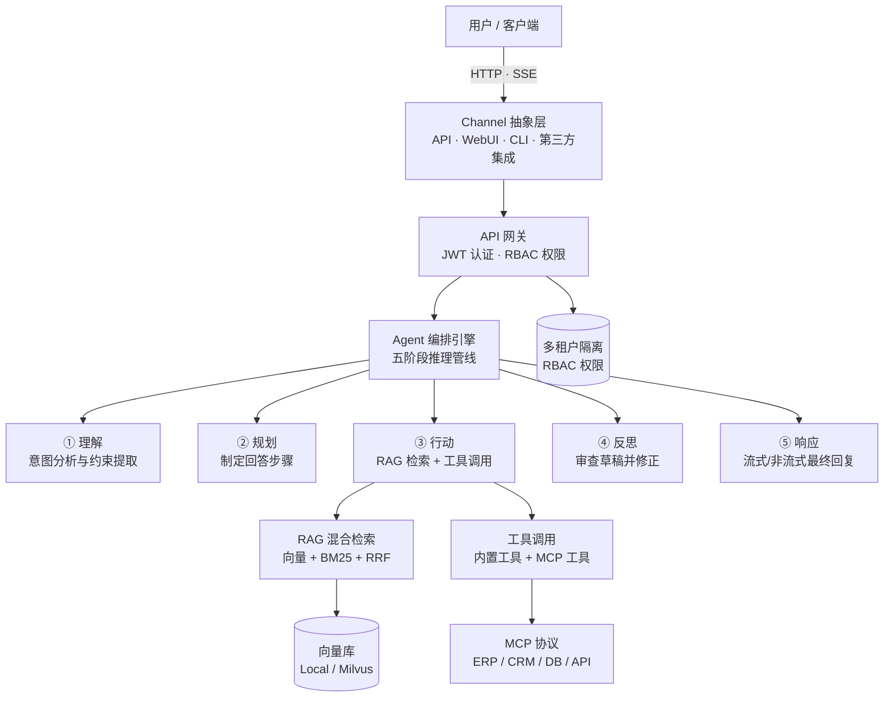

# ai-assistant

[](LICENSE)
[](CONTRIBUTING.md)
[](https://www.python.org)
[](docker-compose.yml)

> **ai-assistant** 是一个面向企业的开源 AI 助手平台，基于深度文档理解（RAG）与 Agent 编排，通过 MCP 协议连接私有知识库与企业系统，提供精准、可追溯且安全的智能问答。

## 项目定位

**ai-assistant** 围绕 **RAG 检索增强生成** 与 **Agent 编排** 两大核心能力构建，通过 **MCP 协议** 连接企业内部的文档、业务系统与第三方服务，帮助团队快速搭建可私有部署、回答可追溯、权限可管控的智能问答系统。

平台提供以下核心能力：

- **企业知识问答**：上传文档并自动分块嵌入，基于混合检索（向量 + 关键词 + RRF 融合）生成精准、附带引用来源的回答；
- **Agent 智能编排**：内置五阶段推理管线（理解 → 规划 → 行动 → 反思 → 响应），支持工具调用与 Function Calling；
- **系统互联互通**：原生支持 MCP 协议，无缝对接 ERP / CRM / 数据库 / 第三方 API，打破数据孤岛；
- **企业级管控**：RBAC 五级角色（系统管理员 / 系统访客 / 租户管理员 / 成员 / 访客）与多租户隔离，保障数据安全；
- **开箱即用**：Docker 一键部署，零额外依赖的本地向量库模式，降低落地门槛。

## 核心特性

- **混合检索 RAG**：向量稠密检索 + BM25 关键词检索 + RRF 倒数排名融合，答案精准可追溯。
- **五阶段 Agent 管线**：理解 → 规划 → 行动（含工具调用循环）→ 反思 → 响应，逐步逼近高质量回答。
- **流式与非流式双模式**：支持 SSE 流式增量输出（逐字推送 + 阶段进度广播），也支持一次性返回。
- **原生 MCP 协议**：作为 AI 与企业系统的「万能连接器」，将 MCP 服务器工具动态注入 Agent 工具箱。
- **多 LLM 提供商**：DeepSeek / OpenAI 兼容接口 / Ollama 本地部署 / Mock 离线占位，默认适配 DeepSeek，无 API Key 时自动降级为 Mock。
- **灵活向量库**：本地模式（SQLite + numpy，零额外依赖）或生产模式（Milvus 分布式）。
- **企业级安全**：JWT 双令牌（access + refresh）、RBAC 五级角色权限矩阵、多租户数据隔离。

## 架构概览



## 技术栈

| 层 | 技术 |
|----|------|
| 后端框架 | Python 3.11+ · FastAPI 0.115 · SQLModel 0.0.22 · Pydantic v2 |
| 数据库 | SQLite（开发）/ PostgreSQL 16（生产） |
| 向量库 | Local（SQLite + numpy）或 Milvus 2.4（分布式） |
| LLM | DeepSeek / OpenAI 兼容接口 · Ollama 本地 · Mock 离线 |
| 嵌入模型 | OpenAI 兼容 `/embeddings` 协议（DeepSeek / OpenAI / 智谱 / BGE-M3 等） |
| 协议 | MCP（Model Context Protocol） |
| Web 控制台 | TypeScript · React 18 · Vite 5 · Tailwind CSS 3 · TanStack Query |
| 部署 | Docker Compose；或由 FastAPI 单进程同时提供 API 与控制台 |

## 项目结构

仓库按 **分层目录 + 能力模块** 组织：`core` / `api` / `services` / `models` 是稳定分层，一般不随功能增减；`agents` / `rag` / `mcp` 等是可复用的技术能力，只有独立能力域才在 `app/` 下新开包。业务场景（如面试官）应落在 `services/` + `api/routes/`，不要按产品功能名平铺顶层目录。

```
ai-assistant/
├── app/                         # 应用主代码
│   ├── main.py                  # FastAPI 入口、lifespan（建库、校验、调度器）
│   ├── core/                    # 基础设施：配置、数据库、JWT/RBAC（不依赖 FastAPI）
│   ├── models/                  # 数据模型（SQLModel 表，不含业务逻辑）
│   ├── schemas/                 # 请求/响应契约（Pydantic）
│   ├── api/                     # HTTP 路由（薄层：校验、调 service、返回）
│   │   ├── deps.py              # 依赖注入：get_db / get_current_user / 权限守卫
│   │   └── routes/              # health、auth、chat、rag、mcp、workflow、audit
│   ├── services/                # 业务编排：对话、认证
│   ├── agents/                  # Agent 编排：五阶段管线、Supervisor、工具、Skills、沙箱
│   ├── llm/                     # LLM 抽象 + 工厂（OpenAI 兼容 / Mock）
│   ├── rag/                     # RAG：摄取、嵌入、向量库、混合检索
│   ├── mcp/                     # MCP 客户端：连接企业系统并注入工具
│   ├── workflow/                # 工作流：cron 调度、引擎、桥接到对话
│   ├── memory/                  # 对话窗口裁剪与 LLM 压缩
│   ├── security/                # 内容安全治理（输入/输出过滤、注入检测；非 JWT 鉴权）
│   ├── audit/                   # 审计日志写入与 Admin 查询
│   ├── evolution/               # Reflect 反思与 Distill 夜间蒸馏
│   ├── debug/                   # Agent 执行 Trace
│   └── channels/                # 多入口抽象（当前登记 HTTP）
├── tests/                       # pytest 测试
├── frontend/                    # Web 控制台（Vite + React + TS，见 frontend/README.md）
├── alembic/                     # 数据库迁移
├── docs/                        # 设计文档与 OpenAPI 导出
├── AGENT.md                     # AI / 贡献者开发规则（模块边界与扩展约定）
├── pyproject.toml               # 依赖与工具配置
└── docker-compose.yml
```

JWT 鉴权、网关、缓存属于基础设施，分别落在 `core/` 与 `api/`，不单独开顶层包。新增目录的判断标准见 [AGENT.md](AGENT.md)「何时新开顶层目录」。

## API 端点

| 模块 | 方法 | 路径 | 说明 |
|------|------|------|------|
| 系统 | `GET` | `/` | 服务基本信息 |
| 系统 | `GET` | `/api/health` | 健康检查 |
| 认证 | `POST` | `/api/auth/login` | 用户名密码登录，返回双令牌 |
| 认证 | `POST` | `/api/auth/refresh` | 刷新令牌（refresh 轮转） |
| 认证 | `GET` | `/api/auth/me` | 当前用户信息 |
| 对话 | `POST` | `/api/chat` | 非流式对话 |
| 对话 | `POST` | `/api/chat/stream` | SSE 流式对话 |
| 对话 | `GET` | `/api/chat/conversations` | 会话列表 |
| 对话 | `GET` | `/api/chat/conversations/{id}` | 会话详情（含消息） |
| 对话 | `DELETE` | `/api/chat/conversations/{id}` | 删除会话 |
| 对话 | `GET` | `/api/chat/tools` | 可用工具列表 |
| 知识库 | `POST` | `/api/rag/documents/ingest` | 文本摄取（自动分块嵌入） |
| 知识库 | `POST` | `/api/rag/documents/upload` | 上传 .txt/.md 文件 |
| 知识库 | `GET` | `/api/rag/documents` | 文档列表 |
| 知识库 | `GET` | `/api/rag/documents/{id}` | 文档详情 |
| 知识库 | `DELETE` | `/api/rag/documents/{id}` | 删除文档 |
| 知识库 | `POST` | `/api/rag/search` | 混合检索 |
| MCP | `GET` | `/api/mcp/servers` | 已配置的 MCP 服务器 |
| MCP | `GET` | `/api/mcp/tools` | 已连接 MCP 工具列表 |
| 工作流 | `GET` / `POST` | `/api/workflows` | 工作流列表 / 创建（需 `WORKFLOW_ENABLED`） |
| 工作流 | `GET` / `PUT` / `DELETE` | `/api/workflows/{id}` | 工作流详情、更新、删除 |
| 工作流 | `GET` | `/api/workflows/{id}/executions` | 执行历史 |
| 工作流 | `POST` | `/api/workflows/{id}/run` | 手动触发 |
| 工作流 | `POST` | `/api/workflows/{id}/toggle` | 启停开关 |
| 审计 | `GET` | `/api/admin/audit-logs` | 审计日志查询（系统管理员） |

> 启动后访问 `http://127.0.0.1:8000/docs` 查看交互式 Swagger API 文档。

## 快速开始

### 本地开发

```bash
# 1. 克隆并进入仓库
git clone https://github.com/lwmjava/ai-assistant.git
cd ai-assistant

# 2. 创建虚拟环境并安装依赖
python -m venv .venv
source .venv/bin/activate        # Windows: .venv\Scripts\activate
pip install -r requirements.txt

# 3. 配置环境变量
cp .env.example .env             # 按需修改 JWT_SECRET_KEY、LLM_API_KEY 等

# 4. 启动服务
uvicorn app.main:app --reload
# 打开 http://127.0.0.1:8000/docs 查看交互式 API 文档
```

### Web 控制台（可选）

`frontend/` 下是配套 Web 控制台，覆盖对话、知识库、工具与 MCP、工作流、审计日志六个模块。

```bash
# 方式一：开发模式（前后端分离，前端热更新，/api 自动代理到 8000）
cd frontend && npm install && npm run dev     # http://localhost:5173

# 方式二：单进程托管（构建产物由 FastAPI 直接提供，无需 Nginx 或 Node 进程）
cd frontend && npm install && npm run build
cd .. && echo "SERVE_FRONTEND=true" >> .env
uvicorn app.main:app                          # http://127.0.0.1:8000
```

两种方式的差别与托管细节见 [frontend/README.md](frontend/README.md)。

### Docker 一键部署

```bash
docker compose up -d --build
# 服务默认监听 http://localhost:8000
```

### 关键配置项

| 环境变量 | 说明 | 默认值 |
|----------|------|--------|
| `ENV` | 运行环境：`development` / `production` | `development` |
| `DATABASE_URL` | 数据库连接串 | `sqlite:///./data/ai_assistant.db` |
| `JWT_SECRET_KEY` | JWT 签名密钥（生产环境必须修改） | 默认占位值 |
| `AUTH_ENABLED` | 是否启用认证 | `true` |
| `LLM_PROVIDER` | 大模型提供商：`openai` / `ollama` / `mock` | `openai` |
| `LLM_BASE_URL` | 大模型 API 地址（兼容 OpenAI 协议均可） | `https://api.deepseek.com/v1` |
| `LLM_API_KEY` | 大模型 API Key（为空时开发环境自动降级 Mock） | — |
| `LLM_DEFAULT_MODEL` | 默认模型名 | `deepseek-chat` |
| `RAG_ENABLED` | 是否启用 RAG 检索 | `false` |
| `RAG_VECTOR_STORE` | 向量库后端：`local` / `milvus` | `local` |
| `RAG_BACKEND` | 切分/检索策略：`native` / `langchain` / `llamaindex` | `native` |
| `RAG_LANGCHAIN_SPLITTER` | LangChain 切分器（当前仅 `recursive`） | `recursive` |
| `RAG_LLAMAINDEX_SPLITTER` | LlamaIndex 切分器：`sentence` / `markdown` | `sentence` |
| `EMBEDDING_PROVIDER` | 嵌入模型提供商 | `openai` |
| `MCP_ENABLED` | 是否启用 MCP 客户端 | `false` |
| `MCP_SERVERS` | MCP 服务器清单（JSON 数组） | — |
| `WORKFLOW_ENABLED` | 是否启用工作流引擎 | `false` |
| `SKILL_ENABLED` | 是否启用 YAML 技能注入 | `true` |
| `MEMORY_ENABLED` | 是否启用对话窗口与压缩 | `true` |
| `AUDIT_ENABLED` | 是否启用审计日志 | `true` |
| `SECURITY_ENABLED` | 是否启用内容安全治理 | `true` |
| `AGENT_ORCHESTRATION` | 编排实现：`self` / `langgraph` | `self` |
| `SERVE_FRONTEND` | 是否由本进程托管 `frontend/dist`（开启后 `GET /` 返回控制台） | `false` |
| `CORS_ORIGINS` | 允许的跨域来源（前后端分离部署时必填） | `*` |

完整配置项见 [`.env.example`](.env.example)。

## 开发

```bash
# 安装开发依赖
pip install -e ".[dev]"

# 运行测试
pytest

# 代码检查
ruff check .
mypy app/
```

## 贡献

欢迎参与建设！提交 Issue、完善文档或贡献代码前，请先阅读 **[CONTRIBUTING.md](CONTRIBUTING.md)** 了解行为规范、分支策略与提交信息约定。

## 许可证

本项目基于 [Apache License 2.0](LICENSE) 开源。
