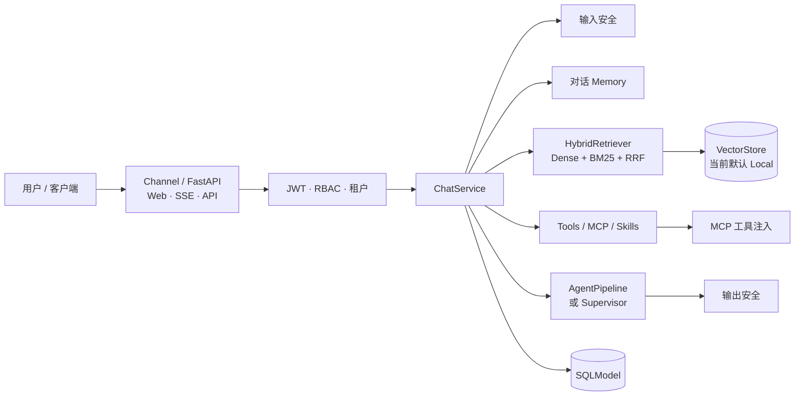
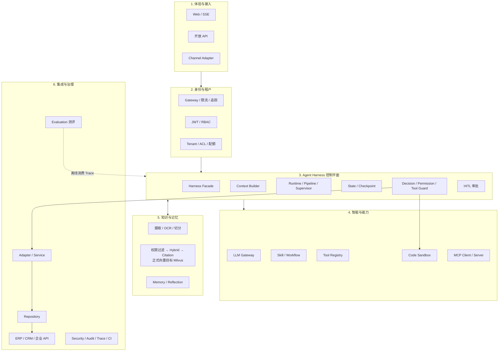
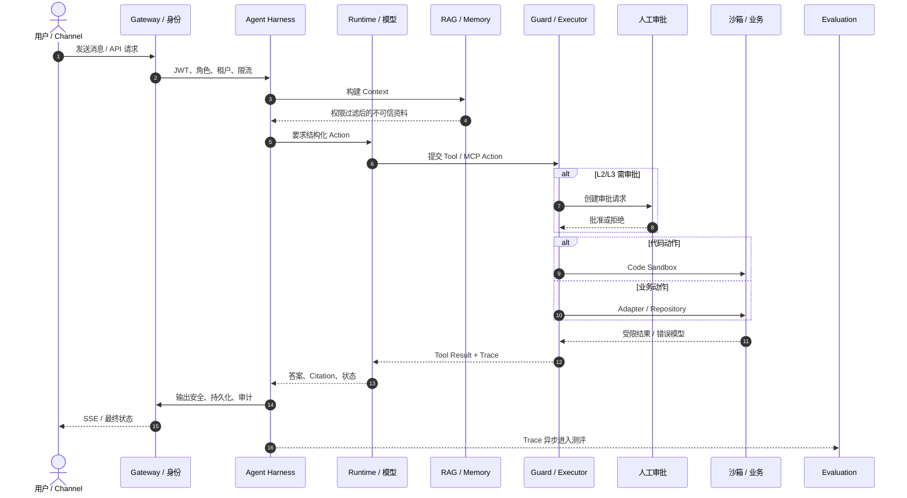

# ai-assistant

[](LICENSE)
[](CONTRIBUTING.md)
[](https://www.python.org)
[](docker-compose.yml)

> **ai-assistant** 是一个面向企业的开源 AI 助手平台，基于 RAG 与 Agent 编排，通过 MCP 连接私有知识库与受控企业能力。当前主链已可用；rag-v0.1 检索基线已冻结。结构化 Citation 与独立 Harness 仍是目标能力，详见下方架构概览。

## 项目定位

**ai-assistant** 围绕 **RAG 检索增强生成** 与 **Agent 编排** 两大核心能力构建，通过 **MCP 协议** 连接企业内部的文档、业务系统与第三方服务，帮助团队快速搭建可私有部署、回答带来源文本、权限可管控的智能问答系统。当前引用以 source 文本为主，结构化 Citation 为 TARGET。

平台提供以下核心能力：

- **企业知识问答**：上传文档并自动分块处理，通过输入护栏的块生成向量，超限结构保留原文并返回未向量化原因；基于混合检索（向量 + 关键词 + RRF 融合）生成附带来源文本的回答；结构化 Citation 为 TARGET；
- **Agent 智能编排**：内置五阶段推理管线（理解 → 规划 → 行动 → 反思 → 响应），支持工具调用与 Function Calling；
- **系统互联互通**：原生支持 MCP 协议，经受控工具接入企业系统与第三方 API；Agent 不得直连业务数据库；
- **企业级管控**：RBAC 五级角色（系统管理员 / 系统访客 / 租户管理员 / 成员 / 访客）与多租户隔离，保障数据安全；
- **开箱即用**：Docker 一键部署，零额外依赖的本地向量库模式，降低落地门槛。

## 核心特性

- **混合检索 RAG**：向量稠密检索 + BM25 关键词检索 + RRF 融合。当前引用以 source 文本为主；结构化 Citation 为 TARGET。
- **五阶段 Agent 管线**：理解 → 规划 → 行动（含工具调用循环）→ 反思 → 响应，逐步逼近高质量回答。
- **流式与非流式双模式**：支持 SSE 流式增量输出（逐字推送 + 阶段进度广播），也支持一次性返回。
- **原生 MCP 协议**：作为 AI 与企业系统的「万能连接器」，将 MCP 服务器工具动态注入 Agent 工具箱。
- **多 LLM 提供商**：对话和意图分流可以各接一家 OpenAI 兼容接口，主家失败后再试兜底那一家。开发环境没有可用密钥时降为 Mock，对话页会提示填写密钥并重启。
- **灵活向量库**：默认 Local（SQLite + numpy，零额外依赖）。Milvus 为可选适配（Partial，ADR-0002：本阶段正式 Local，Milvus 实验）。升格须另开 ADR 并补摄取/检索/删除闭环证据。
- **企业级安全**：JWT 双令牌（access + refresh）、RBAC 五级角色权限矩阵、多租户数据隔离。

## 架构概览

文档必须同时保留 **As-Is（当前实现）** 与 **TARGET（最终形态）**。目标图不能替代当前事实；当前调用链不能替代产品最终边界。权威文字稿见 [`docs/product/项目产品需求方案.md`](docs/product/项目产品需求方案.md) §3.1，可视化见 [`docs/architecture/target-agent-harness-architecture.html`](docs/architecture/target-agent-harness-architecture.html)。

### 当前实现（As-Is）

当前对话主链以 `ChatService` + 自研五阶段 `AgentPipeline`（可选 LangGraph Supervisor）为中心。独立 Agent Harness、Context Builder、Tool Executor、State Manager 和结构化 Citation 仍属目标治理，不得写成已完成。版本化 Evaluation（rag-v0.1）与 VectorStore ADR-0002 已落地。


```mermaid
flowchart LR
    User[用户 / 客户端] --> Channel[Channel / FastAPI<br/>Web · SSE · API]
    Channel --> Auth[JWT · RBAC · 租户]
    Auth --> Chat[ChatService]
    Chat --> SecIn[输入安全]
    Chat --> Mem[对话 Memory]
    Chat --> RAG[HybridRetriever<br/>Dense + BM25 + RRF]
    Chat --> Tools[Tools / MCP / Skills]
    Chat --> Pipe[AgentPipeline<br/>或 Supervisor]
    Pipe --> SecOut[输出安全]
    Chat --> DB[(SQLModel)]
    RAG --> VS[(VectorStore<br/>当前默认 Local)]
    Tools --> MCP[MCP 工具注入]
```

默认配置事实：`AGENT_ORCHESTRATION=self`，`RAG_BACKEND=native`，`RAG_VECTOR_STORE=local`，`RAG_ENABLED=true`，`SECURITY_BLOCK_ON_INJECTION=false`。正式向量库目标为 Milvus（ADR-0002，开发 Lite / 生产 2.4+）；第 5 节门槛通过前不改默认。Trace 以内存环形缓冲为主。无真实 Embedding 时 Mock 只能证明链路，不能证明检索质量。

### 最终目标架构（TARGET）

目标依赖方向：`Channel/API → Harness → Runtime → Skill → Tool Executor → Service/Adapter → Repository → 数据与外部系统`。

- 第 3 层 **Agent Harness** 只负责编排：Context、Runtime、State、预算、Guard、HITL。
- **Code Sandbox** 在第 4 层，由 Tool Guard 调用；代码动作不得在宿主进程执行。
- **Evaluation 测评** 是离线横切能力，消费 Trace 与版本化数据集，不阻塞在线请求。

下图是目标形态，不是当前施工顺序。日历推进顺序见 [`docs/plans/plan_delivery_2027-03-25.md`](docs/plans/plan_delivery_2027-03-25.md)：阶段 A（知识库治理）→ B（最小安装点）→ C（MVP）→ D（完整交付）。


```mermaid
flowchart TB
    subgraph C["1. 体验与接入"]
        WEB[Web / SSE]
        API[开放 API]
        CH[Channel Adapter]
    end
    subgraph I["2. 身份与租户"]
        GW[Gateway / 限流 / 追踪]
        ID[JWT / RBAC]
        TEN[Tenant / ACL / 配额]
    end
    subgraph H["3. Agent Harness 控制平面"]
        HF[Harness Facade]
        CB[Context Builder]
        RT[Runtime / Pipeline / Supervisor]
        ST[State / Checkpoint]
        GD[Decision / Permission / Tool Guard]
        HITL[HITL 审批]
    end
    subgraph A["4. 智能与能力"]
        LLM[LLM Gateway]
        SK[Skill / Workflow]
        REG[Tool Registry]
        SB[Code Sandbox]
        MCP2[MCP Client / Server]
    end
    subgraph K["5. 知识与记忆"]
        ING[摄取 / OCR / 切分]
        RET[权限过滤 → Hybrid → Citation<br/>正式向量目标 Milvus]
        MEM[Memory / Reflection]
    end
    subgraph B["6. 集成与治理"]
        ADP[Adapter / Service]
        REPO[Repository]
        BIZ[ERP / CRM / 企业 API]
        EV[Evaluation 测评]
        SEC[Security / Audit / Trace / CI]
    end
    C --> I --> H --> A
    H <--> K
    GD --> SB
    GD --> ADP --> REPO --> BIZ
    EV -.->|离线消费 Trace| H
```

### 目标请求时序（TARGET）


```mermaid
sequenceDiagram
    autonumber
    actor User as 用户 / Channel
    participant GW as Gateway / 身份
    participant H as Agent Harness
    participant RT as Runtime / 模型
    participant RAG as RAG / Memory
    participant GX as Guard / Executor
    participant HITL as 人工审批
    participant EX as 沙箱 / 业务
    participant EV as Evaluation

    User->>GW: 发送消息 / API 请求
    GW->>H: JWT、角色、租户、限流
    H->>RAG: 构建 Context
    RAG-->>H: 权限过滤后的不可信资料
    H->>RT: 要求结构化 Action
    RT->>GX: 提交 Tool / MCP Action
    alt L2/L3 需审批
        GX->>HITL: 创建审批请求
        HITL-->>GX: 批准或拒绝
    end
    alt 代码动作
        GX->>EX: Code Sandbox
    else 业务动作
        GX->>EX: Adapter / Repository
    end
    EX-->>GX: 受限结果 / 错误模型
    GX-->>RT: Tool Result + Trace
    RT-->>H: 答案、Citation、状态
    H->>GW: 输出安全、持久化、审计
    GW-->>User: SSE / 最终状态
    H-->>EV: Trace 异步进入测评
```

### 目标能力与当前状态（防漂移）

| 能力 | 当前状态 | 目标边界 |
|---|---|---|
| Agent 编排 | `Partial`：`ChatService` + `AgentPipeline` 承担部分 Harness | 独立 Harness / Context / State / 预算 / 恢复 |
| RAG | `Partial`：多格式摄取、混合检索、检索注入块剔除与不可信围栏；默认未注入对话 | 资源 ACL Planned；生效日期 ADR-0003 Accepted 但 Flag 默认关；结构化 Citation |
| 代码沙箱 | `Partial`：存在沙箱工具路径 | 代码动作必须经四层隔离，不得宿主执行 |
| MCP / 工具 | `Partial`：工具与 MCP 可注入 | 完整 Tool Contract；经 Executor，不直连数据库 |
| 测评 | `Partial`：rag-v0.1 Gold 与检索基线已有；未测真实 LLM 生成层 | 离线 RAG / Agent / Skill / Safety 评测 |
| 向量库 | 默认 `local`（ADR-0002 Accepted）；Milvus 实验/`Partial` | 升格 Milvus 须另开 ADR，禁止口头升级为已生产 |

状态术语与 `AGENTS.md` 一致：`Implemented` / `Partial` / `Planned` / `Deferred`。禁止把 `Planned` 写成已交付。

## 技术栈

| 层 | 技术 |
|----|------|
| 后端框架 | Python 3.11+ · FastAPI 0.115 · SQLModel 0.0.22 · Pydantic v2 |
| 数据库 | SQLite（开发）/ PostgreSQL 16（生产） |
| 向量库 | Local（SQLite + numpy）或 Milvus 2.4（分布式） |
| LLM | DeepSeek / OpenAI 兼容接口 · Ollama 本地 · Mock 离线 |
| 嵌入模型 | OpenAI 兼容 `/embeddings` 协议（DeepSeek / OpenAI / 智谱 / BGE-M3 等） |
| 协议 | MCP（Model Context Protocol） |
| Web 控制台 | TypeScript · React 18 · Vite 5 · Tailwind CSS 3 · TanStack Query |
| 部署 | Docker Compose；或由 FastAPI 单进程同时提供 API 与控制台 |

## 项目结构

仓库按 **分层目录 + 能力模块** 组织：`core` / `api` / `services` / `models` 是稳定分层，一般不随功能增减；`agents` / `rag` / `mcp` 等是可复用的技术能力，只有独立能力域才在 `app/` 下新开包。业务场景（如面试官）应落在 `services/` + `api/routes/`，不要按产品功能名平铺顶层目录。

```
ai-assistant/
├── app/                         # 应用主代码
│   ├── main.py                  # FastAPI 入口、lifespan（建库、校验、调度器）
│   ├── core/                    # 基础设施：配置、数据库、JWT/RBAC（不依赖 FastAPI）
│   ├── models/                  # 数据模型（SQLModel 表，不含业务逻辑）
│   ├── schemas/                 # 请求/响应契约（Pydantic）
│   ├── api/                     # HTTP 路由（薄层：校验、调 service、返回）
│   │   ├── deps.py              # 依赖注入：get_db / get_current_user / 权限守卫
│   │   └── routes/              # health、auth、chat、rag、mcp、workflow、audit
│   ├── services/                # 业务编排：对话、认证
│   ├── agents/                  # Agent 编排：五阶段管线、Supervisor、工具、Skills、沙箱
│   ├── llm/                     # LLM 抽象 + 工厂（OpenAI 兼容 / Mock）
│   ├── rag/                     # RAG：摄取、嵌入、向量库、混合检索
│   ├── mcp/                     # MCP 客户端：连接企业系统并注入工具
│   ├── workflow/                # 工作流：cron 调度、引擎、桥接到对话
│   ├── memory/                  # 对话窗口裁剪与 LLM 压缩
│   ├── security/                # 内容安全治理（输入/输出过滤、注入检测；非 JWT 鉴权）
│   ├── audit/                   # 审计日志写入与 Admin 查询
│   ├── evolution/               # Reflect 反思与 Distill 夜间蒸馏
│   ├── debug/                   # Agent 执行 Trace
│   └── channels/                # 多入口抽象（当前登记 HTTP）
├── tests/                       # pytest 测试
├── frontend/                    # Web 控制台（Vite + React + TS，见 frontend/README.md）
├── alembic/                     # 数据库迁移
├── docs/                        # 设计文档与 OpenAPI 导出
│   ├── product/项目产品需求方案.md
│   └── architecture/target-agent-harness-architecture.html
├── AGENTS.md                    # AI / 贡献者开发规则（模块边界与扩展约定）
├── pyproject.toml               # 依赖与工具配置
└── docker-compose.yml
```

JWT 鉴权、网关、缓存属于基础设施，分别落在 `core/` 与 `api/`，不单独开顶层包。新增目录的判断标准见 [AGENTS.md](AGENTS.md) 的架构边界。

## API 端点

| 模块 | 方法 | 路径 | 说明 |
|------|------|------|------|
| 系统 | `GET` | `/` | 服务基本信息 |
| 系统 | `GET` | `/api/health` | 健康检查 |
| 认证 | `POST` | `/api/auth/login` | 用户名密码登录，返回双令牌 |
| 认证 | `POST` | `/api/auth/refresh` | 刷新令牌（refresh 轮转） |
| 认证 | `GET` | `/api/auth/me` | 当前用户信息 |
| 认证 | `POST` | `/api/auth/register` | 公开注册为 `default` 租户的 member，并返回双令牌 |
| 认证 | `GET` | `/api/auth/setup-status` | 是否还没有系统管理员 |
| 认证 | `POST` | `/api/auth/setup` | 没有系统管理员时创建首个管理员；已有时 404 |
| 认证 | `POST` | `/api/auth/users/{user_id}/revoke-tokens` | 系统管理员撤销该用户的刷新令牌 |
| 认证 | `GET` | `/api/auth/memberships` | 当前用户已加入的租户 |
| 认证 | `POST` | `/api/auth/switch-tenant` | 换成已加入的租户并换发令牌；非成员 403 |
| 邀请 | `POST` | `/api/invitations` | 系统管理员或租户管理员生成邀请码 |
| 邀请 | `GET` | `/api/invitations` | 列出该租户的邀请码 |
| 邀请 | `POST` | `/api/invitations/accept` | 已登录用户凭码加入租户，不切换当前会话 |
| 用户 | `GET` | `/api/admin/users` | 系统管理员分页列出用户，含编号和租户名称 |
| 用户 | `PATCH` | `/api/admin/users/{user_id}` | 修改角色；不能修改自己 |
| 用户 | `POST` | `/api/admin/users/{user_id}/disable` | 停用用户，令牌随后失效；不能停用自己 |
| 租户 | `PATCH` | `/api/admin/tenants/{tenant_id}` | 修改未停用租户的名称 |
| 租户 | `POST` | `/api/admin/tenants/{tenant_id}/deactivate` | 停用租户；当前在该租户中的成员不能继续访问 |
| 系统 | `GET` | `/api/admin/system/status` | 系统管理员查看数据库、向量库、版本和启动时间 |
| 对话 | `POST` | `/api/chat` | 非流式对话。响应含 `sources` 与 `code_results`（代码执行的 `status`、`stdout`、`reason`，不含宿主机路径） |
| 对话 | `POST` | `/api/chat/stream` | SSE 流式对话。`code_result` 事件带同结构的单次执行结果 |
| 对话 | `GET` | `/api/chat/conversations` | 会话列表 |
| 对话 | `GET` | `/api/chat/conversations/{conversation_id}` | 会话详情。助手消息含 `code_results`，刷新后仍在 |
| 对话 | `PATCH` | `/api/chat/conversations/{conversation_id}` | 重命名会话（请求体只有 `title`） |
| 对话 | `DELETE` | `/api/chat/conversations/{conversation_id}` | 删除会话 |
| 对话 | `GET` | `/api/chat/tools` | 可用工具列表 |
| 知识库 | `POST` | `/api/rag/documents/ingest` | 文本摄取（自动分块嵌入） |
| 知识库 | `POST` | `/api/rag/documents/upload` | 上传 txt/md/json/xml/csv/doc/xls/ppt/docx/xlsx/pptx/pdf 文件，默认单文件不超过 10MB（扫描版 PDF 可配合 OCR） |
| 知识库 | `GET` | `/api/rag/documents` | 文档列表 |
| 知识库 | `GET` | `/api/rag/documents/{document_id}` | 文档详情 |
| 知识库 | `DELETE` | `/api/rag/documents/{document_id}` | 删除文档 |
| 知识库 | `POST` | `/api/rag/search` | 混合检索 |
| MCP | `GET` | `/api/mcp/servers` | 已配置的 MCP 服务器 |
| MCP | `GET` | `/api/mcp/tools` | 已连接 MCP 工具列表 |
| 工作流 | `GET` / `POST` | `/api/workflows` | 工作流列表 / 创建（需 `WORKFLOW_ENABLED`） |
| 工作流 | `GET` / `PUT` / `DELETE` | `/api/workflows/{workflow_id}` | 工作流详情、更新、删除 |
| 工作流 | `GET` | `/api/workflows/{workflow_id}/executions` | 执行历史 |
| 工作流 | `POST` | `/api/workflows/{workflow_id}/run` | 手动触发 |
| 工作流 | `POST` | `/api/workflows/{workflow_id}/toggle` | 启停开关 |
| 审计 | `GET` | `/api/admin/audit-logs` | 审计日志查询（系统管理员） |
| 租户 | `GET` | `/api/admin/tenants` | 列出未停用租户；`include_inactive=true` 时含已停用（仅系统管理员） |
| 租户 | `POST` | `/api/admin/tenants` | 创建租户；未停用名称唯一，重名 409（仅系统管理员） |
| 租户 | `POST` | `/api/admin/tenants/{tenant_id}/users` | 在指定未停用租户下创建成员；角色固定为 member（仅系统管理员） |

> 启动后访问 `http://127.0.0.1:8000/docs` 查看交互式 Swagger API 文档。

## 快速开始

第一次使用按下面五步走。开发模式的控制台在 `http://localhost:5173`。若已构建前端并把 `SERVE_FRONTEND=true` 写入 `.env`，同一套页面在 `http://127.0.0.1:8000`。

### 1. 填写环境

```bash
git clone https://github.com/lwmjava/ai-assistant.git
cd ai-assistant
python -m venv .venv
source .venv/bin/activate        # Windows: .venv\Scripts\activate
pip install -r requirements.txt
cp .env.example .env
```

`pip install -r requirements.txt` 会安装调度依赖 `croniter`。`pip install -e ".[workflow]"` 也会。`WORKFLOW_ENABLED` 默认是 `false`；打开后，进程启动时创建调度任务。到点是否执行尚未完成。

Supervisor 不在默认安装里。要启用它，执行 `pip install -e ".[langgraph]"`（`langgraph>=1.0.0,<1.1`），再把 `AGENT_ORCHESTRATION` 设为 `langgraph`。这时只有明确要求多轮调研的问题才进入 Supervisor；不需要工具和知识库的问题只生成一次。没装这个包时，多轮请求回退五阶段管线。默认配置仍是 `self`。

至少改 `JWT_SECRET_KEY`。要让对话调用真实模型，再填 `LLM_API_KEY`。可选：同时填写 `INITIAL_ADMIN_USERNAME` 和 `INITIAL_ADMIN_PASSWORD`，启动时会创建系统管理员和名为 `default` 的租户。两项都空着时，不自动建管理员，改由下一步的 `/setup` 创建。

也可以用命令迁移数据库并创建系统管理员。在仓库根目录执行 `pip install -e .` 之后：

```bash
ai-assistant migrate --yes
```

没有待执行的迁移时，这条命令成功退出，并说明数据库已是最新。`--yes` 跳过确认。未安装控制台脚本时，用 `python -m app.cli migrate --yes`，效果相同。`python -m app.core.migration migrate` 仍然可用。

创建时密码放在环境变量 `INITIAL_ADMIN_PASSWORD`，不要写进命令参数。密码至少 8 位。库里已经有系统管理员时，命令会拒绝：

```bash
# Windows PowerShell
$env:INITIAL_ADMIN_PASSWORD = "至少 8 位的密码"
ai-assistant admin create-superuser --username admin

# bash
INITIAL_ADMIN_PASSWORD="至少 8 位的密码" ai-assistant admin create-superuser --username admin
```

命令的输出和日志只包含用户名。环境变量引导和页面 `/setup` 仍然可用。

失败时看：`.env` 没被读到，多半是进程还停在改文件之前，重新启动后端。生产环境若 `JWT_SECRET_KEY` 仍是占位值，进程会拒绝启动，终端里有安全校验失败的报错。

### 2. 启动

```bash
uvicorn app.main:app --reload
```

另开一个终端启动控制台：

```bash
cd frontend
npm install
npm run dev
```

单进程托管时，先在 `frontend/` 执行 `npm run build`，再在 `.env` 设置 `SERVE_FRONTEND=true`，只启动上面的 `uvicorn`。差别见 [frontend/README.md](frontend/README.md)。

失败时看：`http://127.0.0.1:8000/api/health` 应返回 `status` 为 `ok`。打不开 `5173` 时，确认命令是在 `frontend/` 里执行的。接口 404 或跨域失败时，确认前端开发服务把 `/api` 代理到 `8000`。

### 3. 建立管理员

三选一。

- 第 1 步已经填了 `INITIAL_ADMIN_USERNAME` 和 `INITIAL_ADMIN_PASSWORD`：不要打开 `/setup`。用这两个值到 `/login` 登录。启动日志里会有已创建初始 `system_admin` 的提示。
- 两项都没填，而且库里还没有系统管理员：打开 `http://localhost:5173/setup`，填写用户名和至少 8 位密码。成功后进入 `/chat`，这个向导随即关闭。
- 或者先执行 `ai-assistant migrate --yes`，再按第 1 步里的 `ai-assistant admin create-superuser` 创建系统管理员，然后到 `/login` 登录。

失败时看：`/setup` 一打开就回到 `/login`，说明已经有系统管理员，用已有账号登录。向导提交后提示「初始化向导已关闭」，同样改为登录。页面一直停在「正在检查是否需要初始化」，说明后端没起来，先看第 2 步的健康检查。

### 4. 注册或登录

打开 `/login`。已有账号直接登录。新成员打开 `/register`，注册成功后进入 `/chat`，身份是 `default` 租户的 member。

失败时看：页面红字「用户名或密码错误」是登录凭据不对。注册红字「用户名已存在」时换一个用户名。密码少于 8 位会停在表单上，不会发出请求。

### 5. 发送第一条消息

在 `/chat` 的输入框写一句话并发送。能看到助手回复，就说明这条旅程走完了。

失败时看：发送按钮不可用时，先确认输入框里有文字。请求失败时看对话页上的错误提示，并再次打开 `http://127.0.0.1:8000/api/health`。没有模型密钥时，开发环境可能用模拟模型回答，这只说明对话链路通了。

### Docker 一键部署

复制 `.env.example` 为 `.env`，填入随机 `JWT_SECRET_KEY` 和一个 `LLM_API_KEY`。这两项留空时，`docker compose config` 无法展开，编排不会用仓库里的占位口令代替。不要把 `.env` 提交进仓库。

```bash
docker compose up -d --build
# 服务默认监听 http://localhost:8000
```

编排包含 PostgreSQL 和开发用 Milvus（单容器）。默认 `RAG_VECTOR_STORE` 仍是 `local`。只有显式改为 `milvus` 时，应用才连接 `http://milvus:19530`。这不表示向量库闭环门槛已经通过。

启动后打开 `http://localhost:8000`，看到的是镜像内已构建的控制台，由同一个 API 进程提供。`/api/health` 仍是健康检查。第一次建管理员、注册和发消息，按上面「快速开始」的第 3 到第 5 步，页面分别是 `/setup`、`/login`、`/register` 和 `/chat`。本机热更新请在 `frontend/` 下执行 `npm run dev`，那个地址不是这条安装路径。

### 关键配置项

| 环境变量 | 说明 | 默认值 |
|----------|------|--------|
| `ENV` | 运行环境：`development` / `production` | `development` |
| `DATABASE_URL` | 数据库连接串 | `sqlite:///./data/ai_assistant.db` |
| `JWT_SECRET_KEY` | JWT 签名密钥（生产环境必须修改） | 默认占位值 |
| `AUTH_ENABLED` | 是否启用认证 | `true` |
| `LLM_PROVIDER` | 大模型提供商：`openai` / `ollama` / `mock` | `openai` |
| `LLM_BASE_URL` | 大模型 API 地址（兼容 OpenAI 协议均可） | `https://api.deepseek.com/v1` |
| `LLM_API_KEY` | 对话模型密钥。主密钥和兜底密钥都为空时，开发环境降为 Mock，对话页提示填写密钥并重启 | — |
| `LLM_DEFAULT_MODEL` | 默认模型名 | `deepseek-chat` |
| `LLM_FALLBACK_API_KEY` | 第二家模型密钥。主配置失败后改用这一家。留空表示没有兜底 | — |
| `LLM_FALLBACK_BASE_URL` | 第二家的接口地址。留空则沿用 `LLM_BASE_URL` | — |
| `LLM_FALLBACK_MODEL` | 第二家的模型名。留空则沿用 `LLM_DEFAULT_MODEL` | — |
| `LLM_INTENT_API_KEY` | 意图分流专用密钥。留空则和对话用同一家 | — |
| `LLM_INTENT_BASE_URL` | 意图分流的接口地址。留空则沿用对话地址 | — |
| `LLM_INTENT_MODEL` | 意图分流的模型名。留空则沿用对话模型 | — |
| `LLM_CAPABILITY_GUARD_ENABLED` | 每次真实调用前核对上下文预算。关闭后回到 RAG-028 之前的行为 | `true` |
| `LLM_CAPABILITY_DECLARED` | 运营者显式声明的窗口与最大输出（`model=窗口:最大输出`）。未知模型靠它放行 | — |
| `LLM_CAPABILITY_DECLARED_SOURCE` | 上面声明的依据来源。与声明同时填写才生效 | — |
| `LLM_BUDGET_SAFETY_MARGIN` | 预算余量，覆盖消息框架与工具描述的计数误差 | `512` |
| `LLM_OUTPUT_RESERVE_TOKENS` | 未显式给出 `max_tokens` 时的输出预留 | `2048` |
| `RAG_ENABLED` | 是否将检索上下文注入对话。无真实 Embedding 时，开发环境用 Mock，只能证明链路 | `true` |
| `RAG_DROP_INJECTED_CHUNKS` | 检索后剔除高置信度注入分块 | `true` |
| `RAG_RETRIEVAL_CANDIDATE_MULTIPLIER` | 检索过取倍数，供剔除后补位 | `3` |
| `RAG_KB_SCOPE` | 知识库读范围：`tenant` / `uploader` | `tenant` |
| `RAG_MEMORY_CONTEXT_CHARS` | 注入管线的记忆字符预算 | `2000` |
| `RAG_CONTEXT_CHARS` | 注入管线的 RAG 字符预算 | `6000` |
| `RAG_EFFECTIVE_DATE_FILTER` | ADR-0003 生效日期/预告检索 | `false` |
| `RAG_VECTOR_STORE` | 向量库后端：`local` / `milvus` | `local` |
| `RAG_UPLOAD_MAX_BYTES` | 知识库单文件上限（字节）。等于上限可以上传，超过返回 413 | `10485760`（10MB） |
| `RAG_UPLOAD_ALLOWED_EXTENSIONS` | 允许的扩展名，逗号分隔、不带点 | `txt,md,json,xml,csv,doc,xls,ppt,docx,xlsx,pptx,pdf` |
| `RAG_BACKEND` | 切分/检索策略：`native` / `langchain` / `llamaindex` | `native` |
| `RAG_CHUNK_STRATEGY` | 文档切分策略（见下方「文档切分策略」） | `structured` |
| `RAG_LANGCHAIN_SPLITTER` | LangChain 切分器（当前仅 `recursive`） | `recursive` |
| `RAG_LLAMAINDEX_SPLITTER` | LlamaIndex 切分器：`sentence` / `markdown` | `sentence` |
| `RAG_OCR_ENABLED` | 是否启用扫描版 PDF OCR | `false` |
| `RAG_OCR_PROVIDER` | OCR provider：`tesseract` / `cloud` | `tesseract` |
| `RAG_OCR_LANGUAGES` | OCR 语言包 | `chi_sim+eng` |
| `RAG_OCR_TIMEOUT_SECONDS` | 单次 OCR 超时（秒） | `60.0` |
| `RAG_OCR_BASE_URL` | 云 OCR OpenAI 兼容接口地址（优先于 LLM 配置） | — |
| `RAG_OCR_API_KEY` | 云 OCR API Key（优先于 LLM 配置） | — |
| `RAG_OCR_MODEL` | 云 OCR 模型名（优先于 LLM 配置） | — |
| `EMBEDDING_PROVIDER` | 嵌入模型提供商 | `openai` |
| `EMBEDDING_BATCH_SIZE` | 单次嵌入请求的文本条数（DashScope v3/v4 上限 10） | `10` |
| `EMBEDDING_INDEX_VERSION` | 向量索引版本。换模型或改归一化/度量时递增，配合重建脚本切换 | `1` |
| `EMBEDDING_NORMALIZATION` | 写入前的向量归一化：`l2` / `none`，属索引身份的一部分 | `l2` |
| `EMBEDDING_METRIC` | 相似度度量：`cosine` / `ip` / `l2`，属索引身份的一部分 | `cosine` |
| `MCP_ENABLED` | 是否启用 MCP 客户端 | `false` |
| `MCP_SERVERS` | MCP 服务器清单（JSON 数组） | — |
| `WORKFLOW_ENABLED` | 是否启用工作流引擎 | `false` |
| `SKILL_ENABLED` | 是否启用 YAML 技能注入 | `true` |
| `MEMORY_ENABLED` | 是否启用对话窗口与压缩 | `true` |
| `AUDIT_ENABLED` | 是否启用审计日志 | `true` |
| `SECURITY_ENABLED` | 是否启用内容安全治理 | `true` |
| `SECURITY_RATE_LIMIT` | 是否按用户和租户限制对话频率。默认关闭，打开后才会计数 | `false` |

对话限流使用本进程内存中的令牌桶。默认每秒补充 60 个、容量 60。补充速率大于 0 且被拒绝时，响应给出等待秒数；速率小于或等于 0 时拒绝，且不计算等待秒数。计数只在本进程有效，重启即清空。完成 `OPS-001` 之前不要水平扩展 API 进程，否则每个进程各计各的。
| `AGENT_ORCHESTRATION` | 编排实现：`self` / `langgraph`。后者要先装 extra，没装时回退五阶段 | `self` |
| `SERVE_FRONTEND` | 是否由本进程托管 `frontend/dist`（开启后 `GET /` 返回控制台） | `false` |
| `CORS_ORIGINS` | 允许的跨域来源（前后端分离部署时必填） | `*` |

完整配置项见 [`.env.example`](.env.example)。

## 模型能力契约与预算护栏（RAG-028）

每次真实调用发出之前，护栏核对一条不等式：

```
实际 payload + 输出预留 + 余量 ≤ 已登记的上下文窗口
```

payload 用**本次真正要发的 messages** 现算，所以工具返回、自纠错（critique）轮次、历史和系统提示都天然被计入，不需要每个调用方各自统计一遍。超过预算时请求**不会发出**，调用方收到固定提示「本次请求内容超出模型已登记的上下文预算，请缩短输入或拆分后重试。」，异常里的计数数字与模型名不会出现在用户看到的句子里。

### 内置已核对模型表

只登记核对过厂商公开依据的条目，登记时同时写下来源 URL 与核对日期（2026-10-07 实取）：

| 部署 | 模型 | 上下文窗口 | 最大输出 | 依据 |
|------|------|-----------|---------|------|
| `api.openai.com` | `gpt-4o-mini` | 128000 | 16384 | <https://platform.openai.com/docs/models/gpt-4o-mini> |
| `api.deepseek.com` | `deepseek-flash` | 1000000 | 384000 | <https://api-docs.deepseek.com/quick_start/pricing> |
| `api.deepseek.com` | `deepseek-v4-pro` | 1000000 | 384000 | <https://api-docs.deepseek.com/quick_start/pricing> |

部署参与身份：同一个模型名在自建网关上跑，不等于厂商官方接口上的同一模型，窗口不能跟着模型名一起被借走。

### 为什么 `deepseek-chat` 需要声明

`deepseek-chat` 是仓库代码里的默认模型名，但它已不在厂商在售模型表内，各来源给出的窗口数字互相矛盾。本仓库**没有**登记它的能力——不去猜一个上限。继续使用它，必须由运营者显式声明：

```dotenv
LLM_CAPABILITY_DECLARED=deepseek-chat=65536:8192
LLM_CAPABILITY_DECLARED_SOURCE=厂商文档 URL 或内部依据
```

声明与依据来源**缺一即视为未批准**，护栏照旧拒绝。数值由运营者给，不由代码替他猜；声明条目的计数方法会被标成 `operator-declared`，不冒充已核对条目。

### 计数方法与局限

官方计数器优先，不可用时退回经校准的保守估算，用哪种都会写进能力契约：

- 官方计数器：只在 OpenAI 官方域名下认 `tiktoken`。装上 `tiktoken` 后自动优先使用，无需改代码（本仓库不强制安装这个依赖）。
- 保守估算：UTF-8 字节数 + 每条消息的框架开销。字节数一般 ≥ token 数（一个汉字 3 字节 ≥ 1 token），因此**偏保守**——宁可拦下刚好够用的请求，也不放行超限请求。**这不是精确 tokenizer 输出。**

### 关闭护栏

`LLM_CAPABILITY_GUARD_ENABLED=false` 会完全跳过核对，行为与 RAG-028 之前一致。仅在排查护栏本身时临时关闭。

## 备份与恢复

默认数据库是仓库里的 SQLite 文件 `data/ai_assistant.db`。备份前先停掉正在使用这个文件的进程。

不要只复制主文件。用 Python 标准库的 `sqlite3.Connection.backup`，把已提交内容写进另一个文件。源文件旁边若有 `-wal` 或 `-shm`，由这次 `backup` 收进目标文件，不要单独拷走未合并的日志。

备份文件和数据库一样敏感，可能含有口令哈希和对话。不要提交到仓库，不要写进日志。

源文件在 `data/knowledge`，不在这个 SQLite 里，上面的步骤不包含它们。`RAG_VECTOR_STORE` 保持 `local` 时，向量在同一个 SQLite 里。改成 Milvus 之后，向量不在这个文件里，只恢复 SQLite 不会带回 Milvus 中的数据。

在仓库根目录、服务已停止时：

```python
import sqlite3
from pathlib import Path

source = sqlite3.connect("data/ai_assistant.db")
target = sqlite3.connect("备份放在仓库外的路径.db")
with source, target:
    source.backup(target)
```

恢复时把目标文件设为该进程的 `DATABASE_URL` 再启动，并请求 `GET /api/health`。确认 `status` 为 `ok`，且目标文件的 `alembic_version` 与源文件相同。自动备份脚本、PostgreSQL、Milvus 和上传目录的备份这里不提供。

## 文档切分策略

文档摄取时按 `RAG_CHUNK_STRATEGY` 选择切分方式，也可在调用 `ingest_text` 时用 `strategy` 参数按请求覆盖。支持六种模式：

| 策略 | 说明 |
|------|------|
| `structured` | 默认。按 Markdown 标题分节，无标题时回退到句子切分 |
| `paragraph` | 按空行/段落边界切分，超长段落内部按字符硬切 |
| `sliding_window` | 固定窗口 + 步长，适合需要重叠上下文的场景 |
| `token_aware` | 按 token 上限切分（tiktoken 优先，缺失时按字符估算） |
| `semantic` | 复用 embedding 计算相邻句子相似度，低于阈值处断开 |
| `parent_child` | 父子文档：父块为子块倍数粗块，检索命中子块时自动返回父块上下文 |

设 `RAG_CHUNK_STRATEGY=auto` 时，系统按文档特征自动路由（含标题走 `structured`、英文占比高走 `token_aware`，其余走 `paragraph`）。

## OCR（扫描版 PDF）

当 `RAG_OCR_ENABLED=true` 且 PDF 没有可提取的文本层时，系统会尝试使用 OCR 提取文本。

当前支持：

- provider：`tesseract`、`cloud`
- 本地 OCR 语言：`chi_sim+eng`

配置优先级：

1. `RAG_OCR_BASE_URL` / `RAG_OCR_API_KEY` / `RAG_OCR_MODEL`
2. 若未配置，则回退到 `LLM_BASE_URL` / `LLM_API_KEY` / `LLM_DEFAULT_MODEL`

本地 Tesseract 示例：

```env
RAG_OCR_ENABLED=true
RAG_OCR_PROVIDER=tesseract
RAG_OCR_LANGUAGES=chi_sim+eng
RAG_OCR_TIMEOUT_SECONDS=60
```

云 OCR（OpenAI 兼容视觉）示例：

```env
RAG_OCR_ENABLED=true
RAG_OCR_PROVIDER=cloud
RAG_OCR_BASE_URL=https://your-openai-compatible-endpoint/v1
RAG_OCR_API_KEY=your-api-key
RAG_OCR_MODEL=gpt-4.1-mini
RAG_OCR_TIMEOUT_SECONDS=60
```

部署要求：

- Python 依赖中已包含 PDF 渲染库 `PyMuPDF`
- 使用 `tesseract` 时，服务器需额外安装 `tesseract`
- 使用 `tesseract` 时，服务器需安装 `chi_sim` 与 `eng` 语言包
- 使用 `cloud` 时，需提供可访问的 OpenAI 兼容视觉接口与有效鉴权

说明：

- 带文本层的 PDF 不会走 OCR
- 扫描版 PDF 仅在显式开启 OCR 时尝试识别
- `pdf.py` 会先尝试文本层提取，只有无文本层时才走 OCR
- 云 OCR 当前采用“PDF 按页渲染图片，再逐页调用视觉模型”的方式提取文本
- OCR 未启用、环境缺失、配置缺失或云接口调用失败时，导入任务会失败并记录明确错误原因

## 老 Office 格式（doc / xls / ppt）

系统支持上传并摄取老 Office 二进制格式：

- `.xls`：使用纯 Python 的 `xlrd` 直接提取，无需额外系统依赖；
- `.doc` / `.ppt`：使用 headless LibreOffice（`soffice`）先转换为 `docx` / `pptx`，再复用现代解析器提取文本。

部署要求：

- `.doc` / `.ppt` 需要服务器安装 LibreOffice（Docker 镜像已内置 `libreoffice-writer` 与 `libreoffice-impress`）；
- 若未安装 LibreOffice，`.doc` / `.ppt` 导入任务会失败并记录原因：`老 Office 格式依赖缺失：未检测到 LibreOffice（soffice）`。

说明：

- 老格式转换仅用于提取可读文本，不保证复杂版式、表格结构与嵌入对象被完整还原。

## 开发

```bash
# 安装开发依赖（不含 croniter；调度依赖见快速开始，或 pip install -e ".[workflow]"）
pip install -e ".[dev]"

# 运行测试
pytest

# 代码检查
ruff check .
mypy app/
```

## 文档入口

| 文档 | 用途 |
|---|---|
| [`AGENTS.md`](AGENTS.md) | 当前代码事实、分层边界、AI 协作规则 |
| [`tasks.yaml`](tasks.yaml) | 当前任务契约、状态和允许/禁止路径 |
| [`docs/product/as-is-capability-matrix.md`](docs/product/as-is-capability-matrix.md) | 当前能力状态、证据和文档漂移 |
| [`docs/product/项目产品需求方案.md`](docs/product/项目产品需求方案.md) | 产品目标、TARGET 架构/时序/能力清单 |
| [`docs/architecture/target-agent-harness-architecture.html`](docs/architecture/target-agent-harness-architecture.html) | 最终架构图与时序图可视化 |
| [`docs/governance/agent-harness-engineering.md`](docs/governance/agent-harness-engineering.md) | Harness 治理与渐进提取顺序 |
| [`docs/AI辅助开发迭代指导.md`](docs/AI辅助开发迭代指导.md) | 当前推进顺序与 Evaluation 要求 |
| [`docs/ai-prompts/README.md`](docs/ai-prompts/README.md) | 可复制的项目任务提示词 |
| [`docs/checklists/anti-drift-checklist.md`](docs/checklists/anti-drift-checklist.md) | 防漂移审查 |

当 README、PRD 与代码不一致时，以代码和测试证据为当前事实，以 PRD §3.1 为目标边界，并记录漂移，不得静默选一方。

### 知识库检索结果关系

`POST /api/rag/search` 保留原有响应字段，并提供 `chunk_id`、`parent_id`、`chunk_kind`（`parent` / `child` / `unknown`）、`retrieval_origin`（`hit` / `parent_expansion`）和 `expanded_from_chunk_id`。未知块类型不推断为父块；直接命中的父块标为 `hit`。

知识库页面显示命中子块、命中父块或扩展父块及其 ID 关系。`top_k` 是检索命中上限，父块展开后可能增加；扩展父块继承触发子块的融合分数，不是独立重新评分。结果仍按块 ID 去重，文本相同的不同块可能同时出现。

`score_inherited_from_chunk_id` 记录评分继承来源：仅展开的父块继承触发子块的分数；父块本身命中时始终保留自身的融合分数和 similarity，不显示继承来源。结果保留原始命中顺序并穿插展开父块，不表示追加后重新独立排序。

搜索复核命中与父块的租户、所属文档、软删除、当前版本或生效日期，并剔除注入内容。不存在或关联不一致的记录不会返回；安全父块不可用时仍可返回安全子块。该读取路径修复无需重建索引。

### 分块完整性与向量化状态

含 Markdown 围栏代码、保守识别的 ASCII/Unicode 盒图或表格的文档，共享规则保护完整结构，`chunk_size` 为软目标。代码/盒图可以超过软目标；表格按完整行分组并保留派生表头。结构路径明确降级为规则切分，不保证仍执行原语义/滑动窗口算法；普通无结构路径保留原策略。已有文档不会自动重建。

文档摄取、上传、列表与详情响应新增 `vectorization_status`、`vectorized_chunk_count`、`not_vectorized_chunk_count`、`unknown_chunk_count` 和 `embedding_skip_reason_counts`。这些计数包含父块与子块，`chunk_count` 表示已保存块数量，不能当成已向量化数量。

| 文档状态 | 含义 |
|---|---|
| `vectorized` | 全部已保存块有向量 |
| `partial` | 全部状态可判定，部分块有向量、部分明确未向量化 |
| `not_vectorized` | 全部状态可判定，所有块均明确未向量化 |
| `unknown` | 存在未知旧块、没有块或存储块数量不一致；已知计数仍返回 |

`GET /api/rag/documents/{document_id}/chunks` 新增 `embedding_status`、`embedding_skip_reason`、`oversized`。原因包括 `input_limit_exceeded`（超过已批准的输入预算）、`input_limit_unverified`（模型/端点限制未核对）、`input_count_unverified`（缺少计数方法），无法识别的历史原因统一为 `unknown_reason`，不回传任意异常正文。旧块有向量时判为已向量化，没有向量又没有明确处理记录时判为未知。状态只说明存储记录，不能证明向量维度、模型或外部索引兼容。字段不改变现有认证、租户或文档权限。

超限且无法安全拆分的结构保留原文、标记 `oversized`，不发出该块的 Embedding 请求、不伪造向量。未向量化不等于未保存，也不保证完全无法被稀疏检索或父块关联取回。异步导入/重解析的任务完成后，查询文档详情和分块核对结果；提交任务不表示已经向量化完成。管理页面尚未新增这些状态的专用展示，当前通过 API/Swagger 查看。

已核对的 DashScope `text-embedding-v3` 每输入上限 8192 tokens、每批 10 条。当前输入护栏使用负责人批准的 UTF-8 字节数加 32 预留作为保守估算，六类合成样本已用实际 API usage 校准；这不是精确 tokenizer 或所有输入的数学保证。未知模型/端点缺少已验证政策时拒绝外发，通用模型能力配置仍待后续治理。此护栏不更换模型或维度。结构评测只证明合成样本中的完整性，不代表真实检索质量提升。详见 [实现说明](docs/plans/implementation_rag_021_structure_integrity_20261006.md) 和 [结构评测](evals/chunk_structure_integrity/README.md)。

## 贡献

欢迎参与建设！提交 Issue、完善文档或贡献代码前，请先阅读 **[CONTRIBUTING.md](CONTRIBUTING.md)** 了解行为规范、分支策略与提交信息约定。

## 许可证

本项目基于 [Apache License 2.0](LICENSE) 开源。
