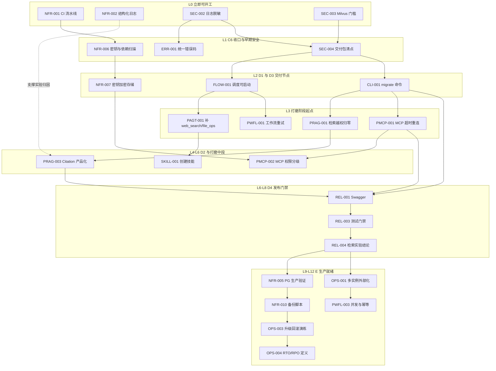

# 新增 36 张任务卡与现有 18 个未完成任务的依赖关系说明

生成日期：2026-09-28
数据来源：`tasks.bak.yaml`（合并版，102 个任务）
分析对象：54 项未完成任务 = 现有 18 项（`status: ready`）+ 新增 36 张卡（`status: backlog`）
校验状态：YAML 可解析、无重复 ID、**依赖图无环**

---

## 1. 结论先行

- 新增 36 张卡**不是**与现有 18 项并列的独立批次，而是通过 11 条跨组依赖边**编织进现有主干**。
- 其中 **8 条是"新卡依赖原任务"**（新卡挂在现有交付节点之后），**3 条是"原任务依赖新卡"**（后向依赖，即我改写 `SKILL-001`、`REL-001` 的结果）。
- 拓扑分层后共 **13 层（L0–L12）**，最长链 13 个节点。**关键路径穿过 P-RAG 打磨与 D4 发布门禁**，说明 RAG 打磨的任何延期都会直接推迟上线。
- 发现 **1 处设计矛盾**（`PWFL-003` 被拉到 L10）和 **1 处疑似过度约束**（`NFR-005` 依赖 `REL-004`），见第 6 节。

---

## 2. 跨组依赖边（核心）

### 2.1 新卡 → 原有任务（8 条）

新卡挂靠在现有交付节点之后，表示"必须先有那个能力，才能打磨"。

| 新增卡 | 依赖的原有任务 | 语义 |
|---|---|---|
| `PAGT-001` 补齐 web_search 与 file_ops | `FLOW-001`（D1 调度可启动） | 工具生态建立在调度可运行之上 |
| `PWFL-001` 工作流重试 | `FLOW-001`（D1 调度可启动） | 先跑通，再谈健壮 |
| `PRAG-001` 检索越权归零 | `CLI-001`（D3 migrate 与管理员命令） | 需要管理员命令与迁移能力配合 |
| `PMCP-001` MCP 超时重连心跳 | `CLI-001`（D3） | 同上 |
| `ERR-001` 统一错误码端到端验收 | `SEC-002`（C6 日志脱敏） | 错误码要复用脱敏后的日志输出 |
| `NFR-005` PostgreSQL 生产路径验证 | `REL-004`（D4 检索实验结论） | 功能与质量验收完成后再切生产库 |
| `NFR-008` 审计日志保留 90 天 | `REL-004`（D4） | 同上 |
| `OPS-001` 多实例状态外部化 | `REL-004`（D4） | 同上 |

**注意**：最后三条是 E 阶段整体挂在 D4 之后的直接原因——D4 未完成，E 阶段一项都启动不了。

### 2.2 原有任务 → 新卡（3 条，后向依赖）

这三条是我上一轮改写的结果，也是"插入点"的真正载体。它们在文件里是**后向引用**（被依赖者物理位置更靠后）。

| 原有任务 | 依赖的新卡 | 改写理由 |
|---|---|---|
| `SKILL-001` 创建技能（D2） | `PAGT-001` | 原依赖 `FLOW-001`。技能创建依赖工具生态，当前只有 4 个工具、无 web_search/file_ops，先做技能必然返工 |
| `REL-001` Swagger 覆盖端点（D4） | `PRAG-003` Citation 产品化 | Citation 改 API 响应结构，必须先于 Swagger 定稿 |
| `REL-001` Swagger 覆盖端点（D4） | `PMCP-001` MCP 超时重连 | MCP 改工具契约，同样影响接口文档 |

### 2.3 指向已完成任务的边（6 条，不构成阻塞）

`SEC-002 → TEN-003`、`SEC-003 → INST-002`、`SEC-004 → SEC-001 / CHAT-005 / ROUTE-002 / SAND-002` —— 目标均为 `done`，已满足。

---

## 3. 拓扑分层

按最长路径深度分层，`L0` = 无未完成前置、可立即开工。

| 层 | 项数 | 任务 |
|---|---|---|
| **L0** | 4 | `NFR-001`、`NFR-002`、`SEC-002`、`SEC-003` |
| **L1** | 4 | `ERR-001`、`NFR-006`、`OPS-007`、`SEC-004` |
| **L2** | 8 | `CLI-001`、`EXPORT-001`、`FLOW-001`、`LIMIT-001`、`MEM-001`、`NFR-007`、`OPS-006`、`QUOTA-001` |
| **L3** | 7 | `FLOW-002`、`PAGT-001`、`PMCP-001`、`PMCP-004`、`PRAG-001`、`PWFL-001`、`REL-002` |
| **L4** | 6 | `PAGT-002`、`PAGT-005`、`PRAG-002`、`PWFL-002`、`PWFL-004`、`SKILL-001` |
| **L5** | 7 | `PAGT-003`、`PAGT-004`、`PMCP-002`、`PRAG-003`、`PRAG-004`、`SKILL-002`、`SUP-001` |
| **L6** | 4 | `PMCP-003`、`PMCP-005`、`REL-001`、`SUP-002` |
| **L7** | 1 | `REL-003` |
| **L8** | 1 | `REL-004` |
| **L9** | 3 | `NFR-005`、`NFR-008`、`OPS-001` |
| **L10** | 6 | `NFR-003`、`NFR-009`、`NFR-010`、`OPS-002`、`OPS-005`、`PWFL-003` |
| **L11** | 2 | `NFR-004`、`OPS-003` |
| **L12** | 1 | `OPS-004` |

### 各组跨度

| 组 | 层跨度 | 归属 |
|---|---|---|
| `SEC` | L0–L1 | 原有 |
| `FLOW` / `MEM` / `CLI` / `QUOTA` / `LIMIT` / `EXPORT` | L2–L3 | 原有 |
| `SKILL` / `SUP` | L4–L6 | 原有 |
| `REL` | L3–L8 | 原有 |
| `NFR` | **L0–L11** | 新增 |
| `OPS` | **L1–L12** | 新增 |
| `PAGT` | L3–L5 | 新增 |
| `PRAG` | L3–L5 | 新增 |
| `PMCP` | L3–L6 | 新增 |
| `PWFL` | **L3–L10** | 新增 |
| `ERR` | L1 | 新增 |

`NFR` 与 `OPS` 跨度大是**预期内**的：它们横跨"验证手段"（最前）与"生产就绪"（最后）两端。`PWFL` 跨度大则是**异常**，见第 6 节。

---

## 4. 依赖骨架图



实线为 `depends_on` 声明的阻塞性依赖，虚线为支撑性依赖（`NFR-002` 结构化日志为 P-RAG 单变量实验提供归因能力）。图为骨架视图，省略了组内线性链（如 `PAGT-002 → 003 → 004`）与部分同层节点。

---

## 5. 关键路径

最长链共 **13 个节点 / 12 层**，任一节点延期都会直接推迟上线：

```text
SEC-002  日志脱敏（C6，P0）
→ SEC-004  交付包清点（C6，P0）
→ CLI-001  migrate 与管理员命令（D3）
→ PRAG-001  检索越权归零（P-RAG，P0）
→ PRAG-002  独立 Reranker（P-RAG）
→ PRAG-003  Citation 产品化（P-RAG）
→ REL-001  Swagger 覆盖端点（D4）
→ REL-003  测试门禁（D4）
→ REL-004  检索实验结论（D4）
→ NFR-005  PostgreSQL 生产验证（E1，P0）
→ NFR-010  备份脚本（E3）
→ OPS-003  升级回滚演练（E3）
→ OPS-004  RTO/RPO 定义（E3）
```

**两个值得注意的点**：

1. **关键路径穿过 P-RAG 全链**（`PRAG-001 → 002 → 003`）。RAG 打磨不是"锦上添花"，它就在上线的必经路径上。`PRAG-002`（Reranker）虽然标 P1，但它在关键路径上，**实际优先级应按 P0 对待**。
2. **D4 之后 E 阶段是串行长尾**：`REL-004 → NFR-005 → NFR-010 → OPS-003 → OPS-004` 单链 5 层，且都依赖 `REL-004`。这意味着 E 阶段几乎无法并行启动。

---

## 6. 发现的问题

### 问题 1：`PWFL-003` 被拖到 L10（设计矛盾，建议修）

- 现象：`PWFL-001` 在 L3、`PWFL-002` 在 L4、`PWFL-004` 在 L4，唯独 `PWFL-003`（并发控制与幂等）在 **L10**。
- 原因：`PWFL-003` 依赖 `OPS-001`（多实例状态外部化），而 `OPS-001` 依赖 `REL-004`，被一路拉到 D4 之后。
- 冲突：P-WFL 阶段的设计意图是"在 D2 之后做健壮性打磨"，但现在它的最后一项要等到 D4 之后才能做，整段 P-WFL 被拆成两截。

**建议二选一**：

- **方案 A（推荐）**：把 `PWFL-003` 拆成两张卡 —— `PWFL-003a` 单机幂等（依赖 `PWFL-001`，落在 L4），`PWFL-003b` 分布式幂等（依赖 `OPS-001`，留在 L10）。语义清晰，也符合"先单机正确、再多实例正确"的工程顺序。
- **方案 B**：把 `OPS-001` 提前。但 `OPS-001` 依赖 `REL-004` 的约束同样可疑（见问题 2），改动面更大。

### 问题 2：`NFR-005` 依赖 `REL-004` 疑似过度约束

- `NFR-005`（PostgreSQL 生产路径验证）依赖 `REL-004`（一轮检索实验结论）。
- 但 `REL-004` 是**质量维度**的验收（跑一轮检索实验出结论），而 PG 生产验证需要的是**功能完备**，并不依赖实验结论。
- 这条约束让 E1 三项（`NFR-005`、`NFR-008`、`OPS-001`）全部卡在 D4 之后，是 E 阶段无法提前启动的主因。

**建议**：把 `NFR-005` 的依赖改为 `REL-001`（Swagger 定稿 = 接口契约稳定）或 `REL-003`（测试门禁）。这样 E1 可提前约 2 层启动。`NFR-008`（审计保留）与 `OPS-001`（多实例）保留对 `REL-004` 的依赖则仍需评估——尤其 `OPS-001`，它是 `PWFL-003` 的前置，提前它能顺带缓解问题 1。

### 问题 3：分组归属与拓扑层不一致（非缺陷，但读文件时会困惑）

- `NFR-006`（pre-commit 扫描）、`NFR-007`（密钥加密）在草案里归入 **E2 安全合规**，但因为只依赖 `NFR-001`，拓扑上落在 **L1–L2**，属于很早就能做的事。
- 同理 `OPS-006`（依赖许可审计）、`OPS-007`（指标告警）在 E2/E3 分组，实际落在 L1–L2。

这不算错误——它们确实只需要 CI/日志就能做。但如果你按"E 阶段"的分组概念去排期，会误以为它们很晚。**建议按拓扑层而非分组排期**，或在任务卡里补一句"可提前执行"。

---

## 7. 执行顺序建议

按拓扑层推进，每层内部可并行：

1. **L0（立即）**：`NFR-001` CI、`NFR-002` 结构化日志、`SEC-002`/`SEC-003` C6 安全
   —— CI 与结构化日志是后续所有打磨的验证手段，必须先落地
2. **L1–L2**：C6 收口完成 → D1/D3 交付节点（`FLOW-001`、`CLI-001` 等）
3. **L3–L5**：P-AGT、P-WFL、P-RAG、P-MCP 四个打磨阶段，与 D2（`SKILL`/`SUP`）交织推进
4. **L6–L8**：D4 发布门禁
5. **L9–L12**：E 生产就绪

**每层可并行度**：L2 有 8 项并行度最高；L7、L8、L12 各只有 1 项，是串行瓶颈。

---

## 8. 附录：36 张新卡依赖明细

| ID | 优先级 | 层 | 依赖 |
|---|---|---|---|
| `NFR-001` | P0 | L0 | — |
| `NFR-002` | P0 | L0 | — |
| `ERR-001` | P0 | L1 | `SEC-002` |
| `NFR-006` | P1 | L1 | `NFR-001` |
| `OPS-007` | P2 | L1 | `NFR-002` |
| `NFR-007` | P1 | L2 | `NFR-006` |
| `OPS-006` | P2 | L2 | `NFR-006` |
| `PAGT-001` | P0 | L3 | `FLOW-001` |
| `PMCP-001` | P0 | L3 | `CLI-001` |
| `PMCP-004` | P1 | L3 | `NFR-007` |
| `PRAG-001` | P0 | L3 | `CLI-001` |
| `PWFL-001` | P1 | L3 | `FLOW-001` |
| `PAGT-002` | P1 | L4 | `PAGT-001` |
| `PAGT-005` | P2 | L4 | `PAGT-001` |
| `PRAG-002` | P1 | L4 | `PRAG-001`、`NFR-001`、`NFR-002` |
| `PWFL-002` | P1 | L4 | `PWFL-001` |
| `PWFL-004` | P2 | L4 | `PWFL-001`、`NFR-002` |
| `PAGT-003` | P1 | L5 | `PAGT-002` |
| `PAGT-004` | P2 | L5 | `PAGT-002` |
| `PMCP-002` | P0 | L5 | `PMCP-001`、`PAGT-002` |
| `PRAG-003` | P1 | L5 | `PRAG-002` |
| `PRAG-004` | P2 | L5 | `PRAG-002` |
| `PMCP-003` | P0 | L6 | `PMCP-002` |
| `PMCP-005` | P2 | L6 | `PMCP-002` |
| `NFR-005` | P0 | L9 | `REL-004` |
| `NFR-008` | P1 | L9 | `REL-004` |
| `OPS-001` | P0 | L9 | `REL-004` |
| `NFR-003` | P1 | L10 | `NFR-005`、`OPS-001` |
| `NFR-009` | P1 | L10 | `OPS-001`、`NFR-005` |
| `NFR-010` | P1 | L10 | `NFR-005` |
| `OPS-002` | P0 | L10 | `OPS-001` |
| `OPS-005` | P2 | L10 | `NFR-008` |
| `PWFL-003` | P1 | L10 | `PWFL-001`、`OPS-001` |
| `NFR-004` | P2 | L11 | `NFR-003` |
| `OPS-003` | P1 | L11 | `NFR-010` |
| `OPS-004` | P1 | L12 | `OPS-003` |

**注**：`PRAG-002` 同时依赖 `NFR-001` 与 `NFR-002`，即 Reranker 的单变量实验需要 CI 保证回归、需要 trace 归因——这正是把 NFR-0 放在最前的理由。

## 9. 附录：18 个原有未完成任务依赖明细

| ID | 优先级 | 层 | 原排期 | 依赖 |
|---|---|---|---|---|
| `SEC-002` | P0 | L0 | 2026-12-25 | `TEN-003`（done） |
| `SEC-003` | P0 | L0 | 2026-12-25 | `INST-002`（done） |
| `SEC-004` | P0 | L1 | 2026-12-25 | `SEC-002`、`SEC-003`、`SEC-001`、`CHAT-005`、`ROUTE-002`、`SAND-002`（后四者 done） |
| `FLOW-001` | P1 | L2 | 2027-01-15 | `SEC-004` |
| `MEM-001` | P1 | L2 | 2027-01-15 | `SEC-004` |
| `FLOW-002` | P1 | L3 | 2027-01-15 | `FLOW-001` |
| `QUOTA-001` | P1 | L2 | 2027-03-05 | `SEC-004` |
| `LIMIT-001` | P1 | L2 | 2027-03-05 | `SEC-004` |
| `EXPORT-001` | P1 | L2 | 2027-03-05 | `SEC-004` |
| `CLI-001` | P1 | L2 | 2027-03-05 | `SEC-004` |
| `SKILL-001` | P1 | L4 | 2027-02-05 | **`PAGT-001`**（原为 `FLOW-001`） |
| `SKILL-002` | P1 | L5 | 2027-02-05 | `SKILL-001` |
| `SUP-001` | P1 | L5 | 2027-02-05 | `SKILL-001` |
| `SUP-002` | P1 | L6 | 2027-02-05 | `SUP-001` |
| `REL-001` | P1 | L6 | 2027-03-25 | `CLI-001`、**`PRAG-003`**、**`PMCP-001`** |
| `REL-002` | P1 | L3 | 2027-03-25 | `CLI-001` |
| `REL-003` | P1 | L7 | 2027-03-25 | `REL-001` |
| `REL-004` | P1 | L8 | 2027-03-25 | `REL-003` |

**注**：`REL-002` 在 L3（依赖 `CLI-001`），但它排在 D4 批次。拓扑上它可以在 D3 之后就做，不必等到 D4 末尾。
