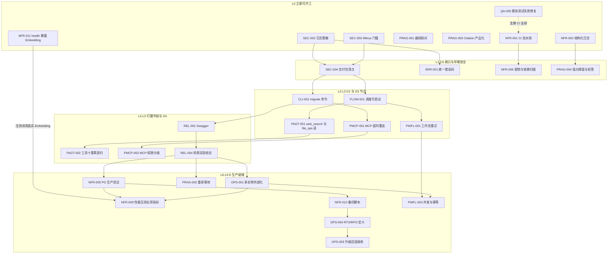

# 新增任务卡与现有未完成任务的依赖关系说明（review 修正后）

生成日期：2026-09-28（按 `docs/reviews/review_tasks_bak_enterprise.md` 修正后重跑）
数据来源：`tasks.bak.yaml`（104 个任务）
分析对象：56 项未完成任务 = 现有 18 项（`status: ready`）+ 新增 38 张卡（`status: backlog`）
校验状态：YAML 可解析、无重复 ID、**无悬空依赖**、**依赖图无环**、**无 L2/L3 夜间准入违规**

> 本文件取代此前同名 36 卡版本。修正内容见第 2 节。

## 2-bis. 二次复审修正（2026-09-28，据 `docs/reviews/2026-09-28-tasks-bak-企业上线复审.md`）

复审认可上一轮修正，另外指出 4 处仍需改。已全部应用并重跑，拓扑层与关键路径均无变化（仍为 L0–L9 / 10 节点 9 层）。

| 卡片 | 问题 | 改动 |
|---|---|---|
| `NFR-011` | 验收同时要求「生产缺密钥启动失败」与「`/health` 标明不可用」，两句不能并存——进程起不来就没有 `/health` 可访问 | 验收重写：保持生产 fail-fast 不改；进程在跑时 `/health` 输出 provider／模型／维度／是否 Mock；开发用 Mock 时标注不可作上线证据 |
| `NFR-009` | 五项指标里的检索延迟若跑在 Mock Embedding 上，只能说明代码走通，不能当上线数字 | `depends_on` 增加 `NFR-011`；补非目标「不使用 Mock 产出上线性能数字」；验收要求写明 `/health` 所见模型与维度且标注非 Mock，机器规格按需求清单机 4C8G，未达标须记录处置 |
| `OPS-005` | 允许改的目录含 `app/core/tenants/` 与 `app/rag/`，实现时可能被做成 HTTP 接口或 Agent 工具 | 补非目标「只做运维脚本，不注册成工具，不提供未经人工确认即可调用的接口」；`forbidden_paths` 增加 `app/api/` |
| `PAGT-002` | 风险 L1 但交付物含文件写入，且夜间执行仍为 true | `nightly.eligible` 改为 false；风险由 L1 提为 **L2**，与 `PAGT-001` 同级 |
| `QA-005` | 复审标注「未验证：未重跑 pytest，失败数量以卡上所写为准」 | 已复跑核实：收集 445 项，**8 failed / 434 passed / 3 skipped、无 error**。早期那 65 个 error（集中在 `test_rag_import_jobs`、`test_rag_permission_semantics`、`test_sandbox`）本次未复现，判断为环境所致。真实失败是另一组（SSE 流式对话 3 项、删除文档清向量、BM25 全零混合检索 3 项、调度器启停），卡片标题与事实已按实测重写，避免按过时清单做无用功 |

另按复审 §2 的提示，修正 `PRAG-002` 一处易误导的表述：`rag-v0.1-rrf-k60-20260924.json` 的 `run_config.rrf_k = 60`，该报告测的是**融合常数 k**，不是独立重排，其 Recall@1 0.8095 不能当作重排已有效的证据。证据字段已同步改为 `run_config.rrf_k = 60`。

复审同时确认：上一轮指出的越权误修、重排必须变好、引用等待重排、文件写入先于工具契约，均已改到位。

---

## 1. 结论先行

修正后的依赖结构发生了三处结构性变化：

1. **后向依赖归零**。原方案有 3 条"原有任务依赖新卡"（`SKILL-001→PAGT-001`、`REL-001→PRAG-003/PMCP-001`），现已全部撤销。新卡不再反向约束既有交付，文件顺序与执行顺序的错位消失。
2. **层数与关键路径双双压缩**。拓扑层从 13 层（L0–L12）压到 **10 层（L0–L9）**；关键路径从 13 节点 / 12 层缩短到 **10 节点 / 9 层**。
3. **RAG 打磨从关键路径移出**。修正前关键路径穿过 `PRAG-001 → PRAG-002 → PRAG-003`；现在 `PRAG` 四张卡全部落到 L0–L1 与 L6，成为并行项，不再阻塞上线。

---

## 2. 本次修正概览

| 类别 | 改动 |
|---|---|
| 卡片改写 | `PRAG-001` 由"修复越权"改为"重跑核对"，风险降为 L0；`PRAG-002` 由"独立 Reranker 实验"改为"重排落地"，改为依赖 `REL-004`；`PRAG-003` 依赖改为 `QA-002`（已 done）；`PRAG-004` 依赖改为 `NFR-002`；`PAGT-001` 改为只交付读能力 |
| 写能力收敛 | `file_ops` 写路径移入 `PAGT-002`，按 L2 契约交付且默认关闭 |
| 依赖改写撤销 | `SKILL-001` 恢复 `FLOW-001`；`REL-001` 恢复仅 `CLI-001` |
| 夜间准入 | `PAGT-001`、`PAGT-004`、`PWFL-003`、`PRAG-001`、`PRAG-003` 的 `nightly.eligible` 改为 false（L2 须单独批准） |
| 顺序反转 | `OPS-004`（RTO/RPO 定义）改到 `OPS-003`（演练）之前，演练才有合格线 |
| 新增卡片 | `QA-005` 既有测试失败修复（P0）；`NFR-011` `/health` 暴露 Embedding 状态与模型维度（P0） |
| 验收补充 | `NFR-003` 写明 Milvus 2.4+ 服务；`NFR-004` 补 TLS 终止与 SSE 缓冲；`NFR-010` 补上传文件目录；`OPS-005` 补确认记录与审计 |

---

## 3. 跨组依赖边

### 3.1 新卡 → 原有任务（8 条）

| 新增卡 | 依赖的原有任务 | 语义 |
|---|---|---|
| `PAGT-001` 补齐 web_search 与 file_ops 读能力 | `FLOW-001`（D1 调度可启动） | 工具生态建立在调度可运行之上 |
| `PWFL-001` 工作流重试 | `FLOW-001`（D1） | 先跑通，再谈健壮 |
| `PMCP-001` MCP 超时重连心跳 | `CLI-001`（D3） | 需要管理员命令与迁移能力配合 |
| `ERR-001` 统一错误码端到端验收 | `SEC-002`（C6 日志脱敏） | 错误码复用脱敏后的日志输出 |
| `NFR-005` PostgreSQL 生产路径验证 | `REL-004`（D4） | 功能与质量验收完成后再切生产库 |
| `NFR-008` 审计日志保留 90 天 | `REL-004`（D4） | 同上 |
| `OPS-001` 多实例状态外部化 | `REL-004`（D4） | 同上 |
| `PRAG-002` 重排落地 | `REL-004`（D4） | 采纳结论由 REL-004 给出，本卡只负责落地 |

### 3.2 原有任务 → 新卡（0 条）

修正前为 3 条，现全部撤销。既有交付不再被新卡反向阻塞。

### 3.3 指向已完成任务的边

`SEC-002 → TEN-003`、`SEC-003 → INST-002`、`SEC-004 → SEC-001 / CHAT-005 / ROUTE-002 / SAND-002`、`PRAG-003 → QA-002`、`SKILL-001 → FLOW-001` 等——目标均为 `done`，不构成阻塞。

---

## 4. 拓扑分层（L0–L9）

| 层 | 项数 | 任务 |
|---|---|---|
| **L0** | 8 | `NFR-001`、`NFR-002`、`NFR-011`、`PRAG-001`、`PRAG-003`、`QA-005`、`SEC-002`、`SEC-003` |
| **L1** | 5 | `ERR-001`、`NFR-006`、`OPS-007`、`PRAG-004`、`SEC-004` |
| **L2** | 8 | `CLI-001`、`EXPORT-001`、`FLOW-001`、`LIMIT-001`、`MEM-001`、`NFR-007`、`OPS-006`、`QUOTA-001` |
| **L3** | 8 | `FLOW-002`、`PAGT-001`、`PMCP-001`、`PMCP-004`、`PWFL-001`、`REL-001`、`REL-002`、`SKILL-001` |
| **L4** | 7 | `PAGT-002`、`PAGT-005`、`PWFL-002`、`PWFL-004`、`REL-003`、`SKILL-002`、`SUP-001` |
| **L5** | 5 | `PAGT-003`、`PAGT-004`、`PMCP-002`、`REL-004`、`SUP-002` |
| **L6** | 6 | `NFR-005`、`NFR-008`、`OPS-001`、`PMCP-003`、`PMCP-005`、`PRAG-002` |
| **L7** | 6 | `NFR-003`、`NFR-009`、`NFR-010`、`OPS-002`、`OPS-005`、`PWFL-003` |
| **L8** | 2 | `NFR-004`、`OPS-004` |
| **L9** | 1 | `OPS-003` |

**L0 从 4 项扩到 8 项**：`PRAG-001`（只读核对）、`PRAG-003`（依赖已完成的 `QA-002`）、`QA-005`、`NFR-011` 都不依赖任何未完成任务，可立即开工。

---

## 5. 依赖骨架图



实线为 `depends_on` 声明的阻塞性依赖，虚线为支撑性依赖（`QA-005` 支撑 CI 全绿）。`PRAG-001` 与 `PRAG-003` 在图中无入边也无出边，属可独立开工的并行项——这正是撤销 `REL-001 → PRAG-003` 依赖后的结果。图为骨架视图，省略了组内线性链（如 `PAGT-002 → 003 → 004`）与部分同层节点。

---

## 6. 关键路径（10 节点 / 9 层）

```text
SEC-002  日志脱敏（C6，P0）
→ SEC-004  交付包清点（C6，P0）
→ CLI-001  migrate 与管理员命令（D3）
→ REL-001  Swagger 覆盖端点（D4）
→ REL-003  测试门禁（D4）
→ REL-004  检索实验结论（D4）
→ NFR-005  PostgreSQL 生产验证（E1，P0）
→ NFR-010  备份脚本（E3）
→ OPS-004  RTO/RPO 定义（E3）
→ OPS-003  升级回滚演练（E3）
```

对比修正前：原关键路径为 13 节点且穿过 `PRAG-001 → PRAG-002 → PRAG-003`。**RAG 打磨已不在关键路径上**——这是撤销 `REL-001 → PRAG-003` 依赖带来的直接收益。

注意关键路径末端仍是 `REL-004 → NFR-005 → NFR-010 → OPS-004 → OPS-003` 的串行长尾，E 阶段无法并行启动的根因未消除（见第 7 节）。

---

## 7. 遗留问题

### 7.1 `PWFL-003` 仍跨阶段（已缓解，未根治）

`PWFL-003` 从 L10 降到 **L7**，但同组的 `PWFL-001/002/004` 在 L3–L4，它仍因依赖 `OPS-001`（L6）而落在 E 阶段。P-WFL 整段仍被拆成两截。

建议（本次未做，待你确认）：拆为 `PWFL-003a` 单机幂等（依赖 `PWFL-001`，落 L4）+ `PWFL-003b` 分布式幂等（依赖 `OPS-001`，留 L7）。

### 7.2 E 阶段串行长尾

`REL-004` 是 `NFR-005`、`NFR-008`、`OPS-001`、`PRAG-002` 四张卡的共同前置，且它们又在关键路径上。E 阶段几乎无法提前并行。

建议（本次未做）：评估 `NFR-005`（PG 生产验证）是否真的需要等 `REL-004`（检索实验结论）——前者要的是功能完备，后者是质量维度验收。若放宽为依赖 `REL-001` 或 `REL-003`，E1 可提前约 1–2 层。

### 7.3 分组归属与拓扑层仍不一致

`NFR-006/007`、`OPS-006/007` 虽归在 E2/E3 分组，但因只依赖 `NFR-001`/`NFR-002`，拓扑落在 L1–L2。**排期应按拓扑层而非分组**，否则会误判为很晚才能做。

---

## 8. 执行顺序建议

1. **L0（立即，8 项）**：CI、结构化日志、测试修复、`/health` embedding 自检、越权核对、Citation 产品化，以及 C6 的 `SEC-002/003`
   —— 这一层并行度最高，且多数是后续工作的验证手段
2. **L1–L2**：C6 收口 → D1/D3 交付节点
3. **L3–L5**：P-AGT、P-WFL、P-MCP 打磨与 D2、D4 交织推进
4. **L6–L9**：E 生产就绪

---

## 9. 附录：38 张新增卡明细

| ID | 优先级 | 风险 | 层 | 依赖 |
|---|---|---|---|---|
| `PRAG-001` | P0 | L0 | L0 | — |
| `PRAG-003` | P1 | L2 | L0 | `QA-002`（done） |
| `NFR-001` | P0 | L1 | L0 | — |
| `NFR-002` | P0 | L1 | L0 | — |
| `NFR-011` | P0 | L1 | L0 | — |
| `QA-005` | P0 | L1 | L0 | — |
| `ERR-001` | P0 | L1 | L1 | `SEC-002` |
| `NFR-006` | P1 | L1 | L1 | `NFR-001` |
| `OPS-007` | P2 | L1 | L1 | `NFR-002` |
| `PRAG-004` | P2 | L1 | L1 | `NFR-002` |
| `NFR-007` | P1 | L2 | L2 | `NFR-006` |
| `OPS-006` | P2 | L0 | L2 | `NFR-006` |
| `PAGT-001` | P0 | L2 | L3 | `FLOW-001` |
| `PMCP-001` | P0 | L2 | L3 | `CLI-001` |
| `PMCP-004` | P1 | L2 | L3 | `NFR-007` |
| `PWFL-001` | P1 | L1 | L3 | `FLOW-001` |
| `PAGT-002` | P1 | L2 | L4 | `PAGT-001` |
| `PAGT-005` | P2 | L1 | L4 | `PAGT-001` |
| `PWFL-002` | P1 | L1 | L4 | `PWFL-001` |
| `PWFL-004` | P2 | L1 | L4 | `PWFL-001`、`NFR-002` |
| `PAGT-003` | P1 | L1 | L5 | `PAGT-002` |
| `PAGT-004` | P2 | L2 | L5 | `PAGT-002` |
| `PMCP-002` | P0 | L2 | L5 | `PMCP-001`、`PAGT-002` |
| `NFR-005` | P0 | L2 | L6 | `REL-004` |
| `NFR-008` | P1 | L2 | L6 | `REL-004` |
| `OPS-001` | P0 | L2 | L6 | `REL-004` |
| `PMCP-003` | P0 | L1 | L6 | `PMCP-002` |
| `PMCP-005` | P2 | L1 | L6 | `PMCP-002` |
| `PRAG-002` | P1 | L1 | L6 | `REL-004`、`NFR-002` |
| `NFR-003` | P1 | L2 | L7 | `NFR-005`、`OPS-001` |
| `NFR-009` | P1 | L1 | L7 | `OPS-001`、`NFR-005`、`NFR-011` |
| `NFR-010` | P1 | L2 | L7 | `NFR-005` |
| `OPS-002` | P0 | L2 | L7 | `OPS-001` |
| `OPS-005` | P2 | L3 | L7 | `NFR-008` |
| `PWFL-003` | P1 | L2 | L7 | `PWFL-001`、`OPS-001` |
| `NFR-004` | P2 | L1 | L8 | `NFR-003` |
| `OPS-004` | P1 | L0 | L8 | `NFR-010` |
| `OPS-003` | P1 | L2 | L9 | `NFR-010`、`OPS-004` |

## 10. 附录：18 个原有未完成任务明细

| ID | 优先级 | 层 | 原排期 | 依赖 |
|---|---|---|---|---|
| `SEC-002` | P0 | L0 | 2026-12-25 | `TEN-003`（done） |
| `SEC-003` | P0 | L0 | 2026-12-25 | `INST-002`（done） |
| `SEC-004` | P0 | L1 | 2026-12-25 | `SEC-002`、`SEC-003` 及 4 项 done |
| `FLOW-001` | P1 | L2 | 2027-01-15 | `SEC-004` |
| `MEM-001` | P1 | L2 | 2027-01-15 | `SEC-004` |
| `FLOW-002` | P1 | L3 | 2027-01-15 | `FLOW-001` |
| `QUOTA-001` | P1 | L2 | 2027-03-05 | `SEC-004` |
| `LIMIT-001` | P1 | L2 | 2027-03-05 | `SEC-004` |
| `EXPORT-001` | P1 | L2 | 2027-03-05 | `SEC-004` |
| `CLI-001` | P1 | L2 | 2027-03-05 | `SEC-004` |
| `SKILL-001` | P1 | L3 | 2027-02-05 | `FLOW-001`（已恢复原依赖） |
| `SKILL-002` | P1 | L4 | 2027-02-05 | `SKILL-001` |
| `SUP-001` | P1 | L4 | 2027-02-05 | `SKILL-001` |
| `SUP-002` | P1 | L5 | 2027-02-05 | `SUP-001` |
| `REL-001` | P1 | L3 | 2027-03-25 | `CLI-001`（已恢复原依赖） |
| `REL-002` | P1 | L3 | 2027-03-25 | `CLI-001` |
| `REL-003` | P1 | L4 | 2027-03-25 | `REL-001` |
| `REL-004` | P1 | L5 | 2027-03-25 | `REL-003` |
