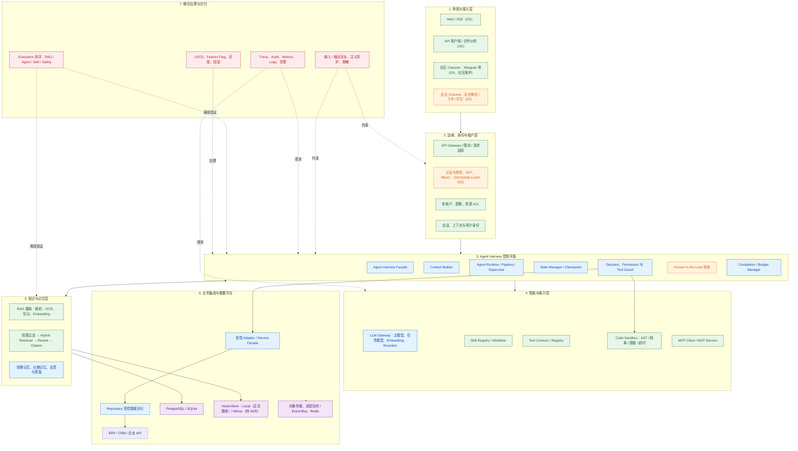
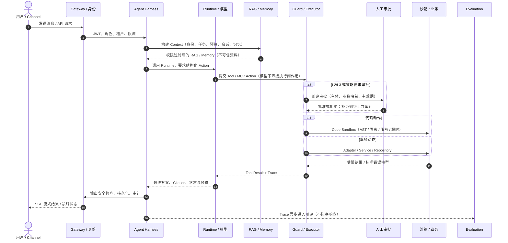

# AI Assistant — 开源项目完整产品需求方案 (PRD)

> **文档版本**：v1.1
> **日期**：2026-09-13
> **文档性质**：产品需求方案 — 定义开源项目"做什么"，指导后续技术方案与实施
> **关联文档**：
> - `docs/architecture/target-agent-harness-architecture.html`（最终目标架构图与时序图可视化）
> - `docs/product/项目设计方案.md`（技术执行层）
> - `docs/governance/agent-harness-engineering.md`（Harness 治理）
> - `AGENTS.md`（当前代码事实入口）

---

## 一、产品定义

### 1.1 一句话定位

**工程级 Agent 框架** — 面向开发者和企业的、开箱即用的智能体构建平台，以代码沙箱安全执行和多租户管理为核心差异，不是低代码拖拽玩具，而是可私有化部署的生产级 Agent 基础设施。

### 1.2 产品愿景

成为开发者构建 AI Agent 应用时的 **"Spring Boot 时刻"** —— 不需要从 LangGraph + Milvus + Model Router + Auth + Admin Panel 逐一拼接，一个项目启动即可获得完整 Agent 能力，同时保留全部代码级控制力。

### 1.3 产品目标

| 目标 | 指标 | 衡量方式 |
|------|------|---------|
| 开发者 5 分钟可跑起来 | `docker compose up` 即可体验 | 时间测量 |
| Agent 具备工程级推理能力 | 五阶段管线 + 自纠错 + 多 Agent 协作 | 功能验收 |
| RAG 精度可验证、可对基线 | 内置 RAG 评估基准，在自建评测集上 Recall@5 ≥ 基线（基线值以 v0.3.0 评估报告为准，目标对齐 FastGPT 公开场景表现） | RAG 评估基准 |
| 安全可审计 | 沙箱执行 + 审计日志 + 角色权限 | 安全审查 |
| 可商业化 | 管理后台 + 多租户 + 配额系统 | 功能验收 |

---

## 二、市场与竞品分析

### 2.1 竞品格局

当前开源 AI Agent 市场存在明显的两极分化：

```
低代码/易用 ←————————————————————————————→ 工程化/可控

Coze Studio     FastGPT      Dify          LangGraph      我们的位置
(消费级开源)   (知识库)    (全栈平台)    (框架)        (工程级平台)
 ▲              ▲             ▲            ▲              ▲
拖拽           拖拽         拖拽        纯代码          代码+管理
私有化         私有化       私有化      纯库            私有化平台
弱代码控制     有限控制     中等控制    完全控制        完全控制
```

**我们的位置**：处于 LangGraph 和 Dify 之间的空白地带 —— **比 LangGraph 多了开箱即用的平台能力（管理后台、多租户、审计），比 Dify 保留了完整代码级控制（非黑盒拖拽）**。与 Coze Studio 相比，我们不面向消费级拖拽场景，而是提供企业级多租户、审计与沙箱安全。

> **竞品事实核对规则**：本节所有竞品声明（Stars、许可证、功能有无）必须可溯源并标注核对日期；任何"无 X"类否定声明发布前须复核竞品官方仓库与官网。

### 2.2 竞品对比矩阵

| 维度 | Dify | FastGPT | CowAgent | LangGraph | **我们** |
|------|------|---------|----------|-----------|----------|
| **类型** | 全栈平台 | 知识库平台 | 聊天 Agent | 开发框架 | 工程级平台 |
| **GitHub Stars** | 135k+ | 20k+ | — | 15k+ | 新项目 |
| **许可证** | Apache 2.0¹ | Apache 2.0 附加条款¹ | MIT | MIT | **Apache 2.0**（见 8.1，决策 D5） |
| **Agent 推理** | 可视化编排 | 工作流节点 | ReAct 循环 | 图状态机 | **LangGraph 五阶段** |
| **RAG 检索** | 内置基础 | 深度优化 | 对话策展 | 需自建 | **混合检索 + 4 重排** |
| **代码沙箱** | 基础 | 无 | 直接执行 | 无 | **四层防护** |
| **多租户** | 团队空间 | 团队/文件夹 | 无 | 无 | **系统级 + 租户级** |
| **管理后台** | 有 | 有 | 无 | 无 | **物理分离 Admin** |
| **多渠道** | API | API | 12+ 平台 | 无 | **Channel 抽象** |
| **前端形态** | Web 完整 | Web 完整 | Web + 桌面 | 无 | Web（双路由） |
| **部署难度** | 中等 | 中等 | 简单 | 需大量自建 | **一键 Docker** |
| **代码控制力** | 中（插件） | 低 | 中 | 高 | **高（全代码）** |
| **安全合规** | 基础 | 基础 | 基础 | 自建 | **6 层防护** |
| **商业化** | SaaS + 企业版 | 企业授权 | 无 | 无 | **OS + EE** |
| **核心用户** | 产品经理+全栈 | 客服+知识管理 | 普通用户 | AI 工程师 | **全栈开发者+企业 IT** |

> ¹ 竞品许可证信息截至 2026-08，发布前需核对各仓库 LICENSE 原文；部分竞品采用"基础协议 + 附加商业条款"的复合许可，不得简化表述。

### 2.3 差异化卖点

| # | 卖点 | 为什么重要 |
|---|------|-----------|
| 1 | **代码沙箱安全执行** | 企业采购 AI Agent 的第一顾虑是安全。四层防护（AST → 进程隔离 → 资源限制 → 超时）是独特的信任锚点 |
| 2 | **完整的 Admin Console** | 竞争对手的管理后台是"附加功能"，我们是"一等公民"。用户管理、审计日志、配额系统、Feature Flag 全部物理分离（开源版含基础管理控制台，能力边界见 §3.2.1） |
| 3 | **Agent 推理质量** | 五阶段（Preflight → Plan → Act → QualityGate → Finalize）远超竞品 ReAct 循环，Plan 阶段任务分解 + QualityGate 自纠错是实打实的质量差异 |
| 4 | **RAG 工程完整度** | 不宣称单点"最强"，而是提供可验证的完整 RAG 工程：自适应切分 + BM25/向量混合 + 4 重排 + Parent Document Retrieval + 内置评估（Recall@K/MRR/NDCG）。以可复现的评估数据说话，而非营销口径 |
| 5 | **不黑盒** | 竞品倾向"拖拽 + 我不告诉你里面发生了什么"，我们倾向"看图/读代码能理解全流程"。这是开发者信任的基础 |

### 2.4 目标用户画像

**画像 A：独立开发者 / 小型团队**

- 场景：想给自己的产品加 AI 能力（客服机器人、文档问答、自动化工作流）
- 痛点：不想从 LangChain/向量库/权限/部署拼起，但 Dify 又不给代码控制力
- 决策：用我们 docker compose up → 配置模型 → 上传知识库 → 嵌入 API
- 技术栈：会 Python/TypeScript，不想学新的 DSL

**画像 B：中小企业 IT 部门**

- 场景：内部知识库问答、工单自动分类、定时报告生成
- 痛点：数据不能上云（必须私有部署），需要审计和角色管理，供应商方案太贵
- 决策（开源版路径）：运维部署开源版 → 初始化超级管理员 → 建租户 → 邀请员工（邀请码）→ 上传内部文档 → 员工使用
- 升级路径：当需要 SSO/SAML/LDAP、合规报表或高可用部署时，升级商业版（EE）——开源版的租户/成员/审计模型与 EE 完全兼容，升级不改变数据结构
- 技术栈：有运维能力，需要权限控制

**画像 C：ISV / 解决方案集成商**

- 场景：为客户交付 AI Agent 解决方案，需要可定制、可白标、可扩展
- 痛点：Dify 企业版太贵，FastGPT 太偏知识库，LangGraph 需要从零搭建太多基础设施
- 决策：基于开源版定制 → 加自有 Channel → 白标 UI → 集成到客户系统
- 技术栈：全栈团队，需要灵活性和控制力

---

## 三、功能全景

### 3.1 最终完整形态：目标架构与能力边界（TARGET）

> **定位与状态说明**：本节描述产品完成治理、验证和商业化扩展后的**目标形态**，是本 PRD 的架构与能力全景基线；并非当前代码实现清单。可视化原稿见 [`docs/architecture/target-agent-harness-architecture.html`](../architecture/target-agent-harness-architecture.html)。能力状态使用 `Implemented`（实现、测试和运行证据齐全）、`Partial`（主路径部分可用）、`Planned`（已规划，尚未完成）和 `Deferred`（暂缓，具备明确进入条件）。当前实现事实以 `AGENTS.md`、`docs/AI辅助开发迭代指导.md` 和代码/测试证据为准。README 必须同时保留 As-Is 与 TARGET，禁止只展示目标图。



**图例与边界**：

- **OS**：开源版的核心能力或社区扩展接口；社区 Channel 不承诺官方 SLA。
- **EE**：商业版增值能力。其功能必须通过稳定契约、Feature Flag 与 License 授权接入，不得形成绕过权限或审计的旁路。
- **目标依赖方向**：`Channel/API → Harness → Runtime → Skill → Tool Executor → Service/Adapter → Repository → 数据与外部系统`。Agent、Prompt、Skill 与 MCP Server 不得直接访问数据库或遗留业务系统。
- **代码沙箱**：位于第 4 层能力层，由 Tool Guard / Executor 调用；不在第 3 层 Harness 循环内。代码动作必须进入 AST / 进程隔离 / 资源限额 / 超时 Kill，不得在宿主进程执行。
- **测评 Evaluation**：位于横切治理层，离线消费 Trace 与版本化数据集；不阻塞在线请求，也不嵌入 Harness 循环。
- **不可信输入**：RAG 文档、网页、上传文件、Tool/MCP 返回均为不可信数据；权限过滤应在内容进入模型之前完成。高风险（L3）动作必须经 HITL 审批，不能由自然语言确认替代。

#### 3.1.1 目标请求时序图（TARGET）

> 与架构图对应的受控执行生命周期。短路路径可跳过不需要的计划或工具步骤，但不得跳过身份、权限、Guard、代码沙箱（代码动作）、审计和输出安全检查。可视化见 [`target-agent-harness-architecture.html`](../architecture/target-agent-harness-architecture.html)。



**时序步骤与验收要点**：

| 步骤 | 行为 | 不得跳过 |
|---|---|---|
| 1–2 | Channel 入站，Gateway 校验 JWT、角色、租户、资源与限流 | 身份与租户校验 |
| 3–4 | Harness 按预算合并身份、任务、会话、Memory 与权限过滤后的 RAG | RAG/网页/上传/Tool 返回标记为不可信 |
| 5–6 | Runtime 只提出结构化 Action；模型不直接执行副作用 | Guard 校验 |
| 7 | L2/L3 进入 HITL；自然语言确认不能替代审批 | 高风险审批 |
| 8a / 8b | 代码动作进沙箱；业务动作经 Adapter → Repository | 沙箱隔离或受控适配 |
| 9–13 | 结果回传、Citation、输出安全、持久化、审计、SSE | 输出安全与审计 |
| 14 | Trace 异步进入 Evaluation（RAG / Agent / Skill / Safety） | 测评不阻塞在线请求 |

#### 3.1.2 最终功能能力清单（与目标架构对应）

| 架构层 | 最终能力 | OS / EE 边界 | 当前状态 | 最终验收依据 |
|---|---|---|---|---|
| 体验与接入 | Web 对话、SSE 流式输出、开放 API、合作伙伴接入 | Web/API 为 OS；Telegram 等为社区扩展；企业微信/飞书/钉钉为 EE | `Partial` | 统一消息契约、渠道适配契约、流式与降级 E2E 用例 |
| 身份与租户 | JWT、RBAC、租户隔离、租户切换、配额、资源 ACL | 基础认证、RBAC、租户隔离为 OS；SSO/SAML/LDAP 与精细化企业策略为 EE | `Partial` | 身份、租户、资源、动作四维权限矩阵；跨租户/越权测试为零泄露 |
| Agent Harness | Context Builder、Runtime、显式 State、Checkpoint、预算、完成判定、恢复 | 核心 Harness 契约为 OS；企业级持久化与运行治理可由 EE 扩展 | `Partial` | 请求可关联 `request_id → trace_id → step_id`；超时、取消、恢复与预算回归用例 |
| Agent Runtime | 自研五阶段 AgentPipeline、可选 Supervisor、多 Agent 协作、任务分解与质量门 | 基础 Pipeline/Supervisor 为 OS；复杂编排模板可作为 EE/生态扩展 | `Partial` | Agent/Skill Evaluation：任务成功、工具选择、参数、步骤、升级处理 |
| Tool、Skill、MCP | 版本化 Tool Contract、Tool Executor、Skill Registry、Workflow、MCP、代码沙箱 | 工具/Skill/MCP/沙箱基础框架为 OS；官方企业系统连接器与治理包为 EE | `Partial` | 每个 Tool 具备 Schema、权限、风险、超时、重试、幂等、错误、审计和版本；代码动作必须进入四层沙箱；L3 审批测试 |
| 模型智能层 | 多模型路由、任务模型、Embedding、Reranker、熔断与回退链 | Provider 抽象和基础路由为 OS；企业专属模型策略与密钥治理为 EE | `Partial` | 可复现的路由、熔断、回退、成本与延迟测试；密钥不入库、不入日志 |
| RAG 与 Citation | 多格式摄取、OCR、切分、版本、权限过滤、Hybrid Retrieval、独立 Rerank、结构化 Citation | RAG 核心和 Local 后端为 OS；Milvus 正式生产支持须经 ADR 和闭环验证后确定；企业知识连接器为 EE | `Partial` | 版本化 Gold/Silver/Adversarial 数据集；Recall@K、MRR、nDCG、Citation、安全与权限切片报告 |
| Memory 与 Evolution | 对话记忆、长期记忆、Reflect、记忆蒸馏、Skill 改进 | 基础会话记忆为 OS；受治理的跨会话记忆与企业保留策略为 EE | `Partial` | Memory 与 RAG 的预算合并回归；来源、授权、TTL、删除和跨租户隔离验证 |
| 业务集成 | Adapter/Service Facade、ERP / CRM / 企业 API 等受控连接 | 通用 Adapter 契约为 OS；官方企业连接器与高风险写入工作流为 EE | `Planned` | 无 Agent 直连遗留系统；副作用分级、幂等、审批、审计和补偿/回滚验证 |
| 数据与平台 | 关系库、对象存储、缓存、消息总线、向量存储、备份恢复 | SQLite 开发与基础部署为 OS；PostgreSQL 高可用、集群与 K8s 为 EE | `Partial` | 数据隔离、索引兼容、备份恢复演练、摄取—检索—重解析—删除闭环 |
| 测评 / Evaluation | 版本化 Gold/Silver/Adversarial 数据集；RAG、Agent、Skill、Safety 与运行时评测 | 开源版提供可复现评测命令与报告；企业合规评测包与门槛为 EE | `Planned` | 离线消费 Trace；Recall@K、MRR、nDCG、Citation、任务成功、越权/注入切片；不阻塞在线请求 |
| 安全、观测与交付 | 输入/输出 Guard、注入防护、脱敏、审计、Trace、Metrics、告警、Feature Flag、灰度/回滚 | 基础安全、审计和 Trace 为 OS；合规报表、可配置保留与企业监控集成为 EE | `Partial` | 安全对抗集、审计可追踪性、脱敏检查、回归门禁、发布与回滚演练 |

#### 3.1.3 目标形态的阶段性约束

1. `Planned` 与 `Deferred` 能力不得作为当前已交付功能对外宣传；只有实现、测试和运行证据齐全后才可标记为 `Implemented`。
2. RAG baseline、资源 ACL 语义和正式 VectorStore 仍是进入后续检索优化、独立 Reranker 与生产化 Milvus 前的前置决策；详见 `docs/AI辅助开发迭代指导.md`。
3. 最终架构是渐进演进的职责图，不要求立即拆分微服务或重写目录。现有 `ChatService` 与 `AgentPipeline` 的 Harness 职责须按 `docs/governance/agent-harness-engineering.md` 分步提取，并保留兼容与回滚路径。

#### 3.1.4 MVP 功能模块全景图

```
┌──────────────────────────────────────────────────────┐
│                    Admin Console                      │
│  用户管理 │ 租户管理 │ 配额 │ 审计 │ 系统配置 │ FF   │
├──────────────────────────────────────────────────────┤
│                    Channel Layer                      │
│     Web (SSE)  │  Telegram  │  飞书  │  ...(预留)    │
├──────────────────────────────────────────────────────┤
│                    Agent Core                         │
│  ┌─────────┐  ┌─────────┐  ┌──────────────────────┐  │
│  │Preflight│→│  Plan   │→│        Act            │  │
│  │ 意图分类 │  │ 任务分解 │  │ Tool│Skill│SubAgent  │  │
│  └─────────┘  └─────────┘  └──────────────────────┘  │
│                      ↓                               │
│               ┌──────────────┐                        │
│               │ QualityGate  │  自纠错 + 审查         │
│               └──────────────┘                        │
│                      ↓                               │
│               ┌──────────────┐                        │
│               │  Finalize    │  格式化 + 流式输出     │
│               └──────────────┘                        │
├──────────────────────────────────────────────────────┤
│                    RAG Engine                         │
│  文档上传 → 自适应切分 → 清洗 → 向量化(Milvus)        │
│  混合检索(BM25+向量+RRF) → 重排(4策略) → 引用标注    │
├──────────────────────────────────────────────────────┤
│              Workflow & Evolution                     │
│  Cron 定时引擎 │ Reflect 反思 │ 记忆蒸馏 │ Skill 进化 │
├──────────────────────────────────────────────────────┤
│              Foundation Layer                         │
│  配置 │ 数据库 │ LLM路由 │ Prompt │ SSE │ 权限 │ 安全  │
└──────────────────────────────────────────────────────┘
```

### 3.2 开源版 vs 商业版功能矩阵

| 功能 | 开源版 (OS) | 商业版 (EE) |
|------|------------|------------|
| **Agent 对话** | ✅ 完整五阶段 | ✅ 同 OS |
| **RAG 知识库** | ✅ Milvus 单机 | ✅ Milvus 集群 + 更多向量库 |
| **工作流引擎** | ✅ | ✅ |
| **记忆与进化** | ✅ | ✅ |
| **多租户** | ✅ | ✅ |
| **安全治理（6 层）** | ✅ | ✅ + 增强合规 |
| **代码沙箱** | ✅ | ✅ |
| **管理后台** | ✅ 基础 | ✅ 完整（SSO、合规报表） |
| **Web Channel** | ✅ | ✅ |
| **多渠道（微信/飞书/钉钉/Telegram）** | ❌（社区贡献） | ✅ 官方维护 |
| **SSO/SAML/LDAP** | ❌ | ✅ |
| **审计合规** | 基础日志 | 完整审计 + 数据保留策略 |
| **高可用部署** | 单机 | 集群 + K8s Helm |
| **SLA 支持** | 社区 | ✅ 专属 |
| **白标/定制** | 自行改造 | ✅ 官方支持 |
| **训练数据导出** | ✅ | ✅ |
| **配额管理** | ✅ | ✅ + 精细化 |

### 3.2.1 OS/EE 边界定义

**管理后台分层清单**：

| 能力 | 开源版（基础 Admin） | 商业版（完整 Admin） |
|------|--------------------|--------------------|
| 用户/租户 CRUD | ✅ | ✅ |
| 成员邀请与角色管理 | ✅ | ✅ |
| 配额管理（租户级） | ✅ | ✅ + 用户级精细化配额 |
| 审计日志查询 | ✅（查询，保留 ≥90 天） | ✅ + 数据保留策略可配置 + 合规报表导出 |
| 系统配置 / Feature Flag | ✅ | ✅ |
| SSO / SAML / LDAP | ❌ | ✅ |
| 高可用部署（集群/K8s Helm） | ❌（单机） | ✅ |
| 白标定制服务 | 自行改造 | ✅ 官方支持 |

**多渠道归属**：Web Channel 为 OS 官方维护；Telegram 等渠道以社区贡献形式进入 OS 仓库的 `channels/community/` 目录，标注"社区维护、不承诺 SLA"；官方商业渠道（微信/飞书/钉钉）仅在 EE 交付。

**EE 技术载体**：EE 与 OS 同一代码仓库，EE 能力通过 Feature Flag + License Key 解锁（License Key 校验模块本身开源，签名验证可审计）；不维护私有分叉，避免双分支漂移。

### 3.3 功能优先级定义

| 级别 | 定义 | 说明 |
|------|------|------|
| **P0** | 必须有 — 没有就不能发布 | MVP v1.0 的核心，缺任一不可 |
| **P1** | 应该有 — 没有则体验不完整 | v1.0 完成度的重要组成部分 |
| **P2** | 可以有 — 锦上添花 | v1.5 或后续版本 |
| **P3** | 以后再说 — 远期愿景 | v2.0+ |

---

## 四、MVP（v1.0）范围定义

### 4.1 一句话 MVP

**开发者 5 分钟部署，获得完整的 Agent 对话 + 知识库问答 + 管理后台的多租户 AI 平台。**

### 4.2 MVP 必须有的功能（P0）

| # | 功能 | 用户故事 | 验收条件 |
|---|------|---------|---------|
| P0-1 | **Agent 对话** | 作为开发者，我发一条消息，Agent 能理解意图、规划步骤、调用工具、自纠错、返回结果 | 五阶段管线完整运行，工具调用成功，SSE 流式输出正常 |
| P0-2 | **知识库 RAG** | 作为用户，我上传 PDF/DOCX/TXT/MD/CSV/JSON 文档到知识库，Agent 能基于文档内容回答我的问题并标注引用 | 文档上传 → 切分 → 向量化 → 检索 → 引用标注，端到端可用 |
| P0-3 | **多租户** | 作为系统管理员，我能创建租户；作为租户管理员，我能邀请成员 | 租户 CRUD + 成员管理 + 行级数据隔离（含跨租户越权测试用例） |
| P0-4 | **管理后台** | 作为管理员，我能通过 Admin 面板管理用户、租户、查看系统状态 | Admin API 可管理用户/租户/系统（Web 基础界面） |
| P0-5 | **代码沙箱** | Agent 执行代码时在安全沙箱中运行，不过度访问系统资源 | AST 检查 + 进程隔离 + 资源限制 + 超时 kill |
| P0-6 | **JWT 认证** | 用户注册、登录、获取 Token，Token 过期可刷新，泄露可撤销 | 注册/登录/刷新/撤销全部正常，无默认密钥 |
| P0-7 | **Docker 部署** | `docker compose up` 一键启动全部服务 | 构建成功，容器运行正常，所有功能可用 |
| P0-8 | **模型路由** | 支持配置多个 LLM 提供商，按任务类型路由 + 兜底链降级。路由规则（ModelRouter，按序匹配）：① 请求显式指定 model_profile → 校验租户可用性后使用；② 按任务类型路由（chat/intent/embedding/rerank 独立配置）；③ 兜底：default profile；主 profile 熔断后按 fallback_chain 依序降级。P0 阶段配置载体 = .env + YAML，API key 仅环境变量注入不落库；P1 引入 model_profiles 表，API key 加密存储 | 至少接入 2 个提供商，配置切换正常 |

### 4.3 MVP 应该有的功能（P1）

| # | 功能 | 用户故事 |
|---|------|---------|
| P1-1 | **多 Agent 协同** | Supervisor 可将复杂任务分配给多个子 Agent 并行执行 |
| P1-2 | **混合检索 + 重排** | 知识库检索使用 BM25 + 向量混合，经过重排提高精度 |
| P1-3 | **查询变换** | 复杂问题自动做 HyDE / Multi-Query 变换提升召回 |
| P1-4 | **对话记忆** | 对话上下文窗口管理，超窗口自动压缩 |
| P1-5 | **速率限制** | 防止 API 滥用，按用户/租户限流 |
| P1-6 | **Skill 系统** | 用户可创建/管理技能，Agent 根据上下文自动选用 |
| P1-7 | **CLI 工具** | `ai-assistant init/start/stop/status/logs/migrate/admin` 命令行管理 |
| P1-8 | **API 文档** | Swagger/OpenAPI 自动生成，完整覆盖所有端点 |
| P1-9 | **SFT 训练数据导出** | 租户管理员可将对话历史导出为 Alpaca/ShareGPT 格式 JSON |

### 4.4 MVP 明确不做的功能（Out of Scope）

| 功能 | 原因 |
|------|------|
| 可视化工作流拖拽 | 与产品定位冲突 — 我们是代码级控制，不是低代码拖拽 |
| 对话策展知识库 | 精度不如文档上传，v2.0 再考虑 |
| 多渠道（微信/飞书/Telegram） | v1.0 只做 Web Channel，预留接口后续加 |
| 前端完整重构 | Phase 5 独立完成"前端架构治理"；v1.0 交付"最简前端"，页面范围见 §4.4.1 |
| SSO/SAML | 商业版功能 |
| K8s/集群部署 | 商业版功能 |
| 内置模型训练 | 只做数据导出，训练在外部进行 |
| 技能市场 | v1.0 不做——社区规模不足；归属 v2.5+（渠道合伙人计划的一部分，见 §9.3 阶段四） |
| 计费系统 | v1.0 只有配额，不计费 |

#### 4.4.1 v1.0 最简前端范围定义

| 页面 | v1.0 范围 | 明确不含 |
|------|---------|---------|
| 登录/注册 | 完整 | — |
| 对话页 | 发消息、流式回复、思考过程展示、引用展示、停止生成、会话列表增删改 | 对话分支、重新生成（P1） |
| 知识库页 | 上传、文档状态列表、重建索引、删除 | 切分细节可视化 |
| 管理后台 | P0 API 对应的用户/租户/审计日志/系统状态四页（见 §5.4.4） | 监控大盘、配额/FF 可视化 |

"前端架构治理"（props≤5、统一错误处理、Vitest、ESLint）是 Phase 5 的工程验收标准，作用于上述最简前端的代码重构，不是 v1.0 的额外功能交付。

### 4.5 MVP 验收标准（Checklist）

- [ ] 新部署能初始化超级管理员（CLI/环境变量/向导三选一）；新用户能在 5 分钟内完成注册 → 加入默认租户 → 发送第一条消息；system_admin 可创建独立租户并邀请成员（"创建租户"属管理员操作，不属于新用户旅程）
- [ ] Agent 能正确执行五阶段管线，工具调用成功
- [ ] 上传 PDF/DOCX/TXT/MD/CSV/JSON 文档后，Agent 能基于内容回答并标注引用
- [ ] Admin 可创建/停用用户、创建/停用租户
- [ ] 代码执行在沙箱中隔离，无法访问宿主机文件系统
- [ ] `docker compose up` 一键启动，所有容器 Healthy
- [ ] `.env.example` 完整覆盖所有配置项
- [ ] 测试覆盖率 ≥ 70%，CI 全绿
- [ ] 所有 API 有 Swagger 文档
- [ ] 代码无变更历史注释，无硬编码密钥/URL
- [ ] 租户管理员可导出本租户对话历史为 Alpaca/ShareGPT 格式，导出记录进入审计日志

#### 4.5.1 "5 分钟上手"计时口径与标准旅程

**计时口径**：
- 起点：开发者已安装 Docker 并克隆仓库，执行 `docker compose up -d`
- 终点：对话页收到 Agent 首个流式 token
- 计入：容器启动与健康检查、注册、进入租户、模型接入检查、发送第一条消息
- 不计入：docker 镜像首次拉取（README 明示"不含首次镜像下载"）

**标准旅程**（每步必须有页面或命令行入口，禁止手改数据库或直接调 API）：

| # | 步骤 | 路径 | 交互要求 |
|---|------|------|---------|
| 1 | 填写 `.env`（至少 1 个模型 API Key） | `cp .env.example .env` | 每项有注释，标注必填/选填 |
| 2 | 初始化与启动 | `ai-assistant init && docker compose up -d` | 终端输出各容器进度与最终访问 URL |
| 3 | 初始化管理员（如未初始化） | 首次访问自动跳转 `/setup` | 一次性向导，见 §5.11 |
| 4 | 注册 / 登录 | `/login`、`/register` | 注册成功自动加入默认租户（§5.3.4） |
| 5 | 模型接入检查 | 对话页自动检测 | 无可用模型时显示引导卡：修改 .env 并重启（v1.0 唯一路径），Admin 模型录入为 P1 |
| 6 | 发送第一条消息 | 对话页 | 流式回复并展示思考过程 |

**验收**：README Quick Start 与本表逐步一致，每个 Release 实测通过；任何一步失败须在 10 秒内给出失败原因与下一步指引。

#### 4.5.2 页面状态覆盖验收

以下页面均须实现六种状态：**初始加载、空数据、错误、无权限、操作成功反馈、操作失败反馈**：

| 页面 | 关键状态要点 |
|------|-------------|
| 对话页 | 空会话引导 / 消息加载指示 / SSE 失败重试 / viewer 只读提示 / 发送成功即时回显 |
| 知识库页 | 空知识库引导 / 上传处理中状态 / 失败重试 / viewer 只读 |
| Admin 用户/租户列表 | 空列表引导 / 搜索无结果 / 请求失败重试 / 非系统角色访问显示 403 页 |
| 审计日志 | 过滤无结果提示 / 大列表分页 |

验收方式：逐页面走查六态，不得出现原生浏览器报错页、白屏或静默失败；一切破坏性/不可逆操作（停用、删除、重建索引）必须有明确的成功或失败反馈。

---

## 五、功能需求详述

### 5.1 Agent 模块

#### 5.1.1 用户故事

| ID | 故事 |
|----|------|
| AGT-01 | 作为用户，我发送一条自然语言消息，Agent 能自动理解意图并开始处理 |
| AGT-02 | 作为用户，我能看到 Agent 的"思考过程"——意图分类 → 任务分解 → 工具调用（流式输出） |
| AGT-03 | 作为用户，当 Agent 执行代码时，代码在安全沙箱中运行，结果返回给我 |
| AGT-04 | 作为用户，我能创建自定义技能，Agent 在合适的场景自动调用 |
| AGT-05 | 作为开发者，我能在对话中看到完整的工具调用参数和返回结果（调试模式） |

#### 5.1.2 功能清单

| 功能 | 优先级 | 说明 |
|------|--------|------|
| 五阶段管线 | P0 | Preflight(意图) → Plan(分解) → Act(执行) → QualityGate(纠错) → Finalize(输出) |
| 短路路径 | P1 | 简单意图（闲聊/事实问答）跳过 Plan/QualityGate，直接回复 |
| 内置工具 | P0 | 清单：`web_search`（提供商可插拔）、`code_sandbox`（迁移自 code_executor）、`file_ops`（读/写双动作合一）、`datetime`（新增，零依赖）、`calculator`（迁移，零依赖）。`weather` 不迁移，作为文档中的"自定义工具示例" |
| 自定义技能 | P1 | 用户创建 Skill manifest，Agent 按条件匹配激活（Prompt 注入/工具模式） |
| Supervisor 编排 | P1 | 多 Agent 并行执行，审查→纠错循环 |
| SSE 流式输出 | P0 | 逐 token 推送，包含节点状态变更事件 |
| 调试模式 | P2 | 开发者可查看完整的图执行 trace |
| 对话分支 | P2 | 用户可从历史某条消息创建新分支 |

**web_search 提供商抽象**：

```yaml
tools:
  web_search:
    provider: "dashscope"   # dashscope | bing | serpapi | duckduckgo | disabled
    max_results: 5
    timeout_seconds: 30
```

| provider | 依赖 | 说明 |
|----------|------|------|
| dashscope | DASHSCOPE_API_KEY | 默认，复用 qwen enable_search |
| bing | BING_SEARCH_API_KEY | 企业环境常用 |
| serpapi | SERPAPI_API_KEY | 可选 |
| duckduckgo | 无 | 免 key 兜底（速率受限） |
| disabled | — | 显式关闭 |

启动时校验所选 provider 的 API key；未配置时 ToolRegistry 将该工具标记为 unavailable（不注册进 Agent 工具列表），并在 `/health` 中提示，不阻塞启动。

#### 5.1.3 配置项

```yaml
agent:
  max_tool_calls: 10          # 单次对话最大工具调用次数
  quality_gate_threshold: 0.7 # QualityGate 评分阈值（低于此值触发自纠错）
  max_retry_count: 3          # 自纠错最大重试次数
  intent_shortcut: true       # 短路路径开关
  debug_mode: false           # 调试模式开关
```

#### 5.1.4 SSE 事件协议（P0）

统一格式：`event: <类型>\ndata: <JSON>\n\n`，所有事件携带 `run_id`。

| 事件类型 | 触发时机 | data 核心字段 | 前端渲染 |
|---------|---------|--------------|---------|
| run.started | 管线开始 | run_id | 创建助手消息占位 |
| node.started / node.finished | 五阶段节点进出 | node, ts | 阶段指示器（意图分类→任务规划→执行→质量检查→输出） |
| intent.classified | Preflight 完成 | intent, shortcut | 展示意图标签；shortcut 时省略阶段展示 |
| plan.generated | Plan 完成 | steps[] | 可折叠的步骤列表 |
| tool.call | 工具调用开始 | tool_name, args_summary | 工具卡片（进行中）；>5s 显示"正在执行 xxx · 已用时 Ns" |
| tool.result | 工具调用返回 | tool_name, ok, result_summary | 工具卡片结果；调试模式展开完整参数与原始返回 |
| token | Finalize 流式 | delta | 追加正文 |
| citations | 检索完成 | sources[{doc, page, excerpt}] | 引用角标（可点击，见 §5.1.5） |
| error | 任一阶段失败 | code, message, retryable | 内联错误块；retryable 时提供重试按钮 |
| run.finished | 结束 | status: done/failed/cancelled | 结束流式 |
| heartbeat | 长执行期间每 15s | ts | 断线判定；断线后 30s 内自动重连一次，run 存活则续流 |

调试模式（AGT-05，P2）：对话页提供"开发者模式"开关，开启后 tool.call/tool.result 展开完整 JSON 与图节点执行 trace；仅 tenant_admin 及以上角色可开启，并受 `agent.debug_mode` 全局开关控制。

#### 5.1.5 对话页核心交互

| 交互 | 规范 | 优先级 |
|------|------|--------|
| 停止生成 | 流式期间发送按钮变为"停止"；点击后取消 run（对接 ActiveRun），保留已生成内容并标记"已停止" | P0 |
| 断线重连 | SSE 断开显示"连接中断，正在重连…"；重连成功且 run 存活则续流；run 已结束但内容缺失时提供"加载完整回复" | P0 |
| 引用交互 | 引用角标可点击，侧栏展示文档名、页码/段落号与原文摘录 | P0 |
| 会话列表 | 新建/重命名/删除（删除二次确认）；空态引导发送第一条消息 | P0 |
| viewer 只读态 | 输入框禁用并说明"只读成员不可发送消息" | P0 |
| 重新生成 | 最后一条助手消息提供"重新生成" | P1 |

#### 5.1.6 异常与降级

| 场景 | 行为 | 用户可见 |
|------|------|---------|
| LLM provider 超时/5xx | 指数退避重试 2 次 → 按 fallback_chain 切换 → 仍失败则终止本轮 | SSE `error` 事件 + "服务暂时不可用"，附 trace_id |
| 单工具调用失败 | 错误作为 ToolMessage 返回 Act，由 Agent 决策换路或放弃 | 思考过程中展示工具失败，不中断对话 |
| 工具连续失败 ≥3 次 | 该工具本轮禁用，注入提示 | 同上 |
| QualityGate 重试耗尽 | 输出历史最佳回复并附加质量提示（`agent.on_gate_exhausted: best_effort \| fail_fast` 可配）；写审计日志 | 正常回复（best_effort）或明确报错（fail_fast） |
| provider 熔断打开 | 快速失败不等待超时，走 fallback_chain；半开探测恢复 | 同 LLM 失败 |
| SSE 连接中断 | 服务端 ActiveRun 继续执行并缓存事件；客户端重连带 `Last-Event-ID` 回放增量；Run 结束后 `GET /api/v1/runs/{id}` 可查最终结果 | 断线重连不丢结果 |

---

### 5.2 RAG 模块

#### 5.2.1 用户故事

| ID | 故事 |
|----|------|
| RAG-01 | 作为用户，我能上传文档（PDF/DOCX/TXT/MD/CSV/JSON）到知识库 |
| RAG-02 | 作为用户，Agent 在回答问题时自动检索我的知识库并以引用标注来源 |
| RAG-03 | 作为用户，我能创建多个知识库，指定 Agent 使用哪一个 |
| RAG-04 | 作为用户，我能查看知识库的文档列表、检索统计 |
| RAG-05 | 作为租户管理员，我能管理本租户所有知识库（删除/重建索引） |

#### 5.2.2 功能清单

| 功能 | 优先级 | 说明 |
|------|--------|------|
| 文档上传 | P0 | 支持 PDF/DOCX/TXT/MD/CSV/JSON，拖拽或 API 上传 |
| 自适应切分 | P0 | 按文档类型自动选择切分策略，保留表格/代码结构 |
| 清洗链 | P0 | 去重 → 质量评分 → 格式规范化 → 元数据提取 |
| 向量化存储 | P0 | Milvus 存储，cosine 相似度 |
| 混合检索 | P1 | BM25 + 向量 RRF 融合，平衡关键词匹配和语义理解 |
| 重排序 | P1 | rule / llm / cross_encoder / auto 四种策略可选 |
| 查询变换 | P1 | HyDE / Multi-Query / 压缩检索器 |
| 父文档检索 | P1 | 小块检索 + 大块返回，平衡精度和上下文 |
| Context Budget | P0 | Token 预算控制，自动截断保证不超模型上限 |
| MultiKB 检索 | P1 | 支持多知识库并行检索并合并结果 |
| 引用标注 | P0 | 检索结果带源文档名称和页码/段落号 |
| 知识库管理 UI（最小集） | P0 | 上传 + 文档状态列表 + 重建索引 + 删除（完整管理界面仍为 P2） |
| RAG 评估 | P2 | Recall@K / MRR / NDCG 自动计算 |

> 配套规则：collection 创建时写入维度并与模型绑定；embedding 配置存于知识库元数据；**不允许原地切换模型**，换模型须新建 collection 并触发全量重建索引（复用 §5.2.4 状态机）；离线环境用 Ollama 本地模型（如 bge-m3）。

#### 5.2.3 知识库配置项

```yaml
rag:
  milvus_uri: "http://milvus:19530"  # Milvus 连接地址（Milvus Lite 时填本地文件路径，如 ./data/milvus_lite.db）
  chunk_size: 1024                    # 默认切分大小
  chunk_overlap: 128                  # 切分重叠
  top_k: 5                            # 检索返回条数
  similarity_threshold: 0.7           # 相似度阈值
  reranker: "cross_encoder"           # 重排策略: rule | llm | cross_encoder | auto
  hybrid_weight_vector: 0.7           # RRF 中向量权重（BM25 = 1 - 此值）
  context_budget_tokens: 4096         # Token 预算上限
  embedding:
    provider: "dashscope"      # dashscope | openai | ollama
    model: "text-embedding-v3"
    dimensions: 1024           # 必须与模型实际输出维度一致
    batch_size: 16
    max_tokens_per_chunk: 8000 # 超长 chunk 截断保护
```

#### 5.2.4 文档索引状态机

```
uploaded → queued → parsing → chunking → embedding → ready
              │         │          │           │
              └─────────┴──────────┴───────────┴→ failed（retry_count<3 自动回 queued）
```

| 项 | 定义 |
|----|------|
| 状态字段 | `kb_document.status` ∈ {queued, parsing, chunking, embedding, ready, failed}；另有 `progress`(0-100)、`error`、`retry_count` |
| 进度可见 | `GET /api/v1/knowledge/documents` 返回 status/progress；前端轮询（v1.0 不做 SSE 推送） |
| 重试 | 自动重试 ≤3 次（指数退避）；`POST /documents/{id}/retry` 手动重试；仅 failed 文档可重试 |
| 文档更新 | 重新上传 = 先清理旧向量再全量索引；更新期间检索沿用旧向量直至 ready |
| 文档删除 | 事务内：删 DB 记录 + 级联删除向量；向量删除失败进入清理队列补偿 |
| 执行载体 | v1.0 进程内 asyncio 任务队列（单 worker）；预留 worker 独立部署接口 |
| 性能口径 | §6.1"10MB PDF < 30s"指端到端（上传到 ready），异步完成，非请求阻塞时间 |

**上传交互**：
- 入口：拖拽区 + 点击选择，明示白名单格式与单文件大小上限（与 `security.file_safety` 配置一致）
- 类型/大小不符：即时拒绝，内联错误，不影响批量中其他文件
- 每个文件独立状态机实时展示；超过 60s 显示提醒并提供"继续等待 / 取消"
- 失败：展示原因分类（解析失败 / 内容为空 / 向量化失败），提供单文件"重试"与"移除"
- 空态：无文档知识库显示引导"拖拽文档到此处，开始构建知识库"

**重建索引（RAG-05）**：二次确认弹窗，明示"重建期间该知识库不可检索"；重建中展示进度；禁止重复触发。
**删除文档**：二次确认，明示该文档的既有引用将失效。

---

### 5.3 多租户与权限

#### 5.3.1 角色体系

```
系统级 (System):
  system_admin     — 跨租户管理 + 系统配置 + 全部 Admin 功能
  system_viewer    — 系统级只读（审计/监控查看，不能修改）

租户级 (Tenant):
  tenant_admin     — 本租户成员/配置/知识库/配额管理
  member           — 读写本租户业务数据（对话、知识库、工作流）
  viewer           — 只读本租户数据
```

#### 5.3.2 权限矩阵

| 操作 | system_admin | system_viewer | tenant_admin | member | viewer |
|------|:-----------:|:------------:|:------------:|:------:|:------:|
| 创建/删除租户 | ✅ | ❌ | ❌ | ❌ | ❌ |
| 管理系统配置 | ✅ | ❌ | ❌ | ❌ | ❌ |
| 查看审计日志 | ✅ | ✅ | ❌ | ❌ | ❌ |
| 查看全租户数据 | ✅ | ✅ | ❌ | ❌ | ❌ |
| 管理本租户成员 | ✅ | ❌ | ✅ | ❌ | ❌ |
| 管理本租户知识库 | ✅ | ❌ | ✅ | ✅ | ❌ |
| 对话/Chat | ✅ | ❌ | ✅ | ✅ | ❌ |
| 创建技能 | ✅ | ❌ | ✅ | ✅ | ❌ |
| 创建定时任务 | ✅ | ❌ | ✅ | ✅ | ❌ |
| 查看本租户数据 | ✅ | ✅ | ✅ | ✅ | ✅ |

#### 5.3.3 功能清单

| 功能 | 优先级 | 说明 |
|------|--------|------|
| 租户 CRUD | P0 | system_admin 可创建/编辑/停用租户 |
| 用户 CRUD | P0 | 管理员可管理用户，包括角色分配 |
| 成员邀请（邀请码） | P0 | tenant_admin 生成邀请码（可限角色/有效期/使用次数），发送给任意渠道；被邀请人注册时输入邀请码直接加入租户 |
| 成员邀请（邮件） | P2 | 可选 SMTP 配置；未配置时入口隐藏。邮件通知统一为可选集成，未配置时降级为站内提示 |
| 数据隔离 | P0 | 租户间数据逻辑隔离：所有业务表强制携带 tenant_id 并经统一 PermissionGuard 过滤，测试覆盖跨租户越权用例；物理隔离（独立数据库/Schema）作为 EE 高可用部署的可选形态 |
| 配额管理 | P1 | 每租户设置消息数/Token 数/存储空间上限 |
| 租户配置 | P1 | 每租户独立模型配置 |
| JWT 认证 | P0 | 登录获取 Token，scope 含 role + tenant_id |
| Token 刷新 | P0 | Refresh Token 换取新 Access Token |
| Token 撤销 | P0 | 管理员可强制撤销某用户的 Token（token_version 递增） |
| 密码策略 | P2 | 最小长度、复杂度要求、过期策略 |
| 超级管理员初始化 | P0 | CLI/环境变量/初始化向导三路径，幂等，无默认密码；首次登录强制改密 |
| 默认租户 | P0 | 初始化时创建 `default` 租户；自动加入可配置 |
| 租户切换 | P0 | `switch_tenant` 校验成员身份后换发 Token，单 Token 单租户上下文 |

#### 5.3.4 用户-租户关系模型

- **关系结构**：用户与租户为多对多。`user` 为全局身份（邮箱全局唯一），通过 `user_tenant` 成员表关联租户并记录租户级角色（tenant_admin / member / viewer）；系统级角色（system_admin / system_viewer）记录在用户本身。
- **注册归属**：系统初始化时创建默认租户 `default`；新注册用户自动加入为 member（配置项 `auth.auto_join_default_tenant`，默认 true）。关闭自动加入时，注册后处于"未入租"状态，仅可访问个人设置与被邀请入口，注册页明示"注册后需管理员分配租户"。
- **JWT 语义**：Access Token 中的 `tenant_id` 表示**当前会话上下文**，不代表用户唯一归属。`switch_tenant` 校验目标租户成员身份后**换发新 Token**（旧 Token 立即失效），租户 ID 经 request body 传递，禁止查询参数。
- **系统管理员 bootstrap**：首次部署通过以下方式之一创建首个 system_admin（均幂等，已存在时拒绝并提示）：
  - CLI：`ai-assistant admin create-superuser`（交互式设置，或读取环境变量 `INITIAL_ADMIN_PASSWORD`）；
  - 环境变量 `SYSTEM_ADMIN_USERNAME/PASSWORD/EMAIL` 存在时首次启动自动创建；
  - 两者皆无时，首次访问任意页重定向 `/setup` 一次性向导创建，完成后 `/setup` 对一切请求返回 404。
- **租户创建**：仅 system_admin 可创建租户（保持 §5.3.2 权限矩阵不变）。

#### 5.3.5 成员邀请流程（P0）

1. 邀请码默认有效期 7 天、单次使用、绑定目标角色（默认 member）
2. 已注册用户绑定邀请码后加入租户（支持多租户归属，见 §5.3.4）
3. 目标已是成员时提示"已在租户中"；邀请与接受行为写入审计日志（`tenant.invite` / `tenant.join`）
4. v1.0 不做邮件邀请（无邮件基础设施依赖）；顶栏提供租户切换器（对接 switch_tenant）

#### 5.3.6 配额执行语义

| 维度 | 定义 |
|------|------|
| **配额类型** | 消息数（条/周期）、Token 消耗（tokens/周期）、存储空间（KB 文件总大小） |
| **执行检查点** | ① 对话请求进入 Agent 管线前检查消息数/Token 余额；② 知识库文档上传前检查存储余额；③ Cron 任务触发前检查消息数余额 |
| **超限行为** | 硬拒绝：HTTP 429 + 错误码 `quota_exceeded`（含配额类型、当前用量、重置时间）；对话流中以友好提示事件推送。不静默降级，不产生部分写入 |
| **重置周期** | 自然月自动重置（可配置为不重置）；管理员可手动重置 |
| **计量口径** | 租户级聚合计量；用户级细分计量为 EE"精细化配额"能力 |
| **与速率限制的关系** | 速率限制管瞬时速率（防滥用）；配额管周期总量（商业额度）。独立计量、独立报错 |

#### 5.3.7 Token 与角色变更语义

| 事件 | 生效方式 |
|------|---------|
| 角色变更 | 已签发 Access Token 继续有效至过期（Access TTL ≤ 15 分钟）；Refresh 时从数据库重读角色重新签发；`/api/admin/*` 每次请求从 DB 复核角色（不信任 claims） |
| 用户被禁用 | 同步递增该用户 `token_version`，Access/Refresh 立即失效 |
| 租户被停用 | 递增该租户全部用户 `token_version`；新请求返回 403 `tenant_disabled` |
| 用户移出租户 | 同"用户被禁用"处理其该租户 token |

---

### 5.4 管理后台

#### 5.4.1 用户故事

| ID | 故事 |
|----|------|
| ADM-01 | 作为 system_admin，我能通过管理后台查看和管理所有用户和租户 |
| ADM-02 | 作为 system_admin，我能查看系统运行状态（在线用户数、存储用量、API 调用量） |
| ADM-03 | 作为 system_admin，我能查看审计日志——谁在什么时间做了什么 |
| ADM-04 | 作为 tenant_admin，我能通过租户设置页管理本租户的成员和知识库 |
| ADM-05 | 作为管理员，我能配置系统的 Feature Flag，动态启用/关闭功能 |

**管理后台入口边界**：
- `/admin/*` 路由与 `/api/admin/*` 仅对系统级角色（system_admin / system_viewer）开放；其他角色访问显示 403 页并说明所需角色
- tenant_admin 的管理能力（ADM-04：本租户成员/知识库/配额查看）在用户端 `/app/settings/tenant/*`（"租户设置"页）实现，导航按角色动态渲染
- system_admin 登录后可在顶栏切换租户上下文，切换时有明确提示"当前以 X 租户身份操作"
- ADM-04 用户故事措辞由"通过管理后台"修订为"通过租户设置页"

#### 5.4.2 API 端点清单

| 模块 | 端点 | 优先级 | 说明 |
|------|------|--------|------|
| 用户管理 | `GET /api/admin/users` | P0 | 用户列表（分页+搜索+过滤） |
| 用户管理 | `POST /api/admin/users` | P0 | 创建用户 |
| 用户管理 | `PATCH /api/admin/users/{id}` | P0 | 编辑用户（角色/状态） |
| 用户管理 | `DELETE /api/admin/users/{id}` | P0 | 禁用用户（软删除） |
| 租户管理 | `GET /api/admin/tenants` | P0 | 租户列表 |
| 租户管理 | `POST /api/admin/tenants` | P0 | 创建租户 |
| 租户管理 | `PATCH /api/admin/tenants/{id}` | P0 | 编辑租户 |
| 租户管理 | `DELETE /api/admin/tenants/{id}` | P0 | 停用租户 |
| 审计日志 | `GET /api/admin/audit-logs` | P0 | 审计日志查询（时间范围+用户+操作类型过滤） |
| 系统配置 | `GET /api/admin/system/config` | P1 | 读取系统配置 |
| 系统配置 | `PATCH /api/admin/system/config` | P1 | 修改系统配置 |
| Feature Flag | `GET /api/admin/features` | P1 | 查看所有 Feature Flag |
| Feature Flag | `PATCH /api/admin/features` | P1 | 切换 Feature Flag |
| 知识库监管 | `GET/DELETE /api/admin/knowledge-bases` | P1 | 系统级查看全部租户知识库 / 强制删除（删除需二次确认并审计） |

Feature Flag 机制：
- 存储：`feature_flags` 表（name PK, enabled, description, updated_by, updated_at）；代码内置默认值，DB 记录覆盖
- 生效：PATCH 即时写库；进程内缓存 TTL 30s
- 判定点：FastAPI 依赖 `require_feature("name")` 挂到受控路由；运行时特性通过 `features.is_enabled()` 判定
- 初始 Flag 清单：`hybrid_search`、`query_transform`、`skill_system`、`workflow`、`virus_scan`

**租户自服务端点（用户端 `/api/v1/tenant/*`）**：tenant_admin 对本租户的管理能力通过用户端暴露（非 `/api/admin/*`），仅限当前 JWT 所属租户，需 tenant_admin 权限：

| 端点 | 方法 | 说明 |
|------|------|------|
| `/api/v1/tenant` | GET / PATCH | 本租户信息（名称、plan、状态）查看与基础设置修改 |
| `/api/v1/tenant/members` | GET | 本租户成员列表 |
| `/api/v1/tenant/invites` | POST | 发起成员邀请（生成邀请码） |
| `/api/v1/tenant/quota` | GET | 本租户配额与当前用量（只读） |

#### 5.4.3 审计日志字段

```json
{
  "id": "event_uuid",
  "timestamp": "2026-08-07T21:00:00Z",
  "user_id": "user_uuid",
  "tenant_id": "tenant_uuid",
  "action": "user.create",
  "resource_type": "user",
  "resource_id": "target_uuid",
  "details": {"role": "member", "email": "xxx@example.com"},
  "ip_address": "192.168.1.1",
  "user_agent": "Mozilla/5.0 ..."
}
```

**审计写入规则**：
- **写入点**：统一审计中间件——所有 `/api/admin/*` 写操作、`/api/v1` 认证类操作（登录/刷新/撤销）、鉴权失败（403）自动记录；业务写操作由各路由显式调用 `audit.record()`
- **写入方式**：进程内异步队列批量落库，队列满降级为丢弃并告警，不阻塞主请求
- **事件类型清单**：`auth.login / auth.logout / auth.refresh / auth.revoke / auth.denied`；`user.create|update|disable`；`tenant.create|update|disable|invite|join`；`kb.create|delete|reindex`；`workflow.create|update|delete|run`；`quota.update`；`feature.toggle`；`system.config_update`；`model.create|update`；`export.sft`
- **保留**：≥90 天（对齐 §6.2）；夜间清理任务删除超期记录，`audit.retention_days` 可配

#### 5.4.4 管理后台 Web 页面清单（v1.0）

| 页面 | 路由 | 对应 API | 交互要求 |
|------|------|---------|---------|
| 用户管理 | /admin/users | users CRUD | 列表分页/搜索/状态过滤；停用为破坏性操作，二次确认并明示"将同时使其 Token 失效" |
| 租户管理 | /admin/tenants | tenants CRUD | 停用二次确认并明示影响该租户全部成员 |
| 审计日志 | /admin/audit-logs | audit-logs | 时间/用户/操作类型过滤 + 分页，只读；CSV 导出为 v1.5 |
| 系统状态（简版） | /admin/status | /health + 基础统计 | 各服务健康状态展示 |

系统配置、Feature Flag、配额、模型管理页面为 P1–P2，v1.0 仅提供 API。所有列表页实现空态/加载态/失败重试态（§4.5.2）。

---

### 5.5 Channel 抽象层

#### 5.5.1 设计目标

所有消息渠道（Web、Telegram、飞书...）共享同一套 Agent Core，通过 Channel Adapter 做格式转换。

```
外部输入（不同格式）
     ↓
Channel.receive() → UnifiedMessage（统一格式）
     ↓
Agent Core（LangGraph 五阶段）
     ↓
Channel.send(UnifiedMessage) → 外部输出（不同格式）
```

#### 5.5.2 UnifiedMessage 格式

```python
class UnifiedMessage:
    id: str                          # 消息唯一 ID
    channel: str                     # "web" | "telegram" | "feishu" | ...
    conversation_id: str             # 会话 ID
    sender_id: str                   # 发送者 ID
    content: str                     # 文本内容
    content_type: str = "text"       # text | image | file | ...
    attachments: list[Attachment]    # 附件
    metadata: dict                   # 渠道元数据
    timestamp: datetime
```

#### 5.5.3 Channel 接口

```python
class Channel(ABC):
    @abstractmethod
    async def receive(self, raw: Any) -> UnifiedMessage: ...
    
    @abstractmethod
    async def send(self, msg: UnifiedMessage) -> None: ...
    
    @abstractmethod
    def supports_streaming(self) -> bool: ...
    
    @abstractmethod
    def name(self) -> str: ...
```

#### 5.5.4 版本计划

| 版本 | Channel | 说明 |
|------|---------|------|
| v1.0 | Web (SSE) | P0 — MVP 唯一渠道 |
| v1.5 | Telegram | 社区贡献或 EE |
| v2.0 | 飞书、钉钉、企业微信 | 商业版 |
| v2.x | 微信个人号/公众号 | 需要额外合规审核 |

---

### 5.6 工作流（Workflow）

#### 5.6.1 用户故事

| ID | 故事 |
|----|------|
| WFL-01 | 作为用户，我能创建定时任务，指定 cron 表达式和要执行的 Prompt |
| WFL-02 | 作为用户，我能查看任务执行历史——每次执行的时间、输入、输出、状态 |
| WFL-03 | 作为用户，我能手动触发一次任务执行 |
| WFL-04 | 作为用户，我能暂停/恢复/删除已创建的任务 |

#### 5.6.2 功能清单

| 功能 | 优先级 | 说明 |
|------|--------|------|
| Cron 定时任务 | P1 | 支持标准 cron 表达式 |
| Prompt 模板 | P1 | 任务关联 Prompt，执行时注入上下文 |
| 执行历史 | P1 | 每次执行记录：时间/状态/输出/耗时 |
| 手动触发 | P1 | "立即执行"按钮 |
| 任务启用/禁用 | P1 | 暂停不需要删除 |
| 回调 Webhook | P2 | 执行完成后回调指定 URL |
| 条件触发 | P3 | 基于事件的条件触发 |
| 时区 | P1 | 任务含 `timezone` 字段（IANA 名），默认取系统配置 `workflow.default_timezone: Asia/Shanghai`；cron 按任务时区解析 |
| 执行身份 | P1 | 以**任务创建者**身份执行：注入其 user_id + tenant_id 上下文；配额计入创建者所属租户 |
| 创建者失效 | P1 | 创建者被禁用/移出租户 → 任务自动禁用并标记 `suspended_owner`，通知 tenant_admin |
| 失败重试 | P1 | `retry_count` 默认 0、最大 3；misfire 策略 = 只补跑最近一次（run_latest） |
| 结果通知 | P1 | 执行结果写执行历史（可查询）；可选 Webhook 回调（P2，已有行） |

---

### 5.7 记忆与进化

#### 5.7.1 功能清单

| 功能 | 优先级 | 版本 | 说明 |
|------|--------|------|------|
| 对话窗口管理 | P1 | v0.5.0 | 滑动窗口，超窗口自动丢弃旧消息 |
| 记忆压缩 | P1 | v0.5.0 | 超长对话自动摘要压缩，保留关键信息 |
| Reflect 反思 | P1 | v0.5.0 | 对话结束后异步反思，提取改进点（进化闭环核心） |
| Skill 自动改进 | P1 | v0.5.0 | Reflect 输出触发 Skill manifest 更新 |
| Action Items 提取 | P1 | v0.5.0 | 对话中提取待办事项，写入工作流调度器 |
| 夜间蒸馏 | P1 | v0.5.0 | 定时压缩和整理长期记忆（Evolution 调度器 + cron） |
| 长期记忆（跨会话） | P2 | v1.5 | 跨会话的用户偏好/事实提取 |

---

### 5.8 安全治理

#### 5.8.1 六层防护

| 层 | 功能 | 优先级 | 说明 |
|----|------|--------|------|
| 输入过滤 | PII 检测 + 敏感词过滤 | P0 | 检测身份证/手机号/银行卡号 |
| 输出过滤 | 有害内容检测 + 敏感信息遮蔽 | P0 | 防止模型输出不安全内容 |
| Prompt Injection | 检测恶意注入 + 可选阻断 | P1 | 配置项可选告警或阻断 |
| 文件安全（校验） | 上传文件类型/大小校验：白名单扩展名 + 魔术数字校验 | P0 | 无外部依赖 |
| 文件安全（病毒扫描） | ClamAV 守护进程，默认关闭 | P1 | docker-compose.prod.yml 提供可选 clamav service（profile: security）；未启用时文档明示 |
| 日志脱敏 | SensitiveFilter 过滤敏感字段 | P0 | token/password/key 等自动脱敏 |
| 速率限制 | 按用户/租户/IP 限流 | P1 | Token Bucket 算法 |

```yaml
security:
  file_safety:
    virus_scan:
      enabled: false            # 默认关闭，保住 5 分钟部署目标
      engine: "clamav"
      clamav_host: "clamav:3310"
      on_unavailable: "reject"  # reject | skip_scan
```

#### 5.8.2 代码沙箱四层防护

| 层 | 机制 | 说明 |
|----|------|------|
| 第 1 层：AST 白名单 | 只允许安全操作（print/算术/数据结构） | 阻止 os.system/subprocess/file I/O |
| 第 2 层：进程隔离 | 独立子进程执行，隔离命名空间 | 无法访问父进程内存 |
| 第 3 层：资源限制 | CPU 时间 / 内存 / 磁盘 限制 | `resource.setrlimit()` |
| 第 4 层：超时 Kill | 超时硬杀进程树 | `SIGKILL` 确保不残留 |

### 5.9 会话管理（Conversation）

#### 5.9.1 用户故事

| ID | 故事 |
|----|------|
| CNV-01 | 作为用户，我能创建新会话，每个会话独立维护上下文 |
| CNV-02 | 作为用户，我能查看会话列表、切换历史会话继续对话 |
| CNV-03 | 作为用户，我能重命名/归档/删除会话 |
| CNV-04 | 作为用户，新建会话首条消息发送后，系统自动生成会话标题（LLM 摘要） |
| CNV-05 | 作为用户，我能按关键词全文搜索历史会话消息 |

#### 5.9.2 功能清单

| 功能 | 优先级 | 说明 |
|------|--------|------|
| 会话 CRUD | P0 | 创建/列表/详情/删除（软删除） |
| SSE 对话绑定 | P0 | `POST /api/v1/conversations/{id}/messages` 触发 Agent 运行 |
| 自动标题生成 | P1 | 首条消息后异步调用 LLM 生成标题，失败回退为消息截断 |
| 重命名/归档 | P1 | PATCH 更新 title/archived |
| 全文搜索 | P1 | 跨会话消息内容搜索，返回命中片段 |
| 会话级检索参数 | P1 | 会话可绑定知识库、retrieval_mode、reranker（默认继承全局） |
| 会话导出 | P2 | 导出为 Markdown/PDF |

#### 5.9.3 API 端点清单

| 端点 | 优先级 |
|------|--------|
| `POST /api/v1/conversations` | P0 |
| `GET /api/v1/conversations` | P0 |
| `GET/PATCH/DELETE /api/v1/conversations/{id}` | P0/P1/P0 |
| `POST /api/v1/conversations/{id}/messages` | P0 |
| `GET /api/v1/conversations/search` | P1 |
| `POST /api/v1/conversations/{id}/export` | P2 |

约束：所有端点强制校验 `conversation.tenant_id == JWT.tenant_id`；viewer 角色只读。

### 5.10 训练数据导出（SFT Export）

#### 5.10.1 用户故事

| ID | 故事 |
|----|------|
| SFT-01 | 作为租户管理员，我能选择时间范围/会话过滤条件，将本租户对话历史导出为 SFT 训练数据 |
| SFT-02 | 作为开发者，我能选择 Alpaca 或 ShareGPT 格式，导出文件可直接用于外部微调流程 |
| SFT-03 | 作为租户管理员，导出仅包含本租户数据，且自动脱敏（遵循 §5.8 脱敏规则） |

#### 5.10.2 功能清单

| 功能 | 优先级 | 说明 |
|------|--------|------|
| 对话历史导出 | P1 | 按租户过滤，支持时间范围/会话筛选；仅 tenant_admin 可导出本租户数据 |
| Alpaca / ShareGPT 格式 | P1 | Alpaca 按消息对；ShareGPT 按整会话 |
| 脱敏处理 | P1 | 复用 log_sanitizer 规则，导出前过滤敏感字段 |
| 导出审计 | P1 | 导出行为写入审计日志（`export.sft`：谁、何时、导出范围） |

API：`POST /api/v1/export/sft`（body：format、conversation_ids、时间范围），返回 JSON 文件下载。版本：v1.0.0（Phase 5）。内置模型训练不做（见 §4.4）。

### 5.11 首次运行体验（OOBE）

**设计原则**：`docker compose up` 之后最多一步交互即可用；任何前置条件不满足时，首次访问必须给出"一句原因 + 一句解法"。

1. **密钥初始化**：`ai-assistant init` 自动生成 `JWT_SECRET` 并写入 `.env`。若跳过 init 直接启动触发默认密钥报错，容器日志与 `/health` 输出引导："JWT_SECRET 为默认值，请先执行 `ai-assistant init` 或在 .env 中设置"——保留强制报错决策（仅开发环境放行，非开发环境强制拒绝，见设计方案 §5.1.1），提供一条命令的解决路径。
2. **管理员初始化**：CLI / 环境变量 / `/setup` 向导三路径（见 §5.3.4）；首次登录强制修改密码。
3. **存储初始化**：DB migration 与 Milvus collection 在应用启动时自动完成（首次运行无需手动 migrate）；CLI `migrate` 仅用于版本升级。
4. **启动自检**：初始化完成后展示服务状态页（DB / Milvus / 模型连通性），失败项标红并附文档链接。

**验收**：
- [ ] 新机器按 README 执行 init + compose up，5 分钟内可登录对话，全程零手工数据库操作
- [ ] 密钥/管理员/模型任一缺失时，错误提示均包含解决路径

---

## 六、非功能需求

### 6.1 性能

| 指标 | 目标 | 说明 |
|------|------|------|
| API 响应时间 (P95) | < 500ms | 不含 LLM 推理时间 |
| 首 Token 延迟 (P95) | < 2s | 从请求到第一个 token 的时间 |
| 知识库检索延迟 (P95) | < 300ms | Milvus 向量检索 |
| 并发对话数 | ≥ 50 | 单机 4C8G |
| 文档上传处理 | 10MB PDF < 30s | 含切分+向量化全程 |

### 6.2 安全

| 指标 | 目标 |
|------|------|
| OWASP Top 10 覆盖 | 100%（输入验证、注入、XSS、CSRF、认证、授权...） |
| 敏感数据存储 | 密码 bcrypt hash，API Key 加密存储 |
| API 密钥泄露 | 0 处硬编码（pre-commit hook 扫描） |
| 审计日志保留 | ≥ 90 天 |

### 6.3 可扩展性

| 要求 | 说明 |
|------|------|
| Model Provider 可插拔 | 通过配置新增 LLM 提供商，不改代码 |
| 向量库可切换 | 生产 Milvus 2.4+；开发模式 Milvus Lite（嵌入式本地文件，零部署）；不提供 Chroma 后端 |
| Channel 可扩展 | 实现 Channel ABC 即可新增渠道 |
| Tool 可扩展 | 实现 ToolProtocol 即可新增工具 |
| Skill 可扩展 | YAML manifest 声明式新增技能 |

### 6.4 兼容性

| 项目 | 要求 |
|------|------|
| Python | ≥ 3.11 |
| 数据库 | SQLite（开发）/ PostgreSQL 14+（生产） |
| 向量库 | Milvus 2.4+（开发模式使用 Milvus Lite 嵌入式，零部署） |
| 浏览器 | Chrome 90+ / Firefox 90+ / Edge 90+ |
| Docker | ≥ 24.0（Docker Compose v2） |

### 6.5 可观测性

| 功能 | 优先级 | 说明 |
|------|--------|------|
| 结构化日志 | P0 | JSON 格式，含 trace_id + user_id + tenant_id |
| 健康检查 | P0 | `/health` 端点（含数据库+向量库连通性） |
| Agent Trace | P1 | 图执行节点追踪（LangGraph callback） |
| 指标暴露 | P2 | Prometheus `/metrics` 端点 |

### 6.6 统一错误码与用户可见提示

统一错误响应格式：`{ "error": { "code": "...", "message": "...", "retry_after": null, "request_id": "..." } }`（`request_id` 仅供服务端排查关联，不向用户展示）；message 为用户可读文案，禁止泄露堆栈与内部异常类名。

| 场景 | HTTP | code | 用户可见交互 |
|------|------|------|--------------|
| Access Token 过期且静默刷新成功 | - | - | 无提示 |
| Refresh Token 过期 | 401 | session_expired | 跳转登录页，提示"登录已过期，请重新登录" |
| 管理员强制撤销 Token | 401 | token_revoked | 提示"您的登录凭证已被管理员重置，请重新登录" |
| 用户被禁用 | 403 | user_disabled | 登录拒绝并说明原因 |
| 租户被停用 | 403 | tenant_suspended | 全屏提示"租户已停用，请联系系统管理员"，随后登出 |
| 触发限流 | 429 | rate_limited | 发送按钮禁用并倒计时"N 秒后可重试" |
| 配额耗尽 | 429 | quota_exceeded | 对话页横幅"本租户配额已用尽，请联系租户管理员"；Admin 租户页展示用量 |
| 模型服务不可用 | 502 | model_unavailable | 对话内联错误"模型服务暂不可用，请联系管理员检查模型配置" |
| 上传超限 | 413 | file_too_large | 内联错误并展示上限值 |

前端在统一 apiClient 层拦截上述错误码，路由级 ErrorBoundary 兜底。

### 6.7 可维护性

| 项 | 要求 | 优先级 |
|----|------|--------|
| 数据库迁移 | 引入 Alembic；`ai-assistant migrate` 封装 `alembic upgrade head`；schema 版本号与应用版本绑定，每个 Phase 交付含迁移脚本 | P0 |
| 数据备份 | 文档化备份方案：PostgreSQL `pg_dump` 夜间任务 + Milvus collection 备份（milvus-backup）+ 上传文件目录备份；提供 `scripts/backup.sh` | P1 |
| 恢复演练 | 发布前完成一次全量恢复演练并记录 RTO | P1 |
| 版本升级 | 升级流程 = 停写 → migrate → 启动；跨版本不兼容变更写入 CHANGELOG "Breaking" 区 | P1 |

---

## 七、路线图

### 7.1 版本里程碑

```
v0.1.0-foundation   v0.2.0-agent    v0.3.0-rag      v0.4.0-workflow
     [P0-6/7/8]          [P0-1/5]         [P0-2]           [WFL]
     ────────┬──────────────┬────────────────┬─────────────────
             │              │                │
         基座层就绪      Agent 可用     RAG 可用      工作流可用

v0.5.0-evolution       v1.0.0                 v1.5.0
     [Mem]              [Admin + Frontend]      [多渠道 + RAG增强]
──────┬────────────────────┬──────────────────────┬──→
      │                    │                      │
   进化闭环就绪        完整可商用            社区壮大
```

### 7.2 功能与版本映射

| 版本 | 包含功能 | P0 完成度 | Tag |
|------|---------|----------|-----|
| v0.1.0 | 配置系统 + DB + LLM 路由 + JWT + 角色 + Web Channel + Docker + 最简前端（登录/对话页） | 3/8（P0-6 认证 / P0-7 部署 / P0-8 模型路由） | foundation |
| v0.2.0 | + Agent 五阶段 + 工具 + Skill + Supervisor | 5/8 (+Agent/沙箱) | agent |
| v0.3.0 | + RAG (Milvus + 混合检索 + 重排 + 引用) | 6/8 (+RAG) | rag |
| v0.4.0 | + Workflow (cron + 执行历史) | 6/8 | workflow |
| v0.5.0 | + 记忆 + Reflect + 蒸馏 | 6/8 | evolution |
| v1.0.0 | + Admin Console + 最简前端完整版（§4.4.1）+ 前端架构治理 + 审计日志 + 配额（P1）+ P0-3 多租户成员管理闭环 | 8/8（全部 P0） | stable |
| v1.5.0 | + Telegram Channel + RAG 评估 + Dashboard | 增强 | community |
| v2.0.0 | + 多渠道商业版 + SSO + K8s | 商业化 | enterprise |

> 注：P0-3 多租户为渐进交付——租户 CRUD 与角色体系随 Phase 0（v0.1.0）交付，成员邀请/租户切换等闭环能力在 v1.0.0 完成，故 8/8 计于 v1.0.0。

### 7.3 与迁移阶段的对应关系

本需求方案中 v0.1.0 ~ v1.0.0 的版本划分，与 `开源项目改造重构完整设计方案` 中 Phase 0 ~ Phase 5 一一对应：

| PRD 版本 | 改造设计 Phase | 交付物 |
|----------|--------------|--------|
| v0.1.0-foundation | Phase 0 | 基座层 |
| v0.2.0-agent | Phase 1 | Agent 模块 |
| v0.3.0-rag | Phase 2 | RAG 模块 |
| v0.4.0-workflow | Phase 3 | 工作流 |
| v0.5.0-evolution | Phase 4 | 记忆与进化 |
| v1.0.0 | Phase 5 | 管理后台 + 前端 + SFT |

---

## 八、开源策略

### 8.1 许可证选择

**推荐：Apache 2.0**

| 对比维度 | MIT | Apache 2.0 | AGPLv3 | BSL |
|---------|-----|------------|--------|-----|
| 商业使用 | ✅ | ✅ | ✅（必须开源） | ✅ |
| 修改后闭源 | ✅ | ✅ | ❌ | 需授权 |
| 专利保护 | ❌ | ✅ | ✅ | ✅ |
| 商标保护 | ❌ | ✅ | ❌ | ❌ |
| 社区友好度 | ⭐⭐⭐⭐⭐ | ⭐⭐⭐⭐ | ⭐⭐ | ⭐ |
| 商业化友好度 | ⭐⭐⭐⭐ | ⭐⭐⭐⭐⭐ | ⭐ | ⭐⭐⭐ |

Apache 2.0 的专利保护条款对商业化至关重要——防止贡献者后续以专利侵权为由起诉使用者。

### 8.2 社区运营策略

| 阶段 | 策略 | 目标 |
|------|------|------|
| v0.1.0 ~ v0.3.0 | 写好 README + 快速开始 + 架构图；每版发 Release | 吸引试用 |
| v0.4.0 ~ v0.5.0 | 发技术博客（"为什么 LangGraph + Milvus"等）；参与 Hacker News/Reddit/V2EX | 积累 Stars |
| v1.0.0 | Product Hunt 发布；中文社区推广（掘金/知乎/CSDN） | 破圈传播 |
| v1.0.0+ | 建立贡献者指南（`CONTRIBUTING.md`）；标签 `good first issue` | 培育社区贡献 |
| v1.5.0+ | 定期线上 meetup；社区贡献者表彰 | 活跃生态 |

### 8.3 社区贡献指引

鼓励社区贡献的方向（低耦合、高价值）：

1. **Channel 适配器** — 实现 Channel ABC，贡献 Telegram/飞书/钉钉等渠道
2. **Tool 扩展** — 实现 ToolProtocol，贡献 API 集成工具（Notion/Slack/...）
3. **文档改进** — 教程、最佳实践、部署案例
4. **前端主题/国际化** — UI 层面的贡献
5. **Bug 修复 + 测试补充**

初期不建议社区贡献核心 Agent 管线——耦合度高，review 成本大，容易引入 bug。

---

## 九、商业化路径

### 9.1 三层变现模型

```
┌─────────────────────────────────────┐
│         企业版 (EE License)          │
│  SSO · K8s · 集群 · SLA · 专属支持  │
│  按年 License 或 按用量收费          │
├─────────────────────────────────────┤
│         云端 SaaS (Hosted)           │
│  托管部署 · 自动升级 · 用量计费      │
│  Free Tier + Pro Plan                │
├─────────────────────────────────────┤
│      开源社区版 (Apache 2.0)         │
│  全部核心功能 · 自部署 · 社区支持    │
│  免费 · 永远免费                     │
└─────────────────────────────────────┘
```

### 9.2 商业化切入点

| 阶段 | 产品形态 | 目标客户 | 收费模式 |
|------|---------|---------|---------|
| v1.0 ~ v1.5 | 社区版 + 咨询 | 早期 adopters | 项目制定制开发 |
| v1.5 ~ v2.0 | 社区版 + 商业授权 | ISV/集成商 | License 年费 |
| v2.0+ | + SaaS Hosted | 中小企业 | 月付/年付，按用量 |
| v2.5+ | + 企业版 | 大型企业/政企 | 年度合同 + SLA |

### 9.3 副业招商路径

如果以"副业招商"为商业化目标，建议的变现链条：

1. **阶段一（v1.0）**：开源项目积累 GitHub Stars + 技术影响力
2. **阶段二（v1.5）**：基于开源版录制课程/写专栏——"从零搭建企业级 AI Agent 平台"
3. **阶段三（v2.0）**：推出 Hosted SaaS 版本——"5 分钟拥有 AI 助手"
4. **阶段四（v2.5）**：推出渠道合伙人计划 + 技能市场——ISV/技能开发者基于平台二次开发并上架技能，收入分成；启动前置条件：GitHub Stars ≥ 5k 或付费客户 ≥ 20 家（以先到者为准）

### 9.4 商业化执行参数（占位基线，随经营数据修订）

| 项 | 基线定义 |
|----|---------|
| **SaaS Free Tier 上限** | 复用配额系统：1 租户、3 成员、1,000 条消息/月、100 万 Token/月、1GB 存储；超限引导升级 Pro |
| **Pro Plan 计量** | 按用量阶梯计费，计量口径与配额系统一致，避免双套计量 |
| **EE 交付形态** | License Key 解锁（见 §3.2.1）+ 年度订阅，含 SLA 与专属支持通道 |
| **定制开发服务边界** | v1.0~v1.5 提供：部署实施、Channel 定制、垂直场景 Prompt/Skill 定制；不含核心管线修改 |
| **各层启动条件** | 咨询/定制：v1.0 发布即启动；商业授权：Stars ≥ 2k；SaaS：Stars ≥ 5k 且 EE 意向客户 ≥ 5 家；合伙人/技能市场：见 §9.3 阶段四 |

---

## 十、风险与假设

### 10.1 关键假设

| # | 假设 | 风险 | 缓解 |
|---|------|------|------|
| A1 | LangGraph API 保持向后兼容 | 中 | 锁定版本，CI 测试覆盖 |
| A2 | Milvus 2.4+ 社区接受度足够 | 低 | 提供 Milvus Lite 嵌入式开发模式（零部署本地文件） |
| A3 | 市场对"代码级控制 Agent 平台"有真实需求 | 中 | v0.1.0 后快速收集反馈 |
| A4 | 能在 6 个 Phase 内完成到 v1.0 | 中 | Phase 可独立发布，不阻塞 |

### 10.2 已知风险

| # | 风险 | 概率 | 影响 | 缓解 |
|---|------|------|------|------|
| R1 | Milvus 部署门槛劝退试用用户 | 中 | 中 | docker-compose 一键启动 + Milvus Lite 嵌入式模式 |
| R2 | 前端重构工作量超预期 | 高 | 中 | 前端架构治理在 Phase 5 执行；Phase 0–4 使用 Phase 0 交付的最简前端，API 验证可与 curl/httpie 并行 |
| R3 | 社区反响不及预期 | 中 | 低 | 双轨制保证当前项目不受影响 |
| R4 | Dify/FastGPT 跟进代码沙箱/Admin 功能 | 低 | 中 | 保持创新节奏，不只依赖功能领先 |
| R5 | 开源项目被用于不良用途 | 低 | 高 | 安全治理模块默认开启，文档注明合规使用 |

---

## 十一、附录

### 附录 A：术语表

| 术语 | 全称 | 说明 |
|------|------|------|
| Agent | AI Agent | 能自主规划、使用工具、执行多步任务的 AI 智能体 |
| RAG | Retrieval-Augmented Generation | 检索增强生成——从知识库检索相关信息增强 LLM 回答 |
| PRD | Product Requirements Document | 产品需求文档 |
| MVP | Minimum Viable Product | 最小可行产品 |
| ABC | Abstract Base Class | Python 抽象基类 |
| RRF | Reciprocal Rank Fusion | 倒数排序融合——合并 BM25 和向量检索结果 |
| SSE | Server-Sent Events | 服务器推送事件——实现流式输出 |
| RBAC | Role-Based Access Control | 基于角色的访问控制 |
| SFT | Supervised Fine-Tuning | 监督微调 |
| ISV | Independent Software Vendor | 独立软件供应商 |
| PII | Personally Identifiable Information | 个人身份信息 |

### 附录 B：文档体系

| 文档 | 路径 | 说明 |
|------|------|------|
| 产品需求方案（本文档） | `docs/product/项目产品需求方案.md` | 产品定义层；§3.1 为 TARGET 架构与时序权威文字稿 |
| 最终目标架构可视化 | `docs/architecture/target-agent-harness-architecture.html` | TARGET 架构图与时序图；不得当作当前实现 |
| 当前代码事实入口 | `AGENTS.md`、`README.md` | As-Is 能力与运行说明 |
| 改造重构设计方案 | `docs/product/项目设计方案.md` | 技术执行层 |
| 代码审查规范 | `docs/reviews/2026-08-07-代码审查标准与流程规范.md` | 质量保障 |
| CowAgent 对比分析 | `docs/reviews/2026-08-07-CowAgent对比与进化路径分析.md` | 竞品参考 |
| 向量库迁移分析 | `docs/product/2026-08-07-向量数据库迁移与双轨策略.md` | 专项分析 |
| 前后台分离设计 | `docs/product/2026-08-07-用户端与管理后台分离设计.md` | 架构决策 |
| 全面缺陷评估 | `docs/reviews/2026-08-05-项目全面缺陷评估.md` | 现状基线 |
| 架构深度分析 | `docs/product/2026-08-05-项目架构深度分析.md` | 架构基线 |
| Agent 设计评估 | `docs/product/2026-08-05-Agent设计模式深度评估.md` | 模块基线 |
| RAG 深度分析 | `docs/product/2026-08-05-RAG模块深度分析.md` | 模块基线 |

### 附录 C：关键设计决策

| # | 决策 | 理由 | 日期 |
|---|------|------|------|
| D1 | 不做低代码拖拽，全代码控制 | 与产品定位一致——面向开发者，非业务人员 | 2026-08-07 |
| D2 | v1.0 只做 Web Channel | 渠道抽象层已预留，逐步扩展 | 2026-08-07 |
| D3 | 使用 Milvus 而非 Chroma | 商业化需要生产级向量库 | 2026-08-07 |
| D4 | 开源版 vs 商业版功能分层 | 社区免费 ≠ 企业免费，可持续商业化 | 2026-08-07 |
| D5 | Apache 2.0 许可证 | 专利保护 + 商业化友好 + 社区接受度高 | 2026-08-07 |
| D6 | 前端 Phase 5 才迁移 | 避免前后端耦合拖慢后端进度 | 2026-08-07 |
| D7 | 管理后台 API 物理分离 | `/api/admin/*` 独立路由组 | 2026-08-07 |
| D8 | 不迁移垂直业务模块 | coding/pm/interview/lab 是内部实验 | 2026-08-07 |
| D9 | v0.1.0 开始发 Release | 早期反馈比完美交付更重要 | 2026-08-07 |
| D10 | 代码无变更历史注释 | 由 Git commit 承载变更记录 | 2026-08-07 |
